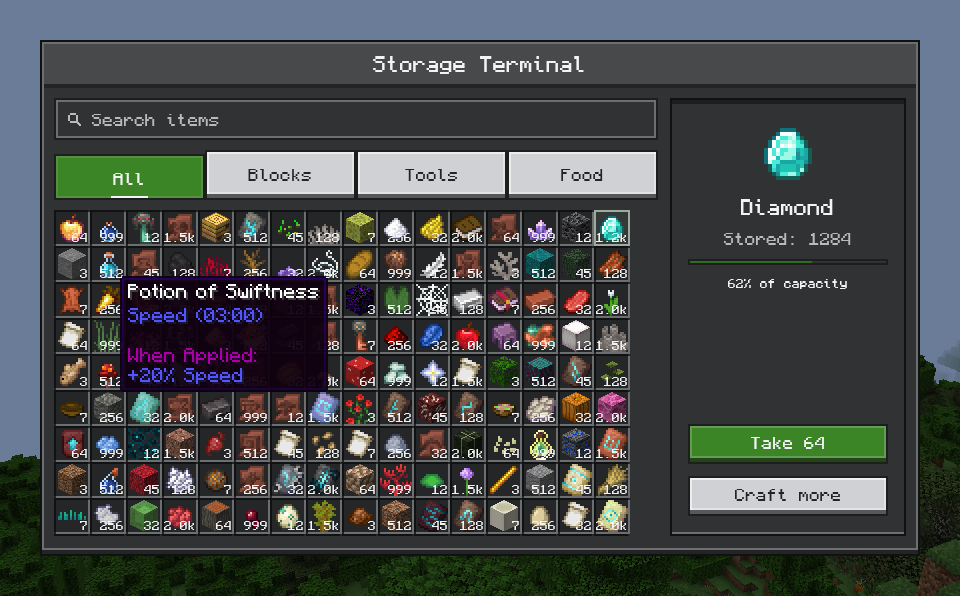
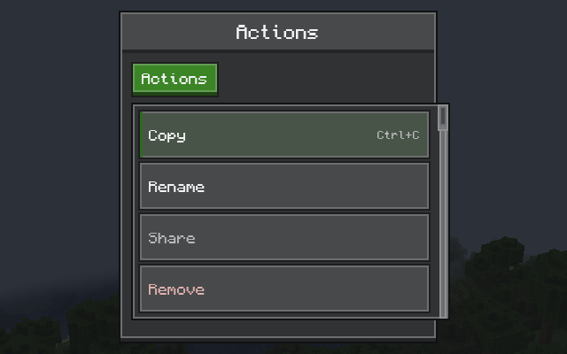
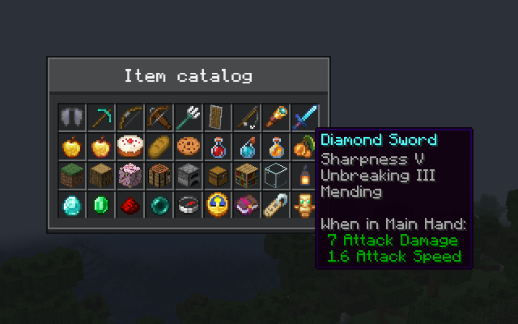
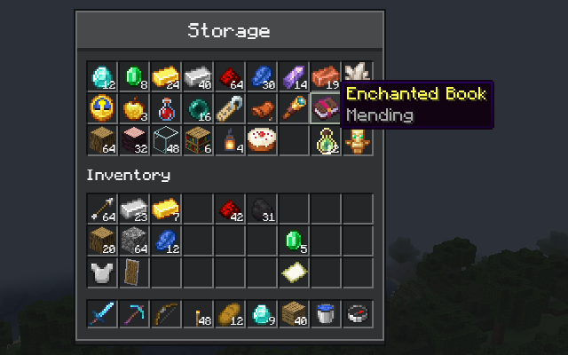
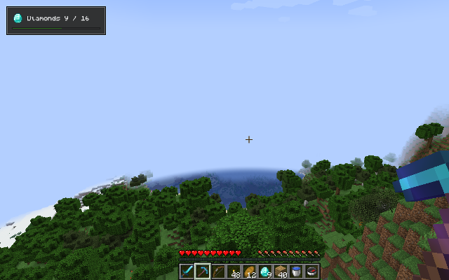

# Compose MC

**Build Minecraft mod interfaces with Jetpack Compose.**

English · [简体中文](README.zh-CN.md)



Compose MC brings Jetpack Compose to Minecraft Java Edition. Write screens, inventories and HUDs as declarative Kotlin, style them with Minecraft-flavored controls, and mix in real item icons and tooltips, all drawn on the GPU inside the game.

| Ore UI controls | Items and tooltips |
| --- | --- |
|  |  |
| **Container screens** | **HUD layers** |
|  |  |

## Features

- **Ore UI**: buttons, text and number fields, sliders, tabs, menus, nested tooltips, windows, trees and more, in a crisp Minecraft style.
- **Real items**: any `ItemStack` with its animation, enchantment glint and native tooltip, inside ordinary composables.
- **Container screens**: arrange real menu slots with Compose. Clicking, dragging, shift-clicking and other mods' hooks keep working.
- **HUD layers**: Compose content over the game view.
- **Menu sync**: server menu state on the client, and typed requests back to the server.
- **Config screens**: a ready-made editor for your mod's config files.
- **OpenGL and Vulkan**: follows the game's renderer, including Vulkan on Minecraft 26.2 and 26.3.

## A first screen

```kotlin
Minecraft.getInstance().setScreen(ComposeScreen(Component.literal("Counter")) {
    var count by remember { mutableStateOf(0) }
    OreScreen("Counter") {
        OreText("Clicked $count times")
        OreButton("Click me", onClick = { count++ })
    }
})
```

[Getting started](docs/en/getting-started.md) takes you from an empty mod to this screen.

## Supported versions

| Minecraft | Loader | Graphics |
| --- | --- | --- |
| 1.20.1 | Forge 47.4.23 | OpenGL |
| 1.21.1 | NeoForge 21.1.250 | OpenGL |
| 26.1.2 | NeoForge 26.1.2.109 | OpenGL |
| 26.2 | NeoForge 26.2.0.88 | OpenGL, Vulkan |
| 26.3 | NeoForge 26.3.0.6-beta | OpenGL, Vulkan |

Latest version: **0.1.0-alpha.36**. The API can still change between alpha releases.

## For players

Compose MC is a library. Install it when a mod you play asks for it: download the file for your Minecraft version from [Releases](https://github.com/Frostbite-time/compose-mc/releases).

- `…-with-kotlin.jar` works on its own.
- The plain `.jar` is smaller and needs [Kotlin for Forge](https://modrinth.com/mod/kotlin-for-forge).

Install one of the two, not both.

## Documentation

- [Getting started](docs/en/getting-started.md): add the dependency and open a screen
- [Ore UI](docs/en/ore-ui.md) · [Items and tooltips](docs/en/items.md) · [Container screens](docs/en/inventory.md) · [HUD layers](docs/en/hud.md)
- [Menu synchronization](docs/en/menu-sync.md) · [Config screens](docs/en/configuration.md)
- [Compatibility](docs/en/compatibility.md) · [Contributing](docs/en/contributing.md) · [Architecture](docs/en/architecture.md)

## License

Compose MC is released under the [MIT License](LICENSE). Bundled libraries keep their own licenses; see [third-party notices](THIRD-PARTY-NOTICES.md). Text uses the [Monocraft](https://github.com/IdreesInc/Monocraft) font by Idrees Hassan, under the [SIL Open Font License 1.1](ui-ore/src/main/resources/dev/composemc/ui/ore/Monocraft-LICENSE.txt).

Compose MC is not an official Minecraft product and is not associated with Mojang or Microsoft.
