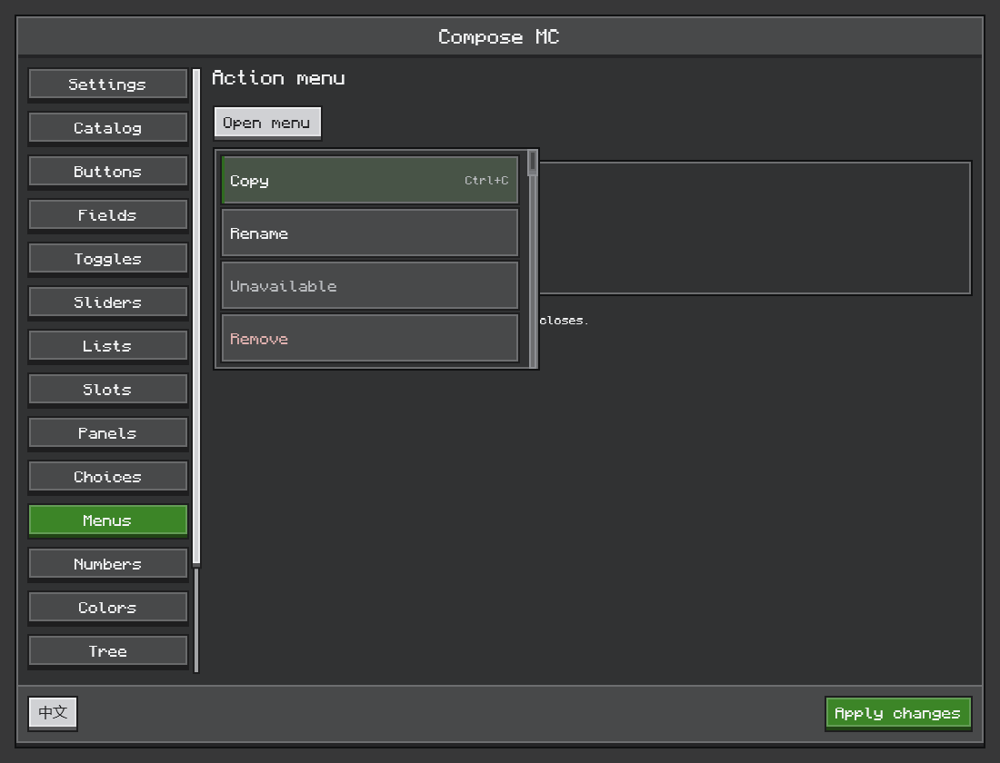

# Compose MC

**Build Minecraft mod interfaces with Jetpack Compose.**

English · [简体中文](README.zh-CN.md)

Compose MC brings declarative layouts, state-driven interaction and Ore-style controls to Minecraft Java Edition. Create settings pages, item browsers and inventory screens with familiar Compose code, backed by Minecraft's graphics context.


*Current Ore components rendered directly from the shared UI code in the offscreen desktop preview.*

## Made for game interfaces

- **A consistent Ore style.** Pixel typography, stepped buttons, inset fields, menus, trees, color pickers and draggable, resizable windows.
- **Minecraft content in Compose.** Native item images, animated icons and rich item tooltips alongside ordinary composables.
- **Real inventory interaction.** Arrange native slots with Compose while retaining container clicks, dragging and integration hooks.
- **State and actions.** Publish immutable UI snapshots; synchronize server menus through bounded updates and typed requests.
- **GPU rendering.** OpenGL across all supported targets, plus Vulkan on Minecraft 26.2 and 26.3.

| Interactive menus | Nested tooltips |
| --- | --- |
|  |  |

These are actual component renders. Explore the [component guide](docs/en/ore-ui.md) for controls, state ownership and examples.


*Captured in Minecraft 1.21.1 with NeoForge and OpenGL. [Native content](docs/en/native-content.md) explains item images, animation and tooltips.*

## A small interface, in a few lines

Inside a Compose MC screen, use standard Compose state and Ore controls:

```kotlin
import androidx.compose.runtime.*
import dev.composemc.ui.ore.button.OreButton
import dev.composemc.ui.ore.display.OreText
import dev.composemc.ui.ore.layout.OreScreen

@Composable
fun CounterPanel() {
    var count by remember { mutableStateOf(0) }
    OreScreen("Hello, Minecraft") {
        OreText("Count: $count")
        OreButton("Add one", onClick = { count++ })
    }
}
```

The [quick start](docs/en/getting-started.md) supplies the dependency setup and a complete client screen example. Browse [Ore UI](docs/en/ore-ui.md) for the component catalog.

## Supported Minecraft versions

| Minecraft | Loader baseline | Graphics |
| --- | --- | --- |
| 1.20.1 | Forge 47.4.23 | OpenGL |
| 1.21.1 | NeoForge 21.1.250 | OpenGL |
| 26.1.2 | NeoForge 26.1.2.109 | OpenGL |
| 26.2 | NeoForge 26.2.0.88 | OpenGL / Vulkan |
| 26.3 | NeoForge 26.3.0.6-beta | OpenGL / Vulkan |

Current version: **0.1.0-alpha.34**. APIs may change during alpha. Each target has its own mod JAR; use the artifact matching your Minecraft version and loader. See [compatibility](docs/en/compatibility.md) for platform coverage and known limitations.

## Start building

Compose MC is installed as a **separate library mod**. Choose the standard JAR with an external Kotlin provider such as Kotlin for Forge, or the `with-kotlin` JAR with Kotlin included. Both include Compose and Skiko; install only one variant. Every Minecraft target offers both choices.

1. Follow the [quick start](docs/en/getting-started.md) to build the local Maven artifacts and connect a consumer.
2. Choose [Ore controls](docs/en/ore-ui.md), [native content](docs/en/native-content.md) or [inventory screens](docs/en/inventory.md).
3. Use the [build guide](docs/en/build-and-test.md) to launch a specific Minecraft version from IntelliJ IDEA and open the F8 preview.

[All documentation](docs/README.md) · [Menu synchronization](docs/en/menu-sync.md) · [Configuration screens](docs/en/configuration.md) · [Architecture](docs/en/architecture.md)

## License and credits

Compose MC's original code and documentation are available under the [MIT License](LICENSE). Third-party components and assets retain their own licenses; see [third-party notices](THIRD-PARTY-NOTICES.md). Ore styling is an independent implementation inspired by Minecraft's interface design; this project is not an official Mojang or Microsoft product.

The bundled [Monocraft font](https://github.com/IdreesInc/Monocraft) is by Idrees Hassan and retains its [SIL Open Font License 1.1](ui-ore/src/main/resources/dev/composemc/ui/ore/Monocraft-LICENSE.txt). Runtime bundles include per-dependency licenses, native-library notices and a machine-readable inventory under `META-INF/composemc-third-party`.
