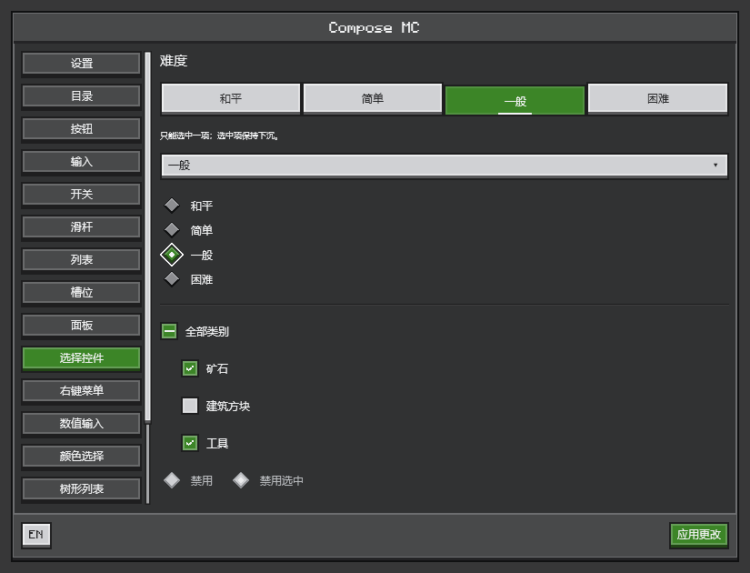
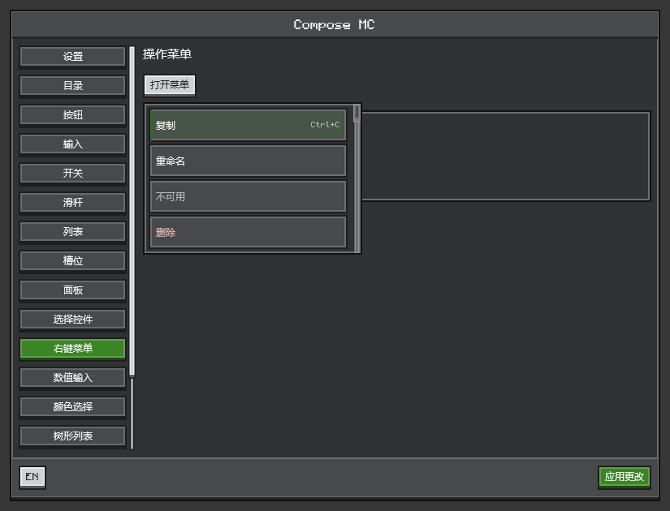
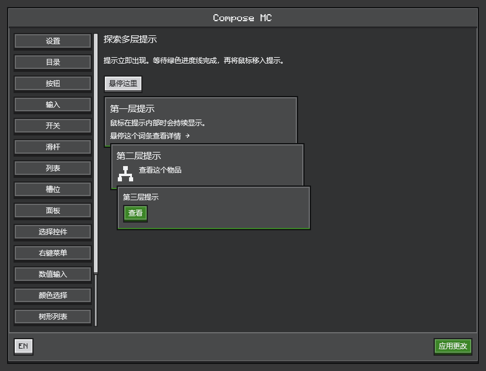

# Compose MC

**用 Jetpack Compose 构建 Minecraft 模组界面。**

[English](README.md) · 简体中文

Compose MC 为 Minecraft Java 版带来声明式布局、状态驱动的交互和 Ore 风格控件。使用熟悉的 Compose 代码编写设置页、物品浏览器和容器界面，由 Minecraft 的图形上下文完成渲染。



*当前 Ore 组件的实际渲染效果，由共享 UI 代码在桌面离屏预览中生成。*

## 为游戏界面而设计

- **统一的 Ore 风格。** 像素字体、台阶按钮、内凹输入框，以及菜单、树形视图、颜色选择器和可拖动缩放的浮窗。
- **在 Compose 中展示 Minecraft 内容。** 原生物品图像、动画图标和丰富的物品提示，可以与普通组件组合。
- **保留原生容器交互。** 使用 Compose 排列真实槽位，保留容器点击、拖拽和模组集成钩子。
- **HUD 层。** 以普通 HUD 层在游戏画面上绘制 Compose，位于打开的屏幕下方，并随原版 HUD 隐藏。
- **状态与动作分离。** 发布不可变 UI 快照，通过有界更新和类型化请求同步服务端菜单。
- **GPU 渲染。** 所有支持版本均使用 OpenGL；Minecraft 26.2 和 26.3 还支持 Vulkan。

| 交互菜单 | 多层提示 |
| --- | --- |
|  |  |

以上均为真实组件渲染。控件用法、状态归属和示例见[组件指南](docs/zh-CN/ore-ui.md)。


*在 Minecraft 1.21.1、NeoForge 和 OpenGL 环境下获取的游戏内截图，预览语言为英文。物品图像、动画及提示用法见[原生内容](docs/zh-CN/native-content.md)。*

## 用几行代码开始

在 Compose MC 屏幕中，直接使用标准 Compose 状态和 Ore 控件：

```kotlin
import androidx.compose.runtime.*
import dev.composemc.ui.ore.button.OreButton
import dev.composemc.ui.ore.display.OreText
import dev.composemc.ui.ore.layout.OreScreen

@Composable
fun CounterPanel() {
    var count by remember { mutableStateOf(0) }
    OreScreen("你好，Minecraft") {
        OreText("计数：$count")
        OreButton("加一", onClick = { count++ })
    }
}
```

[快速开始](docs/zh-CN/getting-started.md)提供依赖配置及完整的客户端屏幕示例。组件目录见 [Ore UI](docs/zh-CN/ore-ui.md)。

## 支持的 Minecraft 版本

| Minecraft | 加载器基线 | 图形后端 |
| --- | --- | --- |
| 1.20.1 | Forge 47.4.23 | OpenGL |
| 1.21.1 | NeoForge 21.1.250 | OpenGL |
| 26.1.2 | NeoForge 26.1.2.109 | OpenGL |
| 26.2 | NeoForge 26.2.0.88 | OpenGL / Vulkan |
| 26.3 | NeoForge 26.3.0.6-beta | OpenGL / Vulkan |

当前版本：**0.1.0-alpha.34**。Alpha 阶段 API 可能发生变化。每个目标有独立的 mod JAR，请选择与 Minecraft 版本和加载器匹配的产物。平台验证范围和已知限制见[兼容性说明](docs/zh-CN/compatibility.md)。

## 开始使用

Compose MC 作为**独立的前置模组**安装。标准 JAR 配合 Kotlin for Forge 等外部 Kotlin 提供者使用；`with-kotlin` JAR 自带 Kotlin。两者均包含 Compose 和 Skiko，只选装一个。所有 Minecraft 目标均提供这两种产物。

1. 按照[快速开始](docs/zh-CN/getting-started.md)构建本地 Maven 产物，配置消费者依赖。
2. 根据需要使用 [Ore 控件](docs/zh-CN/ore-ui.md)、[原生内容](docs/zh-CN/native-content.md)、[HUD 层](docs/zh-CN/hud.md)或[容器界面](docs/zh-CN/inventory.md)。
3. 按照[构建指南](docs/zh-CN/build-and-test.md)，从 IntelliJ IDEA 启动指定 Minecraft 版本并打开 F8 预览。

[完整文档](docs/README.md) · [菜单同步](docs/zh-CN/menu-sync.md) · [配置界面](docs/zh-CN/configuration.md) · [项目架构](docs/zh-CN/architecture.md)

## 许可与致谢

Compose MC 自有代码和文档采用 [MIT 许可证](LICENSE)。第三方组件和资源保留各自许可，详见[第三方声明](THIRD-PARTY-NOTICES.md)。Ore 外观是参考 Minecraft 界面设计的独立实现；本项目并非 Mojang 或 Microsoft 官方产品。

内置 [Monocraft 字体](https://github.com/IdreesInc/Monocraft)由 Idrees Hassan 创作，保留 [SIL Open Font License 1.1](ui-ore/src/main/resources/dev/composemc/ui/ore/Monocraft-LICENSE.txt)。运行时包在 `META-INF/composemc-third-party` 中附带逐依赖许可证、原生库声明和机器可读清单。
