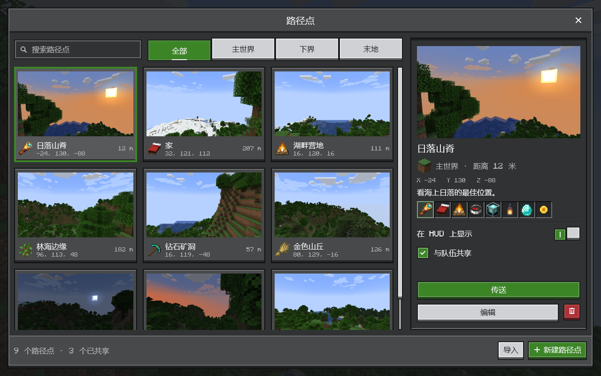
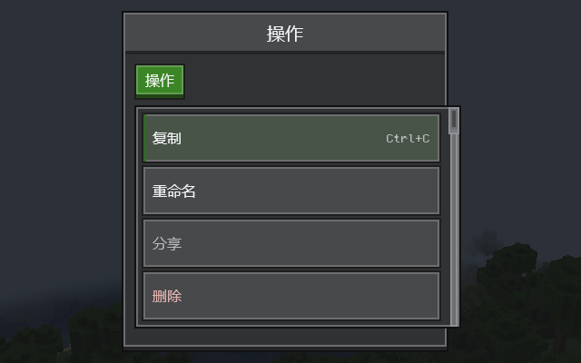
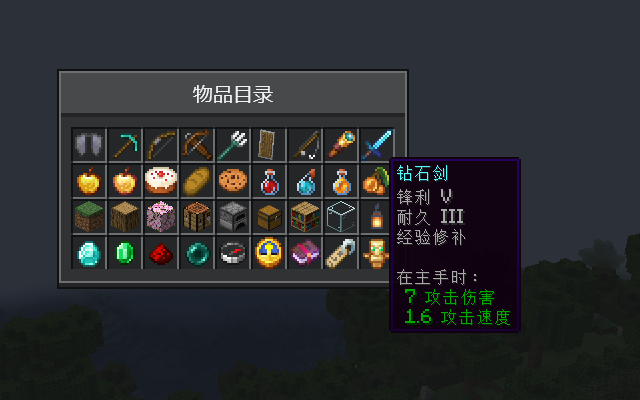
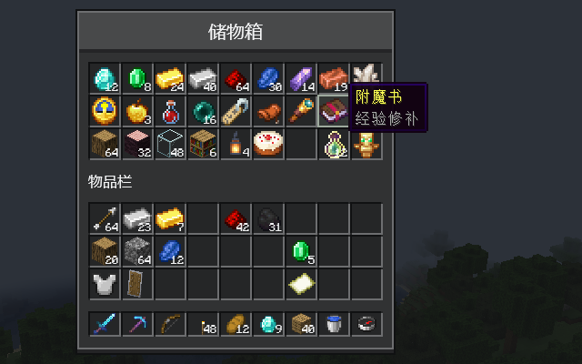
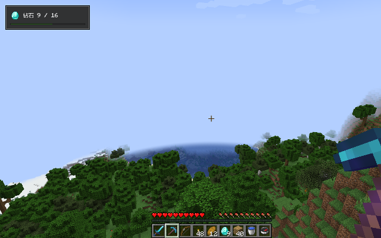

# Compose MC

**用 Jetpack Compose 构建 Minecraft 模组界面。**

[English](README.md) · 简体中文



Compose MC 把 Jetpack Compose 带进 Minecraft Java 版。用声明式 Kotlin 编写界面、容器界面和 HUD，配上 Minecraft 风格的控件，再放入真实的物品图标与物品提示，全部在游戏内由 GPU 绘制。

| Ore UI 控件 | 物品与提示 |
| --- | --- |
|  |  |
| **容器界面** | **HUD 层** |
|  |  |

## 功能

- **Ore UI**：按钮、文本与数值输入框、滑块、标签、菜单、多层提示、窗口、树形列表等，风格清晰统一。
- **真实物品**：任意 `ItemStack` 连同动画、附魔光效和原版提示，直接放进普通可组合项。
- **容器界面**：用 Compose 排布真实菜单槽位，点击、拖动、Shift 点击以及其他模组的钩子照常工作。
- **HUD 层**：在游戏画面上绘制 Compose 内容。
- **菜单同步**：把服务端菜单状态同步到客户端，并把类型化请求发回服务端。
- **配置界面**：现成的模组配置文件编辑器。
- **OpenGL 与 Vulkan**：跟随游戏的渲染后端，Minecraft 26.2 和 26.3 支持 Vulkan。

## 第一个界面

```kotlin
Minecraft.getInstance().setScreen(ComposeScreen(Component.literal("计数器")) {
    var count by remember { mutableStateOf(0) }
    OreScreen("计数器") {
        OreText("已点击 $count 次")
        OreButton("点我", onClick = { count++ })
    }
})
```

[快速开始](docs/zh-CN/getting-started.md)会带你从空模组做到这个界面。

## 支持的版本

| Minecraft | 加载器 | 图形后端 |
| --- | --- | --- |
| 1.20.1 | Forge 47.4.23 | OpenGL |
| 1.21.1 | NeoForge 21.1.250 | OpenGL |
| 26.1.2 | NeoForge 26.1.2.109 | OpenGL |
| 26.2 | NeoForge 26.2.0.88 | OpenGL、Vulkan |
| 26.3 | NeoForge 26.3.0.6-beta | OpenGL、Vulkan |

最新版本：**0.1.0-alpha.37**。Alpha 阶段的 API 仍可能变化。

## 玩家须知

Compose MC 是前置库，当你玩的模组需要它时再安装。在 [Releases](https://github.com/Frostbite-time/compose-mc/releases) 下载对应 Minecraft 版本的文件：

- `…-with-kotlin.jar` 可以单独使用。
- 不带后缀的 `.jar` 更小，但需要 [Kotlin for Forge](https://modrinth.com/mod/kotlin-for-forge)。

两者只装其一。

## 文档

- [快速开始](docs/zh-CN/getting-started.md)：添加依赖并打开界面
- [Ore UI](docs/zh-CN/ore-ui.md) · [主题](docs/zh-CN/themes.md) · [物品与提示](docs/zh-CN/items.md) · [容器界面](docs/zh-CN/inventory.md) · [HUD 层](docs/zh-CN/hud.md)
- [菜单同步](docs/zh-CN/menu-sync.md) · [配置界面](docs/zh-CN/configuration.md)
- [兼容性](docs/zh-CN/compatibility.md) · [参与开发](docs/zh-CN/contributing.md) · [架构](docs/zh-CN/architecture.md)

## 许可

Compose MC 以 [MIT 许可证](LICENSE)发布。随附的库保留各自的许可，见[第三方声明](THIRD-PARTY-NOTICES.md)。界面文字使用 Idrees Hassan 的 [Monocraft](https://github.com/IdreesInc/Monocraft) 字体，遵循 [SIL 开放字体许可证 1.1](ui-ore/src/main/resources/dev/composemc/ui/ore/Monocraft-LICENSE.txt)。

Compose MC 不是 Minecraft 官方产品，与 Mojang 和 Microsoft 无关。
