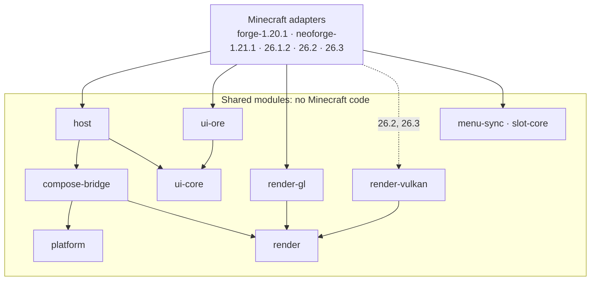
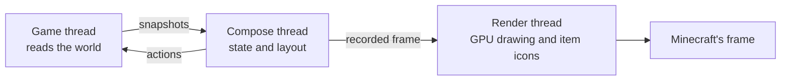

# Architecture

[简体中文](../zh-CN/architecture.md) · [All guides](../README.md)

CompixelUI is a single Gradle build. Shared modules hold everything that doesn't depend on Minecraft, and one adapter per Minecraft version connects them to the game.

## Modules

| Module | Role |
| --- | --- |
| `platform` | Viewport, input, clipboard and other contracts with the host game |
| `render` | Frames, GPU resources and profiling |
| `compose-bridge` | Runs Compose on its own thread, records frames and draws native images |
| `host` | UI sessions, `UiBinding`, `ScreenTransition`, and `UiLayer`, the Compose layer that every screen and HUD layer is built on |
| `render-gl`, `render-vulkan` | The OpenGL and Vulkan renderers |
| `ui-core` | What a design system plugs into: control feedback, the design around a host's content, and theme files with a section per design system |
| `ui-ore` | Ore UI components, theme and font |
| `menu-sync` | The menu synchronization protocol, with the client's and the server's sessions |
| `slot-core` | Slot rules and shift-click routes |
| `minecraft/<loader>-<version>` | Screens, HUD layers, input, items, menus and GPU access for one Minecraft version |
| `runtimes/*` | Packaging of Compose, Skiko and Kotlin |
| `demo`, `desktop`, `testing` | The component preview, a desktop window for it, and shared test code |
| `build-logic`, `gradle`, `tools` | Build conventions, version metadata, checks and scripts |

## Boundaries

- Shared modules never import Minecraft or loader classes. Only `render-gl` and `render-vulkan` use LWJGL, which the game provides at runtime.
- `menu-sync` and `slot-core` are Java 17 with no dependencies, so a dedicated server loads them without any UI code.
- Each adapter owns its build settings, sources and tests; versions never share source files. A fix is applied to every affected version separately.
- Vanilla containers are the baseline. Special behavior such as virtual resources or custom transactions belongs to the mods that need it.

`verifyCoreBoundary`, part of `check`, enforces the first two rules.

## Threads and frames

Game objects stay on the game thread. Compose sees immutable snapshots and sends actions back through `UiBinding`. Screens and HUD layers manage theirs with their Compose session: it opens from a first snapshot, handles the actions an input event sent before the event returns, handles the rest at each tick before taking the next snapshot, and closes with the session. Each frame is recorded by Compose and drawn by the render thread inside Minecraft's own graphics context: OpenGL state is restored afterwards, and Vulkan work uses the game's device and queue.

GPU images that Compose draws, such as item icon pages, belong to the render thread. Pictures recorded by Compose keep references to them, so the renderer frees an image only after those references are gone. Freeing it on another thread would lose its GPU memory.

`NativeImageAtlas` in `compose-bridge` schedules rectangular image requests. Item adapters choose atlas grids; custom native drawings choose independent viewports. The Compose mailbox and image node are shared. `NativeImageOwner` retires published images through the renderer, including tooltip images; native tooltip measurement and loader events remain in each adapter.

## Packaging

- The mod JAR contains every CompixelUI module and no third-party code.
- Compose, Skiko and Kotlin are packaged as runtime bundles: `compixel-runtime-standard`, `compixel-runtime-vulkan` for 26.2 and 26.3, and `compixel-kotlin`. Skiko includes natives for Windows, Linux and macOS on x64 and arm64.
- Each bundle has its own version, and `bundle.lock` records exactly what that version contains.
- Player files embed the bundles through Jar-in-Jar. Maven users get them as dependencies.
- At startup, Java code checks that the expected runtime and Kotlin libraries are present before any Kotlin runs, and names whatever is missing.

## Hooks into the game

Public loader APIs come first. Beyond them, each adapter declares small access transformers: slot coordinates on every version, plus the slot render hook on 1.20.1, and the container size, slot highlight methods, registered native preview factories and GPU backend fields on 26.x. The 26.x adapters also contain one Mixin that sends `GuiRenderer` output to an offscreen target while native drawings, item icons and tooltips are captured. Build checks reject anything not declared.

## Adding a Minecraft version

1. Create `minecraft/<loader>-<version>` with its own `build.gradle` and `gradle.properties`, and list it in `gradle/minecraft-targets.properties`.
2. Port the game-facing code from the nearest version. Copy the client suite drivers unchanged and write the version's `SuitePlatform.kt`.
3. Build it, run both client suites on every graphics backend, and test a separately installed mod against the API.
4. Add the version to the tables in the documentation.
