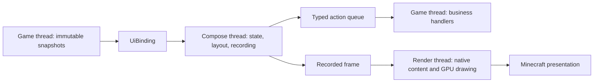

# Architecture and extension

[简体中文](../zh-CN/architecture.md) · [Documentation](../README.md)

Compose MC maintains shared UI/runtime code and per-version Minecraft adapters in one Gradle build. Consumers install the library separately. Each target offers a standard JAR using an external Kotlin provider and a `with-kotlin` JAR carrying its own Kotlin libraries; both own Compose and Skiko.

## Module responsibilities

| Module or directory | Responsibility |
| --- | --- |
| `platform` | Host-neutral viewport, input, clipboard and platform contracts |
| `render` | Backend-neutral frames, resource and profiling contracts |
| `compose-bridge` | Compose scene, thread boundary and frame recording |
| `host` | UI session lifecycle and immutable state/action bindings |
| `render-gl` | Shared OpenGL renderer and GPU composition |
| `render-vulkan` | Shared Skia Vulkan drawing and image-barrier recording |
| `ui-ore` | Shared visual tokens, fonts and controls |
| `menu-sync` | Dependency-free Java 17 schemas, codecs, snapshots and bounded protocol |
| `slot-core` | Dependency-free Java 17 slot policies and transfer routes |
| `demo` / `desktop` | F8 preview pages and desktop preview/capture |
| `minecraft/forge-*` / `minecraft/neoforge-*` | Version-owned builds, native screens, input, resources, items, menus and GPU lifecycle |
| `runtimes/standard` / `runtimes/vulkan` | Assemble the matching shared code, JVM dependencies and six native variants |
| `build-logic` / `gradle` / `tools` | Build conventions, target/version metadata, checks and launch helpers |

The `demo` module contains only preview pages and their state; desktop captures reuse those pages. Shared test code is collected in `testing`: `dev.composemc.testing.render` owns the renderer scene, CPU reference and pixel comparison, and `dev.composemc.testing.ui` owns automated interaction exercises. Component regression tests live in `testing/src/test`; the desktop module provides the preview and capture entry points.

`main` source sets contain installable library behavior. Each adapter's `development` source set contains F8 previews and probes, packaged as the optional `development` mod. They do not enter the production archive. Minecraft/loader-facing code, resources and adapter tests live in that version's own `src` directory. Each version owns its copies; similar fixes are applied and validated manually for the other affected versions.

Backend probes live in matching `render-gl/src/testFixtures` and `render-vulkan/src/testFixtures` source sets. They use the same scenes, two viewport sizes, premultiplied RGBA CPU references and comparison thresholds from `testing`. Each probe repeats render/reset/context-close cycles; OpenGL additionally checks host state and retained image copies, while Vulkan exercises image barriers and GPU readback on the borrowed Minecraft device. Version-specific device access and screen validation live together under each adapter's `development/render` package. These helpers are included only in development artifacts. Backend fixtures can access their own module's internal implementation through Kotlin's test-fixture association.

Within `ui-ore`, public components use responsibility-based packages and one file per independent component. Theme configuration is separate from presentation; shared frame drawing stays internal. The [Ore UI package table](ore-ui.md#choose-a-component) is the component directory and import guide.

## Boundaries

Shared core, UI and fixtures do not import Minecraft or loader types and do not depend on version adapters. Only shared `render-gl` and `render-vulkan` may use LWJGL; their native dependencies come from Minecraft at runtime. `menu-sync` and `slot-core` have empty production dependency classpaths and must load on a dedicated server without initializing UI code.

Version adapters own native device discovery, Minecraft textures, input translation, menu networking and presentation. Resource-specific identity, permissions and transactions belong to consumers. Ordinary vanilla containers are the baseline; specialized resources extend the public interfaces.

`verifyCoreBoundary` checks shared source and declared/resolved dependencies. Run it after changing boundaries or dependencies, together with affected tests/builds.

Transport policy and scheduling live in `menu-sync`: `MenuSyncOptions` groups state/action limits, `TokenBucket` controls sustained and burst bytes, and `ActionQueue` owns FIFO admission and deadlines. Adapters retain credit for the lifetime of the connection and connect these helpers to native payloads. They validate matching policy before sending state bodies and enforce the physical packet envelope. See [menu synchronization](menu-sync.md) for the consumer API.

## Threads and frame ownership

The AWT event thread hosts composition and recording. Game/render-thread code owns live game objects, GPU work and resource retirement. `UiBinding` sends snapshots into composition and queues actions back to its creating thread. Never synchronously call a waiting game thread from Compose.

OpenGL borrows Minecraft's current context, manages its own Skia context and offscreen resources, and restores host GL state. Vulkan borrows native device/queue/image handles; adapters control submission, command-pool reuse, presentation and retirement. Shared code must not destroy host-owned devices or textures. A retained frame may keep an image alive after cache eviction.

Resize updates viewport-dependent resources while retaining the session where supported. Resource reload invalidates images and render targets. Final removal releases owned resources; inventory hosts distinguish temporary recipe-screen visits from final menu closure.

## Runtime packaging

The standard profile uses Skiko 0.150.1. The Vulkan profile uses the matched Polyfrost Skiko 0.999.6 JVM/native distribution and adds the shared Vulkan renderer. Each adapter selects its runtime dependency and matching Skiko constraint in its own build file.

Runtime assembly merges service registrations and third-party notices, includes Windows/Linux/macOS x64 and arm64 natives, and avoids relocation/minimization that would break compiler ABI or JNI. It does not bundle another LWJGL. Archive checks reject development tools, project Mixins and mismatched native/runtime contents.

Each runtime project emits both an external-Kotlin bundle and a `with-kotlin` bundle. The external bundle excludes Kotlin stdlib, Coroutines Core and Serialization while retaining Compose's Swing dispatcher integration and atomicfu. The adapter embeds exactly one matching bundle; it never embeds KFF. Client entry points are Java so missing external libraries can be reported before entering Kotlin code. A shared Java check verifies stdlib >= 2.2.21 and representative Coroutines/Serialization APIs without touching the dedicated-server entry path. This is a dependency check, not certification of arbitrary library combinations.

The `dev` classifier supplies the complete compile-time JVM API for both variants, without native binaries; the `development` classifier supplies preview/probe code. One `sources` JAR and one Dokka HTML `javadoc` JAR describe the adapter and its shared production modules for all binary variants. They contain the project's own sources/API, not dependency sources or another Minecraft target. [Quick start](getting-started.md) explains how consumers depend on these artifacts.

## Build conventions

[build-logic](../../build-logic/src/main/groovy) is an included Gradle build, not game runtime code. It provides four focused convention plugins:

| Plugin | Responsibility |
| --- | --- |
| `composemc.testing` | JUnit, test settings and dependency locking |
| `composemc.jvm-library` | Kotlin/JVM and target toolchains |
| `composemc.skiko-profile` | Matching Skiko version constraints |
| `composemc.runtime-bundle` | Runtime assembly, notices and archive checks |

The pure Java [menu-sync](../../menu-sync/build.gradle.kts) and [slot-core](../../slot-core/build.gradle.kts) modules declare their Java 17 toolchain and release target in their own build files and apply `composemc.testing` directly. Their checks enforce empty production dependency classpaths.

All adapters live under [minecraft](../../minecraft), with complete version-owned source trees. Each adapter's `build.gradle` owns its loader plugin, runtime dependencies, local source sets, run declarations, mapping/remapping rules, access-transformer allowlist and validation exceptions. Its adjacent `gradle.properties` owns the Minecraft/loader versions, Java toolchain and supported backends. For example, [Forge 1.20.1](../../minecraft/forge-1.20.1/build.gradle) declares SRG reobfuscation, while [NeoForge 26.2](../../minecraft/neoforge-26.2/build.gradle) declares its Vulkan launch arguments and upstream cleanup exception.

[minecraft-targets.properties](../../gradle/minecraft-targets.properties) only indexes versions and project directories for selection and launch scripts. [libs.versions.toml](../../gradle/libs.versions.toml) owns shared dependency versions. The root build provides aggregate tasks; it does not inject adapter settings.

The adapters explicitly call four reusable scripts under [gradle/minecraft](../../gradle/minecraft): `sources.gradle` configures local development source sets and Kotlin visibility; `artifacts.gradle` assembles/publishes artifacts and expands metadata; `artifact-checks.gradle` checks archive isolation against the adapter's declared rules; `runs.gradle` supplies common smoke/benchmark mechanics and report checks. These helpers do not choose Minecraft versions, loaders, runtime profiles or version-specific exceptions, and do not attach another adapter's sources. A new target normally requires changes only in its own directory and the target index.

`artifacts.gradle` delegates source/API publication to [api-docs.gradle](../../gradle/minecraft/api-docs.gradle). It follows the selected runtime's declared project dependencies, adds the Java menu/slot cores and the current adapter, and reads their production sources for packaging/documentation only. This does not connect adapter compilation source roots. Dokka runs are serialized by a root build service, and artifact checks compare source bytes and validate representative API pages before release.

Client runs use the loader's ordinary window startup. Direct client and benchmark tasks are visible by default. For background verification on Windows, [run_isolated_gradle.ps1](../../tools/run_isolated_gradle.ps1) starts a fresh Gradle process on a separate, never-activated Win32 desktop. It is shared by the version benchmark wrapper and the consumer's test wrappers. The launcher owns desktop isolation and checks native launch failures; background probes hide their own GLFW/SDL window after startup. No auxiliary window-provider JAR is required; the renderer uses the context supplied by Minecraft/NeoForge and reports its actual GL version.

## Native extension points

Prefer public loader APIs. Current releases use no project Mixins. Access transformers are target-specific:

- 1.21.1 and 26.1.2: `Slot.x` and `Slot.y` for native slot positioning.
- 26.2/26.3: those coordinates plus the target's GPU backend field.
- Forge 1.20.1: mapped slot coordinates and protected access to native `renderSlot` to retain container hooks while replacing slot drawing.

Packaging checks enforce these declarations. Upstream Vulkan cleanup is documented in [compatibility](compatibility.md) and is not patched by a local Mixin.

## Add or change an adapter

1. Create `minecraft/<loader>-<version>/build.gradle` and `gradle.properties`, then add its directory to the target index. Declare loader plugins, toolchain, dependencies, mappings and runs in that adapter. Reuse the focused helpers where appropriate.
2. Keep Minecraft/loader-facing implementation, resources and tests in that adapter. When another version needs the same fix, apply and validate it there separately; do not use shared source roots, links or generated copies to couple version implementations. Minecraft-independent modules and their fixtures remain shared dependencies.
3. Choose a compatible toolchain/runtime profile, lock dependencies and check production/development archive isolation.
4. Build all affected adapters, then validate native input, items, container hooks, resize/reload and cleanup in packaged clients for every affected backend.
5. Exercise public APIs from a separately installed consumer and verify dedicated-server isolation for common APIs.
6. Update both language guides and affected screenshots. Keep API examples and target tables synchronized with source.

See [build and test](build-and-test.md) for commands. A successful compile covers type compatibility; actual GPU/client acceptance is a separate check.
