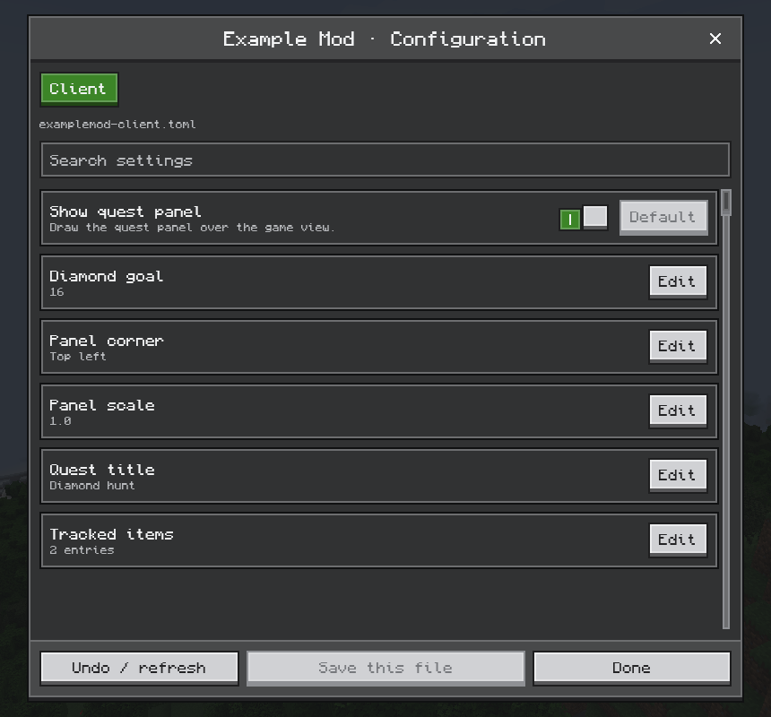

# Config screens

[简体中文](../zh-CN/configuration.md) · [All guides](../README.md)

CompixelUI includes a ready-made editor for your mod's config files. Players get a tab per file, search, value checks, defaults, undo and saving; you keep your normal config spec.



## Register it

Define your config as usual, then register `ComposeConfigScreen` as the mod's config screen, from your client mod constructor:

```kotlin
object ExampleConfig {
    private val builder = ModConfigSpec.Builder()
    val showHud = builder.define("showHud", true)
    val goal = builder.defineInRange("goal", 16, 1, 64)
    val corner = builder.defineEnum("corner", Corner.TOP_LEFT)
    val scale = builder.defineInRange("scale", 1.0, 0.5, 2.0)
    val title = builder.define("title", "Diamond hunt")
    val trackedItems = builder.defineList("trackedItems",
        listOf("minecraft:diamond", "minecraft:emerald"), { "minecraft:diamond" }) { it is String }
    val spec: ModConfigSpec = builder.build()

    fun register(container: ModContainer) {
        container.registerConfig(ModConfig.Type.CLIENT, spec)
        container.registerExtensionPoint(IConfigScreenFactory::class.java,
            IConfigScreenFactory { mod, parent -> ComposeConfigScreen(mod, parent) })
    }
}
```

The **Mods** list now opens this screen for your mod. On Forge 1.20.1, register a `ConfigScreenHandler.ConfigScreenFactory` that returns `ComposeConfigScreen(modContainer, parent)`.

## Names and descriptions

Labels come from your language file:

```json
{
  "examplemod.configuration.goal": "Diamond goal",
  "examplemod.configuration.goal.tooltip": "Diamonds needed to finish the quest.",
  "examplemod.configuration.option.top_left": "Top left"
}
```

| Text | Key |
| --- | --- |
| Entry name | The spec's translation key, or `<modid>.configuration.<path>` |
| Description | `<entry key>.tooltip`, or the spec comment |
| Enum option | `<entry key>.<constant>`, or `<modid>.configuration.option.<constant>` |

Constants are written in lower case. Without a translation, the editor shows a readable form of the path.

## Editing and saving

- Supported values: booleans, integers, longs, finite doubles, strings, enums and lists of those. Other types are shown but can't be edited.
- Changes stay pending until the player saves that file. Values are checked again before saving, and a file changed elsewhere asks for a refresh.
- Defaults and undo only stage values; nothing is written until saving.
- Closing with unsaved changes asks the player first.
- Server configs are read-only when connected to a remote server, and while the world is open to LAN.

## Build your own page

`ConfigEditor` is the model behind the screen. Use it from the game thread to build a custom config page:

```java
ConfigEditor editor = new ConfigEditor("examplemod");
ConfigEditor.Result staged = editor.stage(fileId, "goal", ConfigEditor.Input.scalar("24"));
ConfigEditor.SaveResult saved = editor.save(fileId);
```

`snapshot()` lists the files and entries with their IDs; `Input.list(values)` stages a list; `reset`, `reload` and `discardAll` undo changes.
