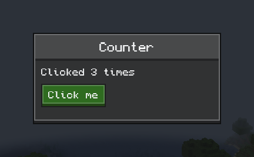

# Getting started

[简体中文](../zh-CN/getting-started.md) · [All guides](../README.md)

This guide adds Compose MC to a NeoForge 1.21.1 mod and opens a first screen. Other Minecraft versions follow the same steps; [Compatibility](compatibility.md) lists what differs.

## 1. Add the dependency

In your mod's `build.gradle`:

```groovy
plugins {
    id 'org.jetbrains.kotlin.jvm' version '2.4.10'
    id 'org.jetbrains.kotlin.plugin.compose' version '2.4.10'
}

repositories {
    maven {
        url = 'https://maven.wintercogs.com/releases'
        content { includeGroup 'dev.composemc' }
    }
}

dependencies {
    compileOnly "dev.composemc:composemc-neoforge-1.21.1-with-kotlin:${composemc_version}"
    localRuntime "dev.composemc:composemc-neoforge-1.21.1-with-kotlin:${composemc_version}"
}

kotlin { jvmToolchain(21) }
```

And in `gradle.properties`:

```properties
composemc_version=0.1.0-alpha.35
kotlin.stdlib.default.dependency=false
```

The `-with-kotlin` coordinate brings the Kotlin libraries along. If your mod already depends on Kotlin for Forge, use `composemc-neoforge-1.21.1` on both lines instead and let KFF supply Kotlin.

Compose MC is installed as its own mod, so don't include it in your JAR through Jar-in-Jar.

## 2. Declare the dependency

In `src/main/resources/META-INF/neoforge.mods.toml`, with your own mod ID:

```toml
[[dependencies.examplemod]]
modId = "composemc"
type = "required"
versionRange = "[0.1.0-alpha.35]"
ordering = "AFTER"
side = "CLIENT"
```

Use `side = "BOTH"` if you use [menu synchronization](menu-sync.md), which also runs on the server.

## 3. Open a screen

```kotlin
import androidx.compose.runtime.*
import androidx.compose.ui.unit.dp
import dev.composemc.forge.ComposeScreen
import dev.composemc.ui.ore.button.OreButton
import dev.composemc.ui.ore.display.OreText
import dev.composemc.ui.ore.layout.OreScreen
import net.minecraft.client.Minecraft
import net.minecraft.network.chat.Component

fun openCounterScreen() {
    Minecraft.getInstance().setScreen(ComposeScreen(Component.literal("Counter")) {
        var count by remember { mutableStateOf(0) }
        OreScreen("Counter", maxWidth = 160.dp, maxHeight = 78.dp) {
            OreText("Clicked $count times")
            OreButton("Click me", onClick = { count++ })
        }
    })
}
```



Call `openCounterScreen()` from client code, such as a key mapping handler. `ComposeScreen` is an ordinary Minecraft screen, and `OreScreen` draws the panel and its title. Keep UI code in client-only classes so a dedicated server never loads it.

## 4. Show game data

Compose runs on its own thread. Read the game on the game thread, and pass Compose an immutable snapshot through a `UiBinding` from `dev.composemc.host`. Buttons send actions back the same way:

```kotlin
data class HeldItem(val name: String, val count: Int)

fun openHandScreen() {
    val minecraft = Minecraft.getInstance()
    val held = UiBinding<HeldItem, Unit>(HeldItem("", 0))
    minecraft.setScreen(object : ComposeScreen(Component.literal("Hand"), content = {
        val item = held.value
        OreScreen("Hand", maxWidth = 180.dp, maxHeight = 84.dp) {
            OreText("${item.name} × ${item.count}")
            OreButton("Drop one", onClick = { held.send(Unit) })
        }
    }) {
        override fun tick() {
            super.tick()
            val player = minecraft.player ?: return
            held.drainActions { player.drop(false) }
            val stack = player.mainHandItem
            held.update(HeldItem(stack.hoverName.string, stack.count))
        }

        override fun removed() {
            super.removed()
            held.close()
        }
    })
}
```

| `UiBinding` call | Where |
| --- | --- |
| Constructor, `update`, `drainActions`, `close` | Game thread |
| `value` | Inside composables |
| `send` | UI callbacks. Returns `false` once the binding is closed or 64 actions are waiting. |

Don't touch players, item stacks or other game objects inside composables, and never make Compose wait for the game thread.

## 5. Ship it

Players install Compose MC next to your mod. Each Minecraft version has two files; players pick one:

| File | For |
| --- | --- |
| `composemc-neoforge-1.21.1-0.1.0-alpha.35-with-kotlin.jar` | Everyone; Kotlin included |
| `composemc-neoforge-1.21.1-0.1.0-alpha.35.jar` | Players who already have Kotlin for Forge |

Both are on the [Releases](https://github.com/Frostbite-time/compose-mc/releases) page.

## Next steps

- [Ore UI](ore-ui.md): every control, with examples
- [Items and tooltips](items.md): real item icons in your UI
- [Container screens](inventory.md): menus with slots
- [HUD layers](hud.md): Compose over the game view
- [Menu synchronization](menu-sync.md) and [Config screens](configuration.md)
