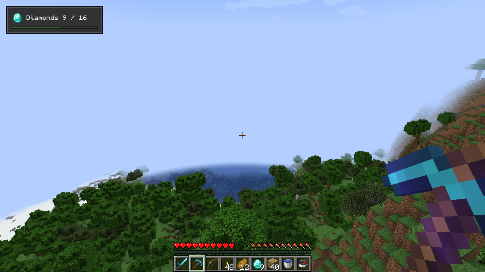

# HUD layers

[简体中文](../zh-CN/hud.md) · [All guides](../README.md)

`ComposeHudLayer` draws Compose content over the game view. It is an ordinary HUD layer: you register it with the loader, and it stacks with the vanilla HUD.



## Register a layer

This layer counts the diamonds in the player's inventory. `ComposeHudLayer` reads the game in `snapshot` and draws the latest value in `Content`:

```kotlin
class QuestHud(private val diamond: ItemIcon) : ComposeHudLayer<Int>() {
    override fun snapshot() = Minecraft.getInstance().player?.inventory?.countItem(Items.DIAMOND) ?: 0

    @Composable
    override fun Content(state: Int) = QuestPanel(diamond, state)
}

fun registerQuestHud(modBus: IEventBus) {
    modBus.addListener { event: RegisterGuiLayersEvent ->
        event.registerAbove(
            VanillaGuiLayers.HOTBAR,
            ResourceLocation.fromNamespaceAndPath("examplemod", "quest"),
            QuestHud(ItemIcon.snapshot(ItemStack(Items.DIAMOND))),
        )
    }
}

@Composable
fun QuestPanel(diamond: ItemIcon, found: Int) {
    OreSurface(Modifier.padding(8.dp).width(128.dp)) {
        Column(Modifier.padding(6.dp), verticalArrangement = Arrangement.spacedBy(4.dp)) {
            Row(verticalAlignment = Alignment.CenterVertically, horizontalArrangement = Arrangement.spacedBy(4.dp)) {
                MinecraftItemIcon(diamond)
                OreText("Diamonds $found / 16")
            }
            OreProgressBar(found / 16f)
        }
    }
}
```

Call `registerQuestHud(modBus)` from your client mod constructor. A layer without game state extends `ComposeHudLayer<Unit>` with `override fun snapshot() {}`.

## What to expect

- The layer draws at the position you registered it, below any open screen.
- It hides with the rest of the HUD when the player presses F1.
- It never takes input. Clicks, keys and text go to the game, and tooltips don't open, so use a screen for anything interactive.
- It starts on the first frame in a world and stops when the player leaves. Call `close()` to stop it sooner; `remember`ed state starts over the next time.
- `snapshot` runs on the game thread when the layer starts and once per client tick after that, also while a screen is open. The content redraws only when the snapshot changes.

## On other versions

| Minecraft | Register in | Layer type |
| --- | --- | --- |
| 1.20.1 (Forge) | `RegisterGuiOverlaysEvent` | `IGuiOverlay`, with a string ID and `VanillaGuiOverlay` anchors |
| 1.21.1 | `RegisterGuiLayersEvent` | `LayeredDraw.Layer`, with a `ResourceLocation` |
| 26.x | `RegisterGuiLayersEvent` | `GuiLayer`, with an `Identifier` |

The `ComposeHudLayer` constructor is the same everywhere.

## Keep it light

Each layer has its own Compose session and a window-sized surface, and it composites every frame the HUD is visible. Put all of your mod's HUD elements in one layer, and avoid animations that never stop.
