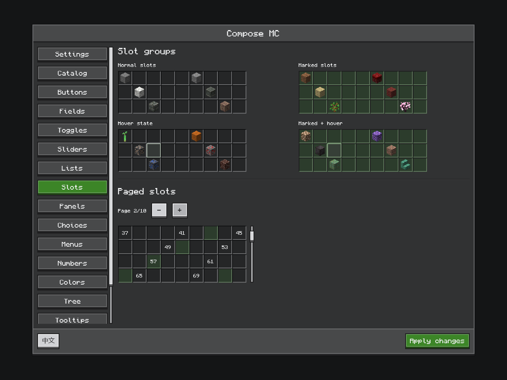

# Containers and slot policies

[简体中文](../zh-CN/inventory.md) · [Documentation](../README.md)

Use `NeoForgeComposeInventoryScreen` to arrange real menu slots with Compose. It retains the native container screen and its input/render hooks. Forge 1.20.1 provides `ForgeComposeInventoryScreen` in `dev.composemc.forge`.



*Slot presentation examples captured in the packaged 1.21.1 OpenGL preview. These demonstrate visual states; the example below connects a real menu.*

## Choose the host

| Host | Use |
| --- | --- |
| `NeoForgeComposeScreen` | Client UI with no native menu lifecycle |
| `NeoForgeComposeMenuScreen<M>` | Server-backed menu with **no slots** |
| `NeoForgeComposeInventoryScreen<M>` | Menu with native slots and container gestures |
| `NeoForgeSlotBehaviorScreen<M>` | Native-rendered container with shared slot policies |

The no-slot menu host rejects menus containing slots. Register NeoForge menu screens with `RegisterMenuScreensEvent`; Forge 1.20.1 uses `MenuScreens.register` from client setup's `enqueueWork`.

## Lay out a menu

Call this factory from a client menu-screen registration. It captures IDs and the title before composition. The sample is intended for a small fixed-size inventory; larger layouts should scroll or page their visible slots.

```kotlin
import androidx.compose.foundation.layout.*
import androidx.compose.ui.Modifier
import androidx.compose.ui.unit.dp
import dev.composemc.neoforge.NeoForgeComposeInventoryScreen
import dev.composemc.ui.ore.layout.OreScreen
import net.minecraft.network.chat.Component
import net.minecraft.world.inventory.AbstractContainerMenu

fun <M : AbstractContainerMenu> inventoryScreen(menu: M, title: Component): NeoForgeComposeInventoryScreen<M> {
    val ids = menu.slots.indices.toList()
    val caption = title.string
    return NeoForgeComposeInventoryScreen(menu, title, content = { slots ->
        OreScreen(caption, panelModifier = slots.areaModifier()) {
            ids.chunked(9).forEach { row ->
                Row(horizontalArrangement = Arrangement.spacedBy(1.dp)) {
                    row.forEach { id -> slots.Slot(id, Modifier.size(18.dp)) }
                }
            }
        }
    })
}
```

Slot IDs are native menu/protocol IDs, not row numbers. Do not place the same slot ID twice simultaneously. `areaModifier()` reports the container area. `bounds(id)` and `areaBounds()` expose clipped GUI-unit rectangles for integrations; unplaced slots have no bounds. GUI units and framebuffer pixels are different coordinate spaces.

## Preserve native behavior

The host retains vanilla clicks, dragging, double-click collection, swaps, drops, carried-stack drawing and container hooks. `VanillaMenuSlotAdapter` snapshots ordinary items and executes through Minecraft's existing click/prediction path. Empty slots retain their native background icon hints.

Use `inventoryTick()` to publish game-thread snapshots or drain a `UiBinding`. Keep that binding while a recipe viewer temporarily replaces the screen and the same menu remains active. Rendering resources may close during the visit; final menu closure/replacement is the point to dispose business bindings.

Call `slots.Interaction(enabled = !overlayBlocksInventory)` from composition when an overlay should block native slot input. The host cancels partial captures on disabling, resize or focus loss. Text editing gets priority over container shortcuts; `hasTextInputFocus` is available on Compose screen hosts.

If synchronized outbound action fragments are queued, supplied inventory hosts suspend native inventory gestures to preserve ordering with vanilla packets. A custom executor must honor `menuSync().isSendingAction()` too. See [menu synchronization](menu-sync.md).

## Customize a slot

`MenuSlotAdapter` provides `visual`, `behavior`, `canDragTo`, `execute`, `localAction` and `tooltip` hooks. These hooks own live-game access; composables receive snapshots. `MenuSlotVisual` carries the item handle, full/compact amount labels and marked style. Reuse an icon for quantity-only changes. Custom drawn resources need a custom tooltip hook.

For example, this immutable policy turns right click into a local action:

```java
SlotBehavior context = SlotBehavior.standard()
    .replaceClick(1, new SlotIntent.Local("example:context"));
```

Imports are `dev.composemc.slots.SlotBehavior` and `SlotIntent`. Return the policy from the adapter's `behavior` hook, or override `slotBehavior`/`localSlotAction` in `NeoForgeSlotBehaviorScreen`. Replacing right click also suppresses its drag phases. Other standard gestures remain available. Local actions do not send packets or grant permission to modify server inventory.

## Declare Shift-click routes

Build routes after allocating slots. This example describes storage IDs 0–8, player IDs 9–35 and hotbar IDs 36–44:

```java
SlotTransferRoutes routes = SlotTransferRoutes.builder(45)
    .group("storage", 0, 9)
    .group("player", 9, 36)
    .group("hotbar", 36, 45, true)
    .route("player", "storage")
    .route("hotbar", "storage")
    .route("storage", "hotbar", "player")
    .build();
```

Import `dev.composemc.slots.SlotTransferRoutes`. Ranges are disjoint and end-exclusive; `true` reverses destination traversal. Rebuild routes if slot allocation changes. In the menu's `quickMoveStack`, delegate ordinary item transfers to `dev.composemc.neoforge.slots.NativeSlotTransfers.quickMove(this, player, slotId, routes)`.

The executor merges matching stacks before filling empty slots, respects pickup/placement and stack limits, and calls native source hooks. It is not a rollback transaction manager. Crafting/merchant result slots are rejected by the generic executor. Ghost slots, virtual resources and special crafting outputs need consumer-owned execution; the same route declarations can still be reused.

The Java 17 `slot-core` module contains only policies and routes. Native gesture translation, packets and execution live in version adapters. [Architecture](architecture.md) documents the small target-specific access transformers used for slot and container geometry and rendering.
