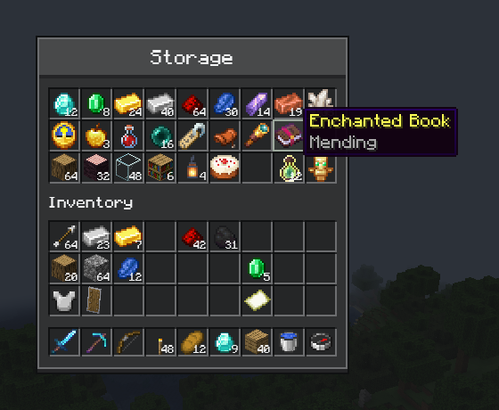

# Container screens

[简体中文](../zh-CN/inventory.md) · [All guides](../README.md)

`ComposeInventoryScreen` lays out a menu's real slots with Compose. Everything else stays native: clicking, dragging, double-click collecting, shift-clicking, the carried stack, slot tooltips, and the hooks that recipe viewers and other mods rely on.



## Lay out a menu

This screen is for a menu with 27 storage slots followed by the player's inventory, like a chest:

```kotlin
class StorageScreen(menu: StorageMenu, inventory: Inventory, title: Component) :
    ComposeInventoryScreen<StorageMenu, Unit, Nothing>(menu, title) {
    private val caption = title.string

    override fun snapshot() {}

    override fun handle(action: Nothing) {}

    @Composable
    override fun Content(state: Unit, slots: ComposeMenuSlots<StorageMenu>) {
        OreScreen(caption, maxWidth = 176.dp, maxHeight = 190.dp, panelModifier = slots.areaModifier()) {
            SlotGrid(slots, 0 until 27)
            OreText("Inventory")
            SlotGrid(slots, 27 until 54)
            SlotGrid(slots, 54 until 63)
        }
    }
}

@Composable
fun SlotGrid(slots: ComposeMenuSlots<*>, ids: IntRange) {
    Column {
        for (row in ids.chunked(9)) Row { for (id in row) slots.Slot(id) }
    }
}
```

Register it like any other menu screen, from your client mod constructor:

```kotlin
modBus.addListener { event: RegisterMenuScreensEvent ->
    event.register(ModMenus.STORAGE.get(), ::StorageScreen)
}
```

- `slots.Slot(id)` places the menu slot with that index. Place each slot once; slots you leave out are hidden.
- `slots.areaModifier()` marks the area other mods treat as the container, for example to place recipe viewer panels beside it.
- Read the title and other game objects before composition, as `caption` does here.
- The slots already show the menu's items, so this screen needs no state of its own: `Unit` and `Nothing` say so, as for any [screen without game state](getting-started.md#4-show-game-data).

On Forge 1.20.1, register the screen with `MenuScreens.register` inside `FMLClientSetupEvent.enqueueWork`.

`ComposeInventoryScreen` caches up to 256 icons across the whole screen; [Large grids](items.md#large-grids) shows how to change that.

## Show the menu's state

When the screen shows more than slots, give it a state type. This version of `StorageScreen` reads the menu in `snapshot`, draws the latest snapshot with the slots in `Content`, and runs the actions the UI sends in `handle`:

```kotlin
data class StorageState(val used: Int, val locked: Boolean)

class StorageScreen(menu: StorageMenu, inventory: Inventory, title: Component) :
    ComposeInventoryScreen<StorageMenu, StorageState, Boolean>(menu, title) {
    private val caption = title.string

    override fun snapshot() = StorageState((0 until 27).count { container.getSlot(it).hasItem() }, container.locked())

    override fun handle(action: Boolean) {
        container.requestLocked(action)
    }

    @Composable
    override fun Content(state: StorageState, slots: ComposeMenuSlots<StorageMenu>) {
        OreScreen(
            caption,
            maxWidth = 176.dp,
            maxHeight = 210.dp,
            onClose = ::requestClose,
            panelModifier = slots.areaModifier(),
        ) {
            Row(verticalAlignment = Alignment.CenterVertically) {
                OreText("${state.used} / 27 used", Modifier.weight(1f))
                OreSwitch(state.locked, onCheckedChange = { send(it) })
            }
            SlotGrid(slots, 0 until 27)
            OreText("Inventory")
            SlotGrid(slots, 27 until 54)
            SlotGrid(slots, 54 until 63)
        }
    }
}
```

Here `locked` and `requestLocked` stand for your menu's own state, for example kept in sync with [menu sync](menu-sync.md).

- `snapshot` runs on the game thread when the screen opens, every tick, and after an input event whose actions `handle` has just run.
- `requestClose()` closes the screen from the UI, as the panel's close button does here.
- `ComposeMenuScreen` works the same way for menus without slots; its `Content(state)` has no slots.

## Choose a screen class

| Class | For |
| --- | --- |
| `ComposeScreen` | Screens without a menu |
| `ComposeMenuScreen` | Server menus without slots |
| `ComposeInventoryScreen` | Menus with slots |
| `SlotBehaviorScreen` | Container screens you draw natively, with CompixelUI's slot rules |

All three Compose classes have `snapshot`, `handle`, `Content` and `requestClose()`; the two menu screens also have `menuClosed()`.

## Change what a click does

Slot rules are immutable `SlotBehavior` values. This one turns right-click into your own action instead of splitting a stack:

```java
SlotBehavior inspect = SlotBehavior.standard()
    .replaceClick(1, new SlotIntent.Local("example:inspect"));
```

Return it from your `MenuSlotAdapter`'s `behavior` hook, or override `slotBehavior` in a `SlotBehaviorScreen`, and handle the action in `localAction`. Other gestures stay as they are. A local action sends nothing to the server by itself.

`MenuSlotAdapter` also decides what each slot shows (`visual`), where dragging may go (`canDragTo`) and how clicks run (`execute`). The default, `VanillaMenuSlotAdapter`, does what Minecraft does.

### Draw slots yourself

`slots.Slot(id)` draws a slot in Ore's look. To give slots a look of your own, pass the slot's size and draw its content:

```kotlin
slots.Slot(id, Modifier.size(18.dp)) { slot ->
    Box(Modifier.matchParentSize().background(if (slot.hovered) Color(0xFFC6C6C6) else Color(0xFF8B8B8B)))
    slot.icon?.let { MinecraftItemIcon(it, Modifier.fillMaxSize().padding(1.dp)) }
    if (slot.amount.isNotEmpty()) BasicText(slot.amount, Modifier.align(Alignment.BottomEnd))
}
```

`slot` holds what the slot shows: its `icon`, the `amount` label and a shorter `compactAmount`, whether it is `marked`, and whether the pointer is over it (`hovered`). `hovered` marks the slot a click would reach: it follows the pointer while a button is held, and it is false while the screen's slot interactions are disabled. Slots in Ore's look light up by it too. Clicks, drags, shift-clicks and tooltips work as for slots in Ore's look, and your `MenuSlotAdapter`'s `visual` still decides the icon and labels.

To keep Ore's look and add a mark of your own, pass `overlay`. It gets the same `slot` and draws above Ore's look:

```kotlin
slots.Slot(id, overlay = { slot ->
    if (slot.hovered) Box(Modifier.matchParentSize().border(1.dp, Color.White))
})
```

## Shift-click routes

Declare where shift-clicked items go, then let `quickMoveStack` use the routes:

```java
SlotTransferRoutes routes = SlotTransferRoutes.builder(63)
    .group("storage", 0, 27)
    .group("inventory", 27, 54)
    .group("hotbar", 54, 63, true)
    .route("storage", "hotbar", "inventory")
    .route("inventory", "storage")
    .route("hotbar", "storage")
    .build();

@Override
public ItemStack quickMoveStack(Player player, int slot) {
    return NativeSlotTransfers.quickMove(this, player, slot, routes);
}
```

Ranges exclude their end, and `true` fills that group from its last slot. Stacks merge into matching stacks before filling empty slots, and every slot's limits still apply. Result slots, such as crafting output, need their own handling.

## Overlays and other screens

- Call `slots.Interaction(enabled = false)` while a dialog or window should block slot clicks.
- When a recipe viewer opens its own screen over yours, your screen keeps its content and comes back as it was; see [covered screens](transitions.md#covered-screens).
- Override `menuClosed()` for work that should happen once, when the screen closes for good, such as saving a search text. A recipe viewer covering the screen doesn't call it.
