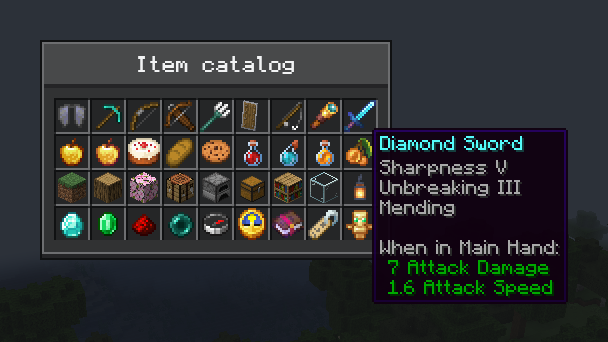

# Items and tooltips

[简体中文](../zh-CN/items.md) · [All guides](../README.md)

CompixelUI draws real Minecraft items inside Compose, with the same models, animations and enchantment glint as an inventory, plus the game's own item tooltips.



## Show items

Take a snapshot of each stack on the game thread with `ItemIcon.snapshot`, then hand the icons to Compose:

```kotlin
fun openItemCatalog(stacks: List<ItemStack>) {
    val icons = stacks.map { ItemIcon.snapshot(it) }
    Minecraft.getInstance().setScreen(ComposeScreen(Component.literal("Item catalog")) {
        OreScreen("Item catalog", maxWidth = 176.dp, maxHeight = 110.dp) {
            LazyVerticalGrid(GridCells.FixedSize(18.dp)) {
                items(icons) { icon ->
                    MinecraftItemTooltip(icon) {
                        OreSlot { MinecraftItemIcon(icon, Modifier.fillMaxSize()) }
                    }
                }
            }
        }
    })
}
```

- `MinecraftItemIcon` behaves like any other composable: size, clip, rotate or fade it.
- `MinecraftItemTooltip` shows the tooltip after the pointer rests for 500 ms, drawn by Minecraft itself, so lines added by other mods appear too.
- An icon holds its own copy of the stack. Reuse it while the stack stays the same, and take a new snapshot when it changes.

The types are in `dev.compixel.forge.item`.

## Animation

Icons follow the game on their own: enchantment glint, animated textures, compasses, clocks and cooldowns. Pass a refresh policy to `snapshot` to change that:

| Policy | Redraws the icon |
| --- | --- |
| `IconRefresh.AUTO` (default) | Every game tick while the item animates, as with glint or animated textures; otherwise when its look changes |
| `IconRefresh.GAME_TICK` | Every game tick |
| `IconRefresh.FRAME` | Every frame |
| `IconRefresh.every(ms)` | At a fixed interval, 16 to 60,000 ms |
| `IconRefresh.STATIC` | Never; the first image stays |

Animated icons redraw once per game tick, the rate at which Minecraft animates its textures. Choose `GAME_TICK` for items whose custom renderer animates without changing its model, and `FRAME` only for drawings that must move faster.

## Draw your own icons

`ItemIcon.drawn` turns any `GuiGraphics` drawing inside a 16×16 area into an icon, for things that aren't items, such as fluids or energy:

```kotlin
val water = ItemIcon.drawn("Water", { graphics ->
    graphics.fill(0, 0, 16, 16, 0xFF3F76E4.toInt())
})
```

The drawing runs on the render thread and repeats every game tick unless you pass another policy. Drawn icons have no item tooltip; wrap them in an [OreTooltip](ore-ui.md#tooltips) instead.

## Large grids

Every icon on screen gets its image, however many there are. Icons are drawn into atlas pages of up to 64 icons each. A page redraws only its due icons, so an animated item doesn't redraw the icons beside it. Pages are added as more icons appear, and discarded once their icons are gone.

Set `nativeItemOptions` when creating a `ComposeScreen`, `ComposeMenuScreen`, `ComposeInventoryScreen` or `ComposeHudLayer` to tune this for that screen or layer:

```kotlin
ComposeScreen(title, nativeItemOptions = NativeItemOptions(cacheCapacity = 512)) { … }

ComposeInventoryScreen(
    menu,
    title,
    nativeItemOptions = NativeItemOptions(cacheCapacity = 1024),
) { slots ->
    // Lay out the menu's slots here.
}
```

`NativeItemOptions` is in `dev.compixel.forge.item`.

| Option | Default | Range | Meaning |
| --- | --- | --- | --- |
| `cacheCapacity` | 128; 256 for inventory screens | 1–1024 | Icons kept while fewer are on screen. An icon that scrolls out of view stays cached while it fits, and returns without being drawn again |
| `preparationsPerFrame` | 64 | 1–64 | Maximum number of icons drawn in one frame, and the number of icons on one atlas page |
| `imageSize` | The pixels each icon is laid out with | 16–256 | Pixel size used to draw each 16×16 icon. By default an icon is drawn with the pixels it is laid out with, so it shows pixel for pixel at any size and matches Minecraft's own item rendering at 16 dp. An icon shown at two sizes is drawn at both; a size that keeps changing, as in an animation, shows the nearest drawn size until it settles. A fixed size draws each icon once and resamples it on screen |

A screen that shows more icons than `preparationsPerFrame` fills in over a few frames. Each page holds icons of one size: 64 icons shown at 16 dp take about 4 MB of GPU memory at GUI scale 4, about 1 MB at scale 2 and about 9 MB at scale 6, and larger icons take more with the square of their size. Reusing the same `ItemIcon` handle shares one image; separately created handles get separate images, even for identical stacks.

## See also

- [Container screens](inventory.md) show items, counts and tooltips for real menu slots on their own.
- [HUD layers](hud.md) can show item icons too; tooltips need a screen.
