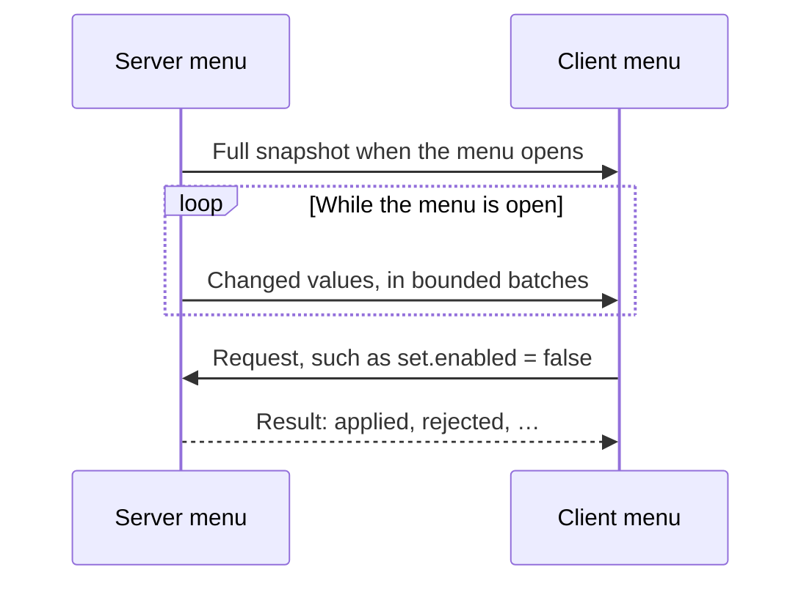

# Menu synchronization

[简体中文](../zh-CN/menu-sync.md) · [All guides](../README.md)

Menu sync keeps the state of a server-side menu on the client, and carries typed requests from the client back to the server. CompixelUI batches, splits and acknowledges the traffic; your menu keeps its own rules about who may change what.



Install CompixelUI on both the server and the client, and declare the dependency with `side = "BOTH"`. Menu sync has no UI code, so it runs on a dedicated server.

## Declare the state

Implement `SyncedMenu` on your menu and describe its fields in a `SyncSchema`:

```java
abstract class PowerMenu extends AbstractContainerMenu implements SyncedMenu {
    private long energy;
    private boolean enabled;

    private static final SyncSchema<PowerMenu> SCHEMA =
        SyncSchema.<PowerMenu>builder("example:power", 1)
            .field("energy", SyncCodecs.LONG, m -> m.energy, (m, v) -> m.energy = v)
            .field("enabled", SyncCodecs.BOOLEAN, m -> m.enabled, (m, v) -> m.enabled = v)
            .build();

    private static final MenuAction<PowerMenu, Boolean> SET_ENABLED = MenuAction.of(
        "set.enabled", SyncCodecs.BOOLEAN,
        (menu, player, value) -> menu.mayConfigure(player) && menu.applyEnabled(value));

    private final MenuSync<PowerMenu> sync = MenuSync.bind(this, SCHEMA).action(SET_ENABLED);

    protected PowerMenu(MenuType<?> type, int id) { super(type, id); }
    @Override public MenuSync<?> menuSync() { return sync; }

    public void captureMachine(long energy, boolean enabled) {
        this.energy = energy;
        this.enabled = enabled;
    }
    public boolean requestEnabled(boolean value) { return sync.request(SET_ENABLED, value).queued(); }

    protected abstract boolean mayConfigure(ServerPlayer player);
    protected abstract boolean applyEnabled(boolean value);
}
```

- On the server, call `captureMachine` whenever the machine changes. The new values reach every client viewing the menu.
- On the client, call `requestEnabled` from the game thread, for example in the `handle` of a `ComposeMenuScreen`. `true` means the request was queued, not that it succeeded.
- The action handler runs on the server. Check permissions there, then change the machine.

Imports are in `dev.compixel.sync.state` (schemas and codecs), `dev.compixel.sync.action` and `dev.compixel.forge.sync` (menu binding).

## Values

Getters must return immutable, non-null values. To change a value, replace it; don't mutate it in place.

| Codec | For |
| --- | --- |
| `SyncCodecs.INT`, `LONG`, `BOOLEAN`, `UUID` | Plain values |
| `SyncCodecs.string(maxBytes)` | Strings up to a UTF-8 size |
| `SyncCodecs.enumeration(MyEnum.class)` | Enums with up to 256 constants |
| `SyncCodec.of(id, writer, reader)` | Your own types |
| `MinecraftSyncCodecs.registry(id, maxBytes, streamCodec)` | Minecraft values such as `ItemStack` |

```java
private static final SyncCodec<ItemStack> ITEM =
    MinecraftSyncCodecs.registry("example:item/1", 64 * 1024, ItemStack.OPTIONAL_STREAM_CODEC);
```

On Forge 1.20.1, use `MinecraftSyncCodecs.buffer(id, maxBytes, codec)` with a `FriendlyByteBuf` codec instead. Change a codec's ID or the schema version whenever its wire format changes.

## Collections

`keyedCollection` syncs a list whose entries have unique keys. For large collections with frequent small changes, use a `SyncMap` with `keyedMap`: only changed entries are sent.

```java
final class CatalogState {
    record Entry(int id, String name) {}
    private SyncMap<Integer, Entry> entries = SyncMap.empty();

    private static final SyncCodec<String> NAME = SyncCodecs.string(256);
    private static final SyncCodec<Entry> ENTRY = SyncCodec.of("example:entry/1",
        (out, entry) -> { out.writeInt(entry.id()); NAME.write(out, entry.name()); },
        in -> new Entry(in.readInt(), NAME.read(in)));

    static final SyncSchema<CatalogState> SCHEMA = SyncSchema.<CatalogState>builder("example:catalog", 1)
        .keyedMap("entries", SyncCodecs.INT, ENTRY, Entry::id, m -> m.entries, (m, v) -> m.entries = v)
        .build();

    void upsert(int id, String name) { entries = entries.with(id, new Entry(id, name)); }
    void remove(int id) { entries = entries.without(id); }
}
```

A map has no order; sort it where you display it. `current.forEachChange(previous, handler)` lists what changed between two versions. On the client, `sync.onUpdate(menu -> …)` runs once a complete update has arrived.

## Requests and results

`request(action, value)` returns an `ActionSubmission`. If it wasn't queued, `failure()` says why:

| Failure | Meaning |
| --- | --- |
| `QUEUE_BYTES`, `PENDING_ACTIONS` | Too much is already waiting. Try again later. |
| `BODY_BYTES`, `CODEC` | The value is too large or invalid for this action. |
| `NOT_READY`, `CLOSED`, `TRANSPORT_UNAVAILABLE`, `UNKNOWN_ACTION` | The menu or connection can't take requests now. |

`actual()` and `limit()` give the sizes involved. Nothing is retried automatically.

Register `onActionResult(listener)` before the menu opens to hear back from the server. Results are `APPLIED`, `REJECTED`, `INVALID`, `THROTTLED` or `EXPIRED`; the new state itself arrives through normal syncing. Rejections are also logged, at most once per 100 ticks per menu.

## Limits

Every limit can be changed by passing `MenuSyncOptions` to `MenuSync.bind`. Both sides must use the same options. The defaults:

| Server → client | Default |
| --- | --- |
| Batch size | 128 KiB |
| Transfer rate | 32 KiB per tick, bursts up to 4 MiB, at most 256 KiB per tick |
| Batches awaiting acknowledgement | 16 |
| Largest single value | 1 MiB |
| Largest snapshot or update | 32 MiB |
| Collection entries in total | 100,000 |
| Timeout without progress | 200 ticks |

| Client → server | Default |
| --- | --- |
| Packet size | 16 KiB |
| Transfer rate | 32 KiB per tick, bursts up to 4 MiB, at most 256 KiB per tick |
| Queued request data | 4 MiB |
| Requests waiting for a result | 32 |
| Requests per tick | 16 |
| Timeouts (queue, progress, reply) | 200 ticks each |

A single action is limited to 8 KiB unless you declare more with `MenuAction.of(id, codec, maxBytes, handler)`. Larger values are split into packets automatically.

```java
static final MenuSyncOptions OPTIONS = MenuSyncOptions.DEFAULT
    .withState(new SyncLimits(128 * 1024, new TransferBudget(64 * 1024, 8L * 1024 * 1024, 512 * 1024),
        16, 2 * 1024 * 1024, 64L * 1024 * 1024, 250_000, 400));

MenuSync.bind(this, SCHEMA, OPTIONS);
```

## Readiness

`hasSnapshot()` becomes true once the first complete state has arrived, and stays true while later updates stream in. `status()` and `statistics()` report progress. Updates are applied all at once, so the UI never sees half an update.
