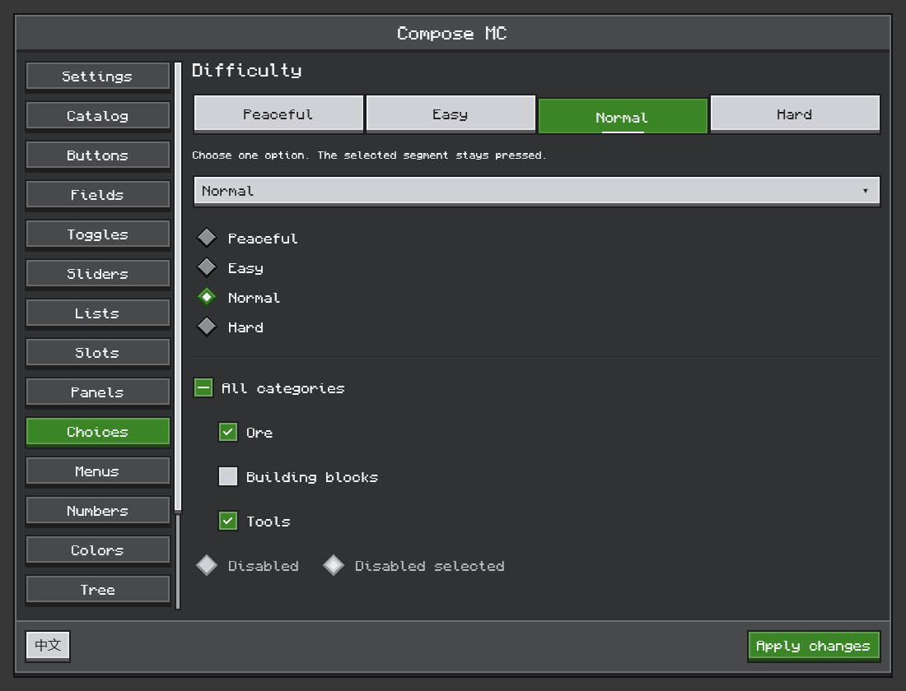
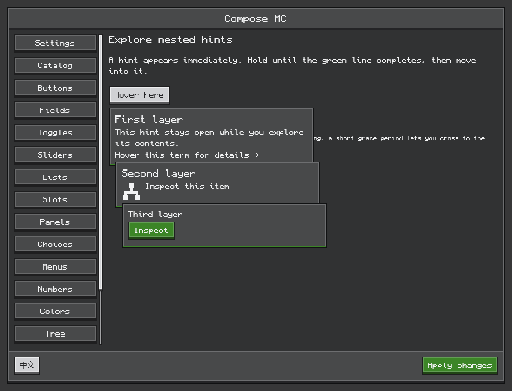
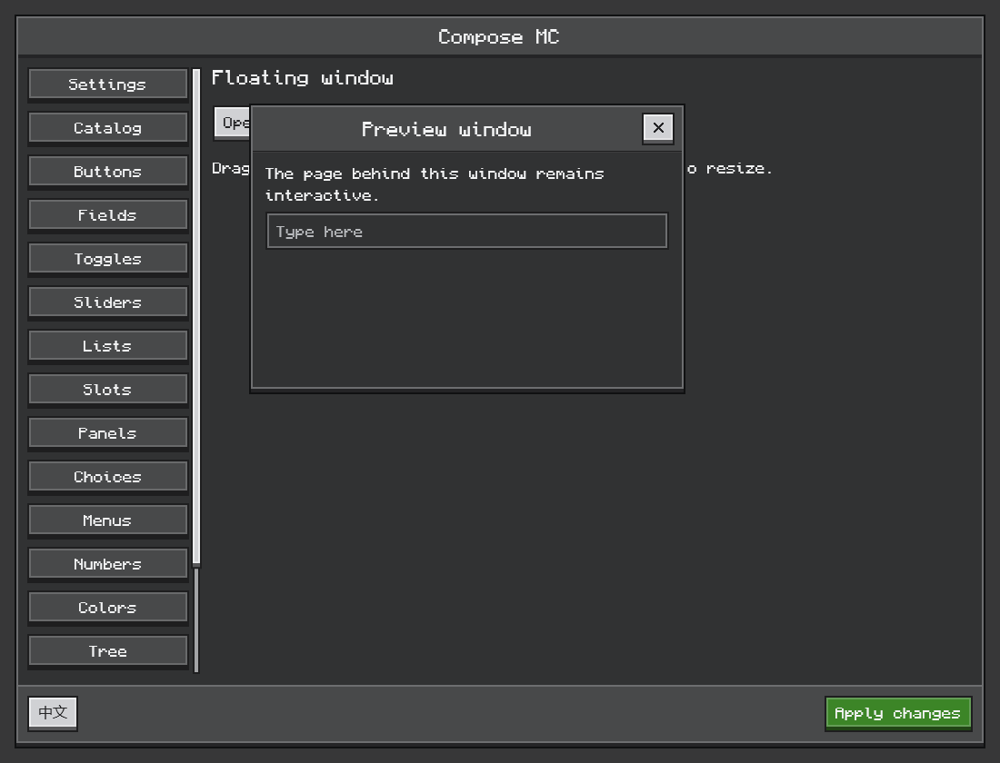

# Ore UI

[简体中文](../zh-CN/ore-ui.md) · [Documentation](../README.md)

Minecraft-facing controls live in the subpackages of `dev.composemc.ui.ore`. The module is built on Compose Foundation and has no Minecraft dependency. Screen adapters install `OreTheme`; standalone compositions should wrap their content in it. Standard Compose layouts, state and modifiers remain available.



*Offscreen render of the shared preview: joined tabs, select, radio buttons and mixed selection.*

## Choose a component

All package names below have the prefix `dev.composemc.ui.ore.`.

| Package | Responsibility | Components and related types |
| --- | --- | --- |
| `theme` | Theme configuration and feedback | `OreTheme`, `OreColors`, `OreTypography`, `OreFeedback` |
| `display` | Read-only presentation | `OreText`, `OreIcon`, `OreGlyph`, `OreProgressBar` |
| `layout` | Surfaces and page structure | `OreSurface`, `OreSurfaceStyle`, `OrePanel`, `OreScreen`, `OreDivider` |
| `button` | Action triggers | `OreButton`, `OreButtonStyle`, `OreIconButton` |
| `input` | Text, numeric and color editing | `OreTextField`, `OreIntField`, `OreLongField`, `OreDoubleField`, `OreSlider`, `OreColorPicker` |
| `selection` | Discrete value selection | `OreSelect`, `OreRadioButton`, `OreTabButton`, `OreCheckbox`, `OreSwitch` |
| `navigation` | Tabs, list rows and trees | `OreTab`, `OreListItem`, `OreTreeView`, `OreTreeNode` |
| `scroll` | Scrolling controls | `OreScrollbar`, `OreScrollTrack` |
| `overlay` | Menus, tooltips, dialogs and floating windows | `OreMenu`, `OreMenuItem`, `OreContextMenuArea`, `OreTooltip`, `OreDialog`, `OreWindow`, `OreWindowState`, `rememberOreWindowState` |
| `inventory` | Slot presentation | `OreSlot`; use the [inventory host](inventory.md) for actual container interaction |

`OreTabButton` selects a value in a joined group, so it belongs to `selection`; `OreTab` represents page navigation. `OreSlider` edits a value, while `OreProgressBar` only displays one.

## Imports and source organization

Import components from their owning subpackage. Kotlin wildcard imports do not include subpackages: the former `dev.composemc.ui.ore.*` import must be replaced. For example, text is now `dev.composemc.ui.ore.display.OreText`, and all four text/numeric fields live in `dev.composemc.ui.ore.input`. Consumers must recompile against the rebuilt library; previous JVM package names are not retained as aliases.

Each independent public component has a matching file. Overloads and component-specific types stay together: `OreButtonStyle` lives with `OreButton`, `OreMenuItem` with `OreMenu`, and window state with `OreWindow`. Theme colors, typography and feedback each have their own file. Numeric editing and popup positioning helpers stay beside the components that use them; cross-component frame drawing lives in `internal`. These helpers remain Kotlin `internal` and are not consumer APIs. Add new components to the appropriate package instead of a general `Controls` file.

## Custom icon buttons

`OreGlyph` is the bundled glyph catalog, named by shape and complete within each family: four-way arrows and chevrons; plus, minus, cross and checkmark; bars and both ellipses; circled checkmark, information and exclamation marks and a warning triangle; and common tools (magnifying glass, pencil, trash, gear, sliders, funnel and cycle arrows). Keep domain icons in the consumer as `OrePixelArt`, 16 rows of 16 `#`/`.` cells drawn with `OreIcon(art)` in the same style; `mirrored()` and `rotated()` derive other directions. `OreIconButton` also accepts an `icon: @Composable (Color) -> Unit` slot, so consumers can supply pixel art, a painter, vector, Canvas or prepared native image. The button keeps its styling, click/keyboard handling, feedback, disabled state and tooltip. The slot receives the current foreground color, including secondary-button contrast and disabled colors; use it to tint monochrome visuals. A full-color image may omit the tint.

```kotlin
import androidx.compose.foundation.Image
import androidx.compose.foundation.layout.size
import androidx.compose.runtime.Composable
import androidx.compose.ui.Modifier
import androidx.compose.ui.graphics.ColorFilter
import androidx.compose.ui.graphics.painter.Painter
import androidx.compose.ui.unit.dp
import dev.composemc.ui.ore.button.OreIconButton

@Composable
fun RefreshButton(painter: Painter, onRefresh: () -> Unit, enabled: Boolean = true) {
    OreIconButton(contentDescription = "Refresh", onClick = onRefresh, enabled = enabled) { contentColor ->
        Image(painter, contentDescription = null, modifier = Modifier.size(8.dp),
            colorFilter = ColorFilter.tint(contentColor))
    }
}
```

The action's `contentDescription` also supplies its tooltip; keep the child image decorative (`contentDescription = null`) and avoid nested clickable controls in the icon slot. Size the visual inside the slot and use the button's `modifier` for its outer bounds. The `OreIconButton(OreGlyph.Pencil, description, onClick)` overload remains a convenience over this same implementation. The F8 Buttons page shows custom Canvas icons in enabled and disabled styles, and the Icons page lists every glyph by family.

## State and selection

Controls receive values and callbacks; your composition owns the state. The examples below include their imports.

```kotlin
import androidx.compose.foundation.layout.Column
import androidx.compose.runtime.*
import dev.composemc.ui.ore.selection.OreRadioButton
import dev.composemc.ui.ore.selection.OreSelect
import dev.composemc.ui.ore.selection.OreTabButton

@Composable
fun DifficultyOptions() {
    val options = listOf("Peaceful", "Easy", "Normal", "Hard")
    var selected by remember { mutableStateOf(2) }
    Column {
        OreTabButton(options, selected, { selected = it })
        OreSelect(options, options[selected], { selected = options.indexOf(it) })
        options.forEachIndexed { index, label ->
            OreRadioButton(selected == index, { selected = index }, label = label)
        }
    }
}
```

`OreTabButton` joins buttons into one single-choice group. Its options must be nonempty and the selected index valid. `OreRadioButton` represents one choice; share a selected value to make a group mutually exclusive. `OreSelect` also accepts `optionLabel`, `optionEnabled` and a placeholder when selection is null.

`OreCheckbox` has Boolean and `ToggleableState` overloads. The latter displays `Off`, `On` or `Indeterminate`; the caller defines the next state, for example selecting all members of a mixed group. Import `ToggleableState` from `androidx.compose.ui.state`.

## Editing and structured data

- Numeric controls require a value inside their declared range. `OreLongField` preserves the full signed 64-bit range without converting to floating point. `OreDoubleField` accepts finite values and positive finite steps, with decimal stepping. Numeric editors support buttons, arrow keys, wheel input and Shift/Ctrl step sizes. Incomplete drafts stay in the editor and do not become business values. On Enter or focus loss, a complete number outside the range is clamped to the nearest bound and submitted; an incomplete draft is not submitted and resets on focus loss. Stepping from an invalid or out-of-range draft starts from the supplied value.
- `OreColorPicker` accepts a Compose `Color`, offers HSV controls and hexadecimal entry, and can hide its alpha control through `showAlpha=false`.
- `OreTreeView` accepts immutable `OreTreeNode` values, a selected ID and expanded IDs. IDs must be unique. Its callbacks report selection and expansion changes; your state decides whether to retain them. Visible rows use lazy layout, with keyboard navigation.
- Supply localized labels, option text, placeholders and accessibility descriptions. Built-in English defaults are conveniences, not automatic translation of consumer content.

## Menus and context menus

For a button-anchored menu, put `OreMenu` and its trigger inside the same `Box`. The caller owns `expanded`. Each `OreMenuItem` needs a unique ID and an activation callback; optional checked, disabled, destructive and shortcut labels affect presentation. Shortcut text alone does not register a key binding.

```kotlin
import androidx.compose.foundation.layout.Box
import androidx.compose.runtime.*
import dev.composemc.ui.ore.button.OreButton
import dev.composemc.ui.ore.overlay.OreMenu
import dev.composemc.ui.ore.overlay.OreMenuItem

@Composable
fun ActionMenu(onInspect: () -> Unit) {
    var expanded by remember { mutableStateOf(false) }
    Box {
        OreButton("Actions", { expanded = true })
        OreMenu(expanded, { expanded = false }, listOf(
            OreMenuItem("inspect", "Inspect", onClick = onInspect),
        ))
    }
}
```

`OreContextMenuArea(items) { content() }` supplies a right-click trigger at the pointer. Menus support arrows, Home/End and activation keys; Escape/Tab dismiss them. Native inventory right-click handling still belongs to the [slot policy](inventory.md), since a Compose context area alone does not replace the container's input hooks.

## Interactive, nested tooltips

`OreTooltip` appears immediately when the pointer enters its trigger. Before locking, leaving closes it immediately. A progress line fills during the default 600 ms dwell. Once locked, a 350 ms exit grace period lets the pointer cross into the body. Hovering the body or a descendant keeps ancestors open. Blur, disabling or removing the trigger dismisses it.

```kotlin
import androidx.compose.runtime.*
import dev.composemc.ui.ore.display.OreText
import dev.composemc.ui.ore.overlay.OreTooltip

@Composable
fun EquipmentHint() {
    OreTooltip(tooltip = {
        OreText("Equipment details")
        OreTooltip(tooltip = { OreText("Increases movement speed.") }) {
            OreText("Speed effect")
        }
    }) {
        OreText("Hover for details")
    }
}
```

Set `lockDelayMillis` and `exitDelayMillis` to tune those timings. The rich body can contain any composable, including a prepared item image and another `OreTooltip`. `MinecraftItemTooltip` is a separate native-content API with different timing and rendering; see [native content](native-content.md).



## Floating windows and dialogs

Place a window after page content in a bounded `Box`. Keep its state and decide when to show it:

```kotlin
import androidx.compose.foundation.layout.Box
import androidx.compose.foundation.layout.fillMaxSize
import androidx.compose.runtime.*
import androidx.compose.ui.Modifier
import dev.composemc.ui.ore.button.OreButton
import dev.composemc.ui.ore.display.OreText
import dev.composemc.ui.ore.overlay.OreWindow
import dev.composemc.ui.ore.overlay.rememberOreWindowState

@Composable
fun WindowExample() {
    var open by remember { mutableStateOf(false) }
    val window = rememberOreWindowState()
    Box(Modifier.fillMaxSize()) {
        OreButton("Open details", { open = true })
        if (open) OreWindow("Details", { open = false }, window) {
            OreText("Drag the title; resize an edge or corner.")
        }
    }
}
```

`OreWindow` stays inside the scene. It supports title dragging and eight resize handles, clamps to its parent and defaults to a 120×80 dp minimum. Covered Compose controls do not receive the same click; the surrounding page stays interactive. You control ordering between multiple windows. Use `OreDialog` for modal interaction. Inventory screens must separately gate native slot input when an overlay should block it.



## Appearance and fonts

Use `OreColors` and `OreTypography` through `OreTheme` to customize appearance. Flat, inset and raised surfaces share pixel-aligned framing. Button styles include primary, secondary, destructive and quiet; focus, hover, press and disabled states are distinct.

`OreSlot` defaults to an 18 dp frame and a 16 dp content area. Frame size and `contentModifier` are independent. Scaling the frame alone does not enlarge its contents.

The bundled Monocraft font uses the [SIL Open Font License](../../ui-ore/src/main/resources/dev/composemc/ui/ore/Monocraft-LICENSE.txt). Missing scripts use Compose/Skia platform fallback; CJK appearance depends on available fonts. Supply your own font family when consistent coverage across platforms is required. No Minecraft font or texture files are bundled by `ui-ore`.

The [F8 and desktop previews](build-and-test.md) use these same components. Source and full parameter lists live in [ui-ore](../../ui-ore/src/main/kotlin/dev/composemc/ui/ore).
