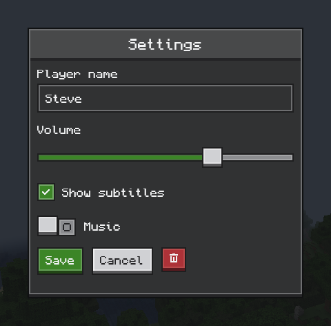
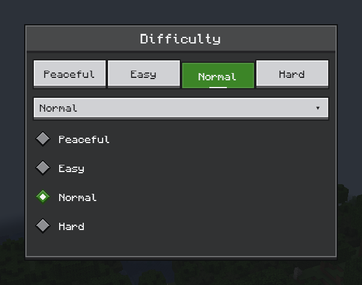
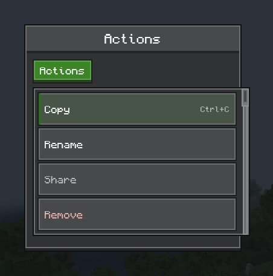
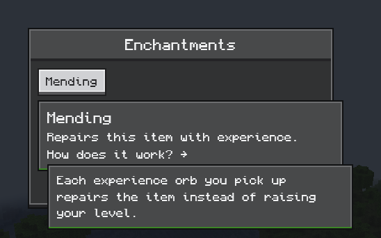
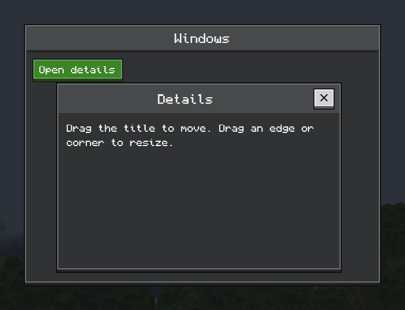
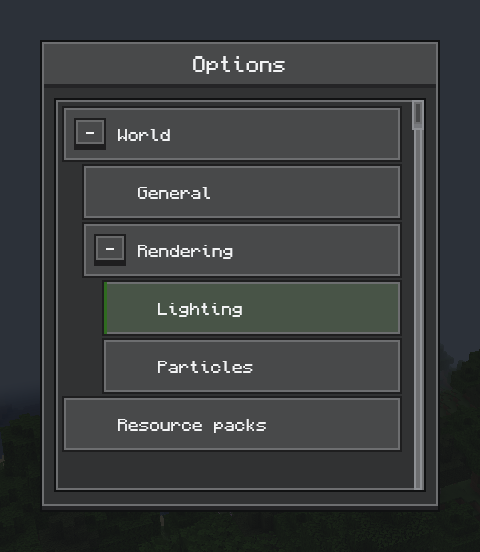
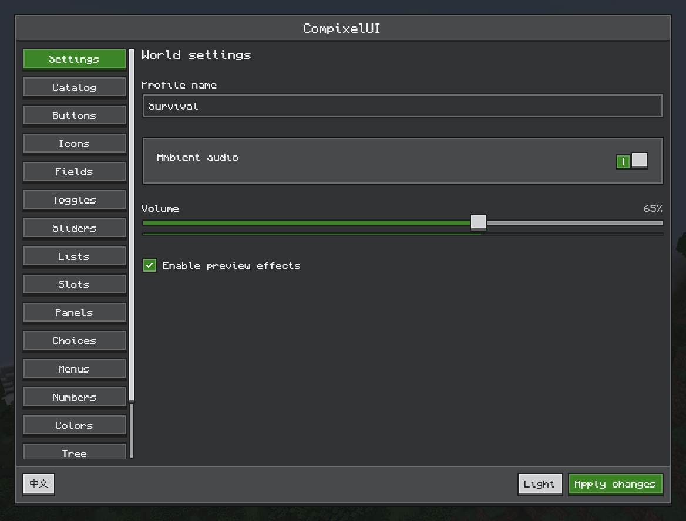

# Ore UI

[简体中文](../zh-CN/ore-ui.md) · [All guides](../README.md)

Ore UI is CompixelUI's set of Minecraft-styled components: pixel text, beveled buttons, inset fields and dark stone panels. CompixelUI screens apply the theme for you, and standard Compose layouts, state and modifiers work alongside it.

Like other Compose components, controls take a value and a callback, and your code owns the state.

## Components

Each package below is under `dev.compixel.ui.ore`.

| Package | Components |
| --- | --- |
| `layout` | `OreScreen`, `OrePanel`, `OreSurface`, `OreDivider` |
| `display` | `OreText`, `OreIcon`, `OreGlyph`, `OreProgressBar` |
| `button` | `OreButton`, `OreIconButton` |
| `input` | `OreTextField`, `OreIntField`, `OreLongField`, `OreDoubleField`, `OreSlider`, `OreColorPicker` |
| `selection` | `OreCheckbox`, `OreSwitch`, `OreRadioButton`, `OreTabButton`, `OreSelect` |
| `navigation` | `OreTab`, `OreListItem`, `OreTreeView` |
| `scroll` | `OreScrollbar`, `OreScrollTrack` |
| `overlay` | `OreMenu`, `OreContextMenuArea`, `OreTooltip`, `OreDialog`, `OreWindow` |
| `inventory` | `OreSlot` |
| `theme` | `OreTheme`, `OreColors`, `OreTypography` |

## Screens and title bars

`OreScreen` provides centering, size limits and a backdrop, using `OrePanel` for the panel itself. Both accept `showTitleBar = false` to hide the built-in title bar:

```kotlin
OreScreen(
    title = "Storage",
    showTitleBar = false,
    footer = { OreButton("Close", onClick = onClose) },
) {
    // Custom heading, toolbar or other content
    OreText("Storage contents")
}
```

`showTitleBar` defaults to `true`. Setting it to `false` removes the title, built-in close button and separator below the title bar without reserving their height, giving the space to the content. The panel frame, content padding and footer remain. If you need a close button, put it in the footer as above or in your own toolbar. An empty title string still displays the title bar.

## Buttons and inputs



```kotlin
@Composable
fun ControlsExample() {
    var name by remember { mutableStateOf("Steve") }
    var volume by remember { mutableFloatStateOf(0.7f) }
    var subtitles by remember { mutableStateOf(true) }
    var music by remember { mutableStateOf(false) }
    Column(verticalArrangement = Arrangement.spacedBy(8.dp)) {
        OreTextField(name, { name = it }, label = "Player name")
        OreText("Volume")
        OreSlider(volume, { volume = it })
        OreCheckbox(subtitles, { subtitles = it }, label = "Show subtitles")
        Row(verticalAlignment = Alignment.CenterVertically, horizontalArrangement = Arrangement.spacedBy(6.dp)) {
            OreSwitch(music, { music = it })
            OreText("Music")
        }
        Row(horizontalArrangement = Arrangement.spacedBy(6.dp)) {
            OreButton("Save", onClick = {})
            OreButton("Cancel", onClick = {}, style = OreButtonStyle.Secondary)
            OreIconButton(OreGlyph.Trash, "Delete", onClick = {}, style = OreButtonStyle.Destructive)
        }
    }
}
```

- Button styles are `Primary`, `Secondary`, `Destructive` and `Quiet`.
- `OreIntField`, `OreLongField` and `OreDoubleField` keep a number inside its range. Arrow keys and the mouse wheel step it; Shift and Ctrl take bigger steps.
- `OreColorPicker` edits a `Color`: drag its color plane and sliders, or type a hex code.
- `OreGlyph` has the common shapes: arrows, plus, cross, checkmark, magnifying glass, pencil, trash, gear and more. For your own icons, write 16 rows of `#` and `.` as an `OrePixelArt` and draw it with `OreIcon`.

## Choices



```kotlin
@Composable
fun DifficultyOptions() {
    val options = listOf("Peaceful", "Easy", "Normal", "Hard")
    var selected by remember { mutableIntStateOf(2) }
    Column(verticalArrangement = Arrangement.spacedBy(6.dp)) {
        OreTabButton(options, selected, { selected = it })
        OreSelect(options, options[selected], { selected = options.indexOf(it) })
        options.forEachIndexed { index, label ->
            OreRadioButton(selected == index, { selected = index }, label = label)
        }
    }
}
```

`OreCheckbox` also accepts a `ToggleableState`, for a "select all" box that shows a mixed state.

## Menus



```kotlin
@Composable
fun ActionMenu() {
    var expanded by remember { mutableStateOf(false) }
    Box {
        OreButton("Actions", onClick = { expanded = true })
        OreMenu(expanded, { expanded = false }, listOf(
            OreMenuItem("copy", "Copy", shortcut = "Ctrl+C") {},
            OreMenuItem("rename", "Rename") {},
            OreMenuItem("share", "Share", enabled = false) {},
            OreMenuItem("remove", "Remove", destructive = true) {},
        ))
    }
}
```

Keep the menu and its button in the same `Box`. `OreContextMenuArea(items) { … }` opens the same kind of menu with a right click. Arrow keys, Enter and Escape work in both. The shortcut label is only text; register the key binding yourself.

Menus default to 136 dp wide with a minimum row height of 22 dp; longer labels can wrap. Select dropdowns use their anchor's width. The scrollbar and its reserved space appear only when the menu content can scroll.

## Tooltips



```kotlin
@Composable
fun MendingHint() {
    OreTooltip(tooltip = {
        OreText("Mending", style = OreTheme.typography.title)
        OreText("Repairs this item with experience.")
        OreTooltip(tooltip = {
            OreText("Each experience orb you pick up repairs the item instead of raising your level.")
        }) {
            OreText("How does it work? →")
        }
    }) {
        OreButton("Mending", onClick = {}, style = OreButtonStyle.Secondary)
    }
}
```

`OreTooltip` accepts a `mode` in both its text and composable overloads. The default, `OreTooltipMode.Delayed`, opens as soon as the pointer arrives. Keep the pointer still until the green line fills (`lockDelayMillis`, 600 ms by default) and the tooltip locks; you can then move into it to click buttons or open the next layer. Once locked, `exitDelayMillis` (350 ms by default) gives you time to cross the gap. Tooltips can hold any composable, including item icons.

For a hint that only follows its trigger, use `OreTooltipMode.Immediate`:

```kotlin
OreTooltip("Refresh the list", mode = OreTooltipMode.Immediate) {
    OreButton("Refresh", onClick = { refresh() })
}
```

Immediate hints open on hover and close as soon as the pointer leaves the trigger, including when moving into the hint itself. They have a regular bottom frame without a lock progress line and do not use the lock or exit delays. `OreIconButton` uses immediate hints for its action label.

## Windows and dialogs



```kotlin
@Composable
fun WindowExample() {
    var open by remember { mutableStateOf(true) }
    Box(Modifier.fillMaxSize()) {
        OreButton("Open details", onClick = { open = true })
        if (open) OreWindow("Details", onClose = { open = false }) {
            OreText("Drag the title to move. Drag an edge or corner to resize.")
        }
    }
}
```

A window stays inside its `Box`, and the page around it keeps working. When the player must answer before continuing, use `OreDialog` instead.

## Trees and lists



```kotlin
@Composable
fun SettingsTree() {
    val nodes = listOf(
        OreTreeNode("world", "World", listOf(
            OreTreeNode("general", "General"),
            OreTreeNode("render", "Rendering", listOf(
                OreTreeNode("lighting", "Lighting"),
                OreTreeNode("particles", "Particles"),
            )),
        )),
        OreTreeNode("packs", "Resource packs"),
    )
    var selected by remember { mutableStateOf<String?>("lighting") }
    var expanded by remember { mutableStateOf(setOf("world", "render")) }
    OreTreeView(nodes, selected, { selected = it }, expanded,
        { id, open -> expanded = if (open) expanded + id else expanded - id })
}
```

Tree rows are created lazily, so ten thousand entries scroll smoothly. For flat lists, put `OreListItem` rows in a `LazyColumn` and add an `OreScrollbar`.

## Theme and text

- `OreTheme` supplies `OreColors` and `OreTypography`. Give a screen `theme = ThemeId("yourmod", "storage")` so resource packs can recolor it, or pick the built-in light or twilight theme; see [Themes](themes.md). `OreTheme(colors = …)` sets fixed colors directly.
- Text uses the bundled Compixel font: Monocraft for the characters it has, and GNU Unifont, which Minecraft also uses, for the other characters of Minecraft's languages, such as Chinese, Japanese and Korean. Text therefore looks the same on every computer. At 9 sp, each Monocraft pixel covers one GUI pixel and each Unifont pixel half of one, as in Minecraft's own text. Emoji, Devanagari, Tamil, Kannada, rare Chinese characters and the scripts of languages Minecraft lacks come from the system fonts, which draw emoji in color and lay out these scripts correctly.
- `OreSlot` is an 18 dp slot frame with a 16 dp content area; [container screens](inventory.md) use it for real menu slots.

## Try every component in game

Add the development artifact to your run, launch the game and press **F8**:

```groovy
localRuntime "dev.compixel:compixel-neoforge-1.21.1:${compixel_version}:development"
```


