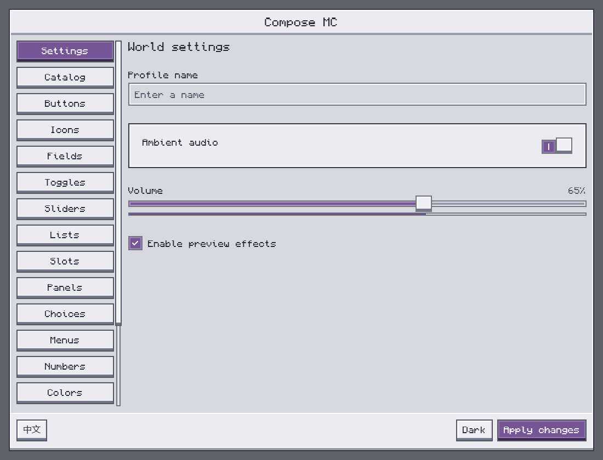
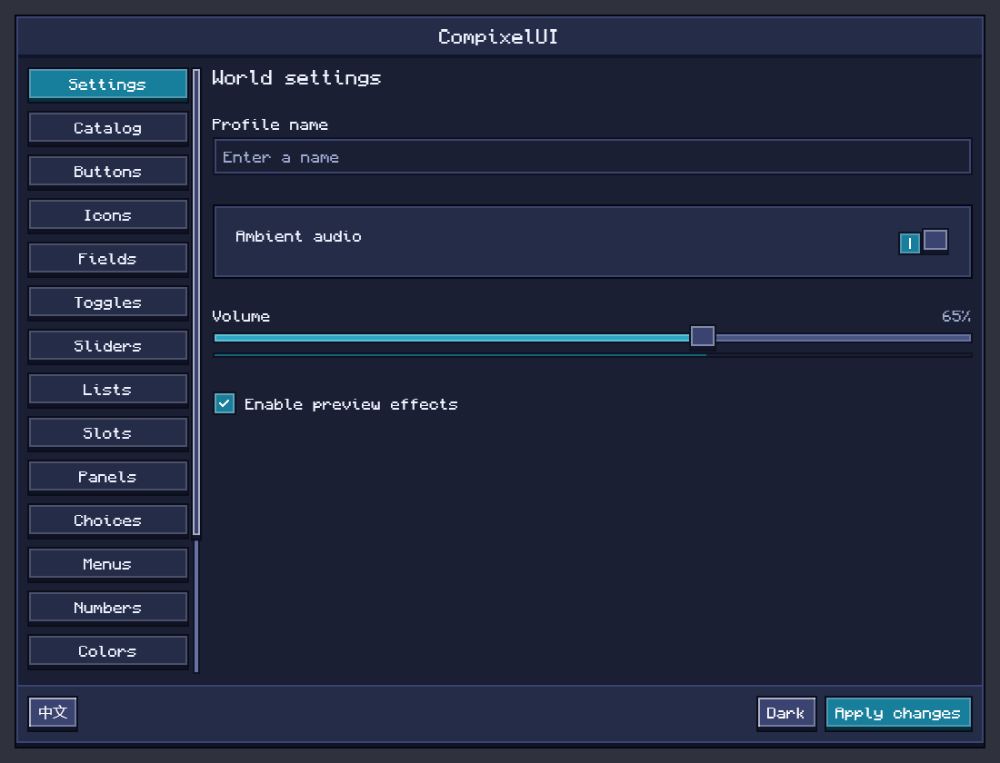

# Themes

[简体中文](../zh-CN/themes.md) · [All guides](../README.md)

Ore screens take their colors from a theme. Resource packs can recolor them with small JSON files, and no code is needed. A theme changes colors only: panels, text, buttons, slots and so on. Layouts, item textures and Minecraft's own item tooltips stay as they are.

A theme file can also hold colors of other mods' own designs, each in its own section next to Ore's; see [For mod developers](#for-mod-developers).

## Built-in themes

CompixelUI comes with three complete color schemes.

| Theme | Look |
| --- | --- |
| Default | The original Ore style: dark gray panels, light text, green accents |
| Light | Light gray metal panels, dark text, violet accents |
| Twilight | Deep navy panels, pale text, teal accents |





A resource pack switches a screen to one of them with `preset`, described below. A mod can also select one directly for a screen with `ThemeId.Light` or `ThemeId.Twilight`.

## Write a theme file

Every theme file uses the same format. Here is a complete file that turns a screen light:

```json
{
  "format": 1,
  "ore": {
    "preset": "light"
  }
}
```

| Field | Required | Value | What it does |
| --- | --- | --- | --- |
| `format` | Yes | `1` | The version of this file format. It isn't the Minecraft version or the pack's `pack_format`. |
| `ore` | No | An object with the fields below | Colors of Ore controls. |
| Other names | No | Whatever that mod documents | Colors of a mod's own design, such as `"examplemod"`. |

Inside `ore`:

| Field | Required | Value | What it does |
| --- | --- | --- | --- |
| `preset` | No | `"default"`, `"light"` or `"twilight"` | Starts over from a built-in scheme. |
| `palette` | No | Base colors for `primary`, `secondary` or `danger` | Generates a matching set of colors for those controls. |
| `colors` | No | Colors for individual parts | Sets exact colors, one part at a time. |

Only write what you want to change; everything else keeps its current color. JSON doesn't allow comments or trailing commas, and field names are case-sensitive.

### `preset`: start from a built-in scheme

A preset replaces every color with one of the built-in schemes, then applies the rest of the section. So `"preset": "default"` means "start again from the dark default". To build on the colors a screen already has, leave `preset` out.

The value names a built-in scheme; it isn't a file path, a mod ID or a theme ID. For your own colors, use `palette` and `colors`.

### `palette`: recolor a family of controls

Give one base color and CompixelUI derives the rest: the normal, hover and pressed faces, the edge, and a readable text and icon color.

| Name | Used for | Also changes |
| --- | --- | --- |
| `primary` | Main actions and selected states | Filled slider tracks, and marked and hovered slots |
| `secondary` | Secondary buttons and similar controls | The pixel bevel of secondary buttons |
| `danger` | Destructive actions such as Delete | Nothing else |

This file keeps the current scheme and makes its accent blue:

```json
{
  "format": 1,
  "ore": {
    "palette": {
      "primary": "#5688D8"
    }
  }
}
```

Panels and body text stay unchanged.

### `colors`: set one part exactly

This file changes only the panel background and the body text:

```json
{
  "format": 1,
  "ore": {
    "colors": {
      "panel": "#252B38",
      "text": "#EEF2F8"
    }
  }
}
```

Every name you can use is listed under [Color names](#color-names).

`palette.primary` and `colors.primary` differ: the first regenerates the whole primary family, the second changes only the normal primary color. Use `palette` to change an accent, and `colors` to fine-tune.

### Combine them

A section always applies `preset`, then `palette`, then `colors`, whatever order you write them in. This one starts from the light scheme, swaps the violet accent for blue, then sets two colors exactly:

```json
{
  "format": 1,
  "ore": {
    "preset": "light",
    "palette": {
      "primary": "#5688D8"
    },
    "colors": {
      "panel": "#E6E9EF",
      "primaryHover": "#365C9C"
    }
  }
}
```

The final primary hover color is `#365C9C`, because `colors` is applied last.

## Where the file goes

Put the file in a resource pack for your Minecraft version. The pack still needs its usual `pack.mcmeta`.

Each screen uses a theme ID such as `examplemod:storage`: the part before the colon is the namespace, usually the mod ID, and the part after it is the theme name. Its file lives at:

```text
your-resource-pack/
├── pack.mcmeta
└── assets/
    └── examplemod/
        └── compixel/
            └── themes/
                └── storage.json
```

Replace `examplemod` and `storage` with the ID the mod publishes; `assets`, `compixel` and `themes` stay as they are. IDs are lower case, and a `/` in a theme name becomes a subfolder.

| To change | Put the file at |
| --- | --- |
| Every screen | `assets/compixel/compixel/themes/default.json` |
| Every screen of one mod | `assets/examplemod/compixel/themes/default.json` |
| One theme | `assets/examplemod/compixel/themes/storage.json` |
| The built-in light theme | `assets/compixel/compixel/themes/light.json` |
| The built-in twilight theme | `assets/compixel/compixel/themes/twilight.json` |

A file only affects screens that use its exact theme ID. `storage.json` does nothing unless a screen uses `examplemod:storage`, so look up the IDs in the mod's resource-pack notes rather than guessing from the mod name. Mods may share one theme between screens or use the `compixel` namespace.

## How files stack

For `examplemod:storage`, colors are built up in this order:

1. The built-in default scheme.
2. `assets/compixel/compixel/themes/default.json`, for every screen.
3. `assets/examplemod/compixel/themes/default.json`, for the mod.
4. `assets/examplemod/compixel/themes/storage.json`, for the theme.

Missing files are skipped. When several resource packs contain the same file, all of them apply, from the lowest-priority pack to the highest, after the mod's own bundled copy. Each file changes only the fields it contains, except that `preset` resets every color and `palette` regenerates its whole family.

For example, if a lower-priority `storage.json` sets `panel` and `text`, and a higher-priority one sets only `panel`, the panel changes and the text keeps the lower pack's color.

The more specific file always wins over a more general one, whatever the pack order: a `default.json` can't override a color that `storage.json` sets. To change that color, override `storage.json` itself.

The built-in light and twilight themes are the exception. They start from their own scheme and skip the global `default.json`; only `light.json` or `twilight.json` applies on top. Editing those files changes only screens that use the built-in theme, not `"preset": "light"` or `"preset": "twilight"` in other files.

Each section stacks on its own in the same way: a file without an `examplemod` section leaves that mod's colors as the files below it set them.

## Color names

Colors are written `"#RRGGBB"`, or `"#RRGGBBAA"` with an opacity from `00` (transparent) to `FF` (opaque). For example, `"#00000080"` is half-transparent black. Upper and lower case both work, but the `#` is required; names such as `red`, `rgb(…)` and short forms such as `#FFF` aren't accepted.

These are all the names `colors` in `ore` accepts. Several controls share some of them, so the table lists typical uses. Parts a mod colors itself aren't affected.

| Name | Where it appears |
| --- | --- |
| `backdrop` | The dimming layer over the game behind a screen |
| `panel` | Main panels, text fields and similar backgrounds |
| `raised` | Raised surfaces, title bars and some tooltips |
| `hovered` | Hovered list rows, icon buttons and similar |
| `edge` | Dark control edges and dividers |
| `highlight` | Light edges of panels, slots and similar |
| `frameEdge` | The outer frame of windows |
| `ledge` | The strip under a window or panel that gives it depth |
| `slot` | Item slot background |
| `slotEdge` | Item slot dark edge |
| `markedSlot` | Marked item slot background |
| `slotHover` | Color blended into a hovered slot |
| `slotHoverEdge` | Outline of hovered and marked slots |
| `text` | Body text and typed text |
| `mutedText` | Secondary text and placeholders |
| `disabledText` | Text on disabled controls |
| `ink` | A dark text color for mods to use; it doesn't change `onSecondary` |
| `primary` | Primary buttons and selected states |
| `primaryHover` | Hovered primary buttons |
| `primaryPressed` | Pressed primary buttons and similar |
| `primaryEdge` | Dark and bottom edge of primary controls |
| `onPrimary` | Text, icons and checkmarks on primary colors |
| `secondary` | Secondary buttons and similar |
| `secondaryHover` | Hover color of some secondary controls; secondary buttons use `secondaryButtonActive` |
| `secondaryPressed` | Pressed color of some secondary controls; secondary buttons use `secondaryButtonActive` |
| `secondaryEdge` | Dark and bottom edge of secondary controls |
| `onSecondary` | Text and icons on secondary colors |
| `danger` | Destructive buttons, and input errors |
| `dangerHover` | Hovered destructive buttons |
| `dangerPressed` | Pressed destructive buttons |
| `dangerEdge` | Dark and bottom edge of destructive buttons |
| `onDanger` | Text and icons on destructive buttons |
| `buttonBorder` | Button frames, and scrollbar thumb frames |
| `secondaryButtonActive` | Secondary button face while hovered or pressed |
| `secondaryButtonLightEdge` | Top and left bevel of secondary buttons |
| `secondaryButtonDarkEdge` | Bottom and right bevel of secondary buttons |
| `secondaryButtonCorner` | Corner pixels between the two bevels |
| `bevelLight` | The color mixed in for generated highlights, normally white |
| `switchTrack` | Unchecked switch tracks, and unselected radio buttons |
| `trackFilled` | The filled part of a slider |
| `trackFilledLight` | The light edge of the filled part |
| `trackEmpty` | The empty part of a slider |
| `trackEmptyLight` | The light edge of the empty part, and scrollbar rails |
| `disabledEdge` | Edges of disabled controls |
| `focus` | The outline around the focused control |

Colors set in `colors` don't adjust each other: changing `text` doesn't change `onPrimary`, and changing `slot` doesn't regenerate the hover colors. `palette` runs before `colors`, so a `colors.slot` or `colors.bevelLight` in the same section doesn't affect generated colors either. Set each color you want exactly.

## Try it in game

Put the pack in the instance's `resourcepacks` folder and enable it. After editing a file, press **F3+T** to reload: open screens update in place and keep their typed text, scroll position and menu state. Disabling the pack and reloading removes its colors again.

If a change doesn't show up, check:

1. The file path matches the theme ID the screen uses, and no more specific file overrides your color.
2. The pack is enabled, and no higher-priority pack replaces the same file.
3. The JSON is valid, has `"format": 1`, puts Ore's fields inside `"ore"`, uses `"default"`, `"light"` or `"twilight"` as `preset`, and spells every color name and value correctly.
4. `logs/latest.log` mentions `Skipping theme` or `Ignoring theme`, followed by the file, the pack and the reason.

A file with broken JSON or another `format` is skipped as a whole. A section with an unknown field, an invalid color or an unknown preset is ignored on its own: the file's other sections and the other files still apply. Theme files are only read on the client.

## For mod developers

Give each screen a theme ID so resource packs can target it:

```kotlin
import dev.compixel.ui.theme.ThemeId

class StorageScreen :
    ComposeScreen<StorageState, StorageAction>(Component.literal("Storage"), theme = ThemeId("examplemod", "storage")) {
    // snapshot, handle and Content as usual
}
```

- Publish your screens' theme IDs and their file paths in your mod's documentation, for example "Storage: `examplemod:storage`, `assets/examplemod/compixel/themes/storage.json`". To ship your own colors, put a file at the same path under `src/main/resources`; resource packs can still override it.
- `ComposeMenuScreen`, `ComposeInventoryScreen`, `ComposeHudLayer` and `ComposeConfigScreen` take `theme` too. Screens default to `compixel:default`, and config screens to `<modid>:default` for the mod they edit.
- Pass `ThemeId.Light` or `ThemeId.Twilight` to use a built-in theme.
- Dialogs, menus and Compose tooltips inherit the screen's theme. To theme part of a screen differently, wrap it in `OreTheme(id = ThemeId("examplemod", "inspector")) { … }`.
- `OreTheme(colors = …)` applies fixed colors that resource packs can't change. Hosts outside Minecraft provide their theme files as a `ThemeCatalog` through `LocalThemeCatalog`.

### Add your own colors

When your mod draws parts of its own, give their colors a section of their own instead of borrowing Ore's names, so resource packs can change them without touching Ore controls. Declare the section once; it reads the decoded JSON of each file and returns the updated value:

```kotlin
import dev.compixel.ui.theme.ThemeId
import dev.compixel.ui.theme.ThemeSection
import dev.compixel.ui.theme.current

data class StorageColors(val accent: Color = Color(0xFF22C7F0), val online: Color = Color(0xFF17A56C))

object StorageThemeSection : ThemeSection<StorageColors>("examplemod") {
    override val default = StorageColors()

    override fun apply(value: StorageColors, layer: Any?): StorageColors {
        require(layer is Map<*, *>) { "expected an object" }
        fun color(name: String, old: Color): Color {
            val hex = layer[name] ?: return old
            require(hex is String && hex.matches(Regex("#[0-9a-fA-F]{6}"))) { "$name: expected #RRGGBB" }
            return Color(0xFF000000 or hex.drop(1).toLong(16))
        }
        return StorageColors(color("accent", value.accent), color("online", value.online))
    }
}

// In composition: this theme's colors in the current resources.
val colors = StorageThemeSection.current(ThemeId("examplemod", "storage"))
```

A resource pack then writes `"examplemod": { "accent": "#5688D8" }` next to `"ore"` in the same file. Your section stacks like Ore's, an invalid one is ignored without affecting the file's other sections, and open screens update on **F3+T**. Throw from `apply`, for example with `require`, to reject a file; document the fields you accept.

### Use your own design system

Screens wrap their content in a design, Ore by default. To set up your own components around every screen, pass a `UiDesign`:

```kotlin
val LocalStorageColors = staticCompositionLocalOf { StorageColors() }

object StorageDesign : UiDesign {
    @Composable
    override fun Decorate(theme: ThemeId, content: @Composable () -> Unit) {
        // Keep Ore for the Ore controls you still use, and add your own colors around the content.
        OreDesign.Decorate(theme) {
            CompositionLocalProvider(LocalStorageColors provides StorageThemeSection.current(theme), content = content)
        }
    }
}

class StorageScreen :
    ComposeScreen<StorageState, StorageAction>(Component.literal("Storage"), theme = ThemeId("examplemod", "storage"), design = StorageDesign)
```

Your own controls give the native click sound like Ore's buttons by calling `LocalUiFeedback.current.activate()` when the user activates them, for example right after `onClick`; the screen plays it on the game thread.
