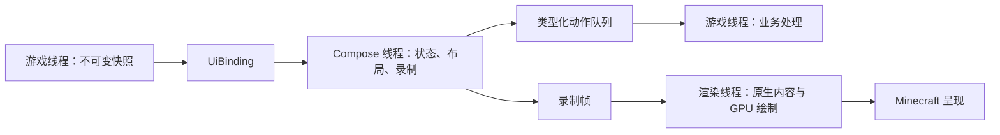

# 架构与扩展

[English](../en/architecture.md) · [文档目录](../README.md)

Compose MC 在同一个 Gradle 构建中维护共享 UI/运行时和各版本 Minecraft 适配器。消费者单独安装本库。每个目标都提供使用外部 Kotlin 提供者的标准 JAR，以及自带 Kotlin 库的 `with-kotlin` JAR；两者均持有 Compose 和 Skiko。

## 模块职责

| 模块或目录 | 职责 |
| --- | --- |
| `platform` | 独立于宿主的视口、输入、剪贴板和平台约定 |
| `render` | 独立于后端的帧、资源和性能记录约定 |
| `compose-bridge` | Compose 场景、线程边界、帧录制、原生图像绘制和图标图集调度 |
| `host` | UI 会话生命周期、不可变状态与动作绑定 |
| `render-gl` | 共享 OpenGL 渲染器和 GPU 合成 |
| `render-vulkan` | 共享 Skia Vulkan 绘制和图像屏障记录 |
| `ui-ore` | 共享视觉参数、字体和控件 |
| `menu-sync` | 无依赖 Java 17 数据声明、codec、快照和有界协议 |
| `slot-core` | 无依赖 Java 17 槽位策略和转移路线 |
| `demo` / `desktop` | F8 预览页面及桌面预览/截图 |
| `minecraft/forge-*` / `minecraft/neoforge-*` | 各版本独立构建、原生屏幕、输入、资源、物品、菜单和 GPU 生命周期 |
| `runtimes/standard` / `runtimes/vulkan` | 装配匹配的共享代码、JVM 依赖及六种原生库 |
| `build-logic` / `gradle` / `tools` | 构建约定、目标/版本元数据、检查与启动工具 |

`demo` 只包含预览页面及其状态，桌面截图复用同一套页面。公共测试代码集中在 `testing`：`dev.composemc.testing.render` 管理渲染场景、CPU 参考图和像素比较，`dev.composemc.testing.ui` 管理自动交互脚本。组件回归测试集中在 `testing/src/test`，桌面模块提供预览和截图入口。

`main` 源码集包含可安装的库功能。各适配器的 `development` 源码集包含 F8 预览和探针，打包为可选 `development` 模组，不进入正式产物。Minecraft/加载器相关代码、资源和适配器测试均位于该版本自己的 `src` 目录。各版本独立维护自己的副本；同类修复需要手动同步到其他受影响版本并分别验证。

两种后端的探针分别位于对应的 `render-gl/src/testFixtures` 和 `render-vulkan/src/testFixtures`，统一使用 `testing` 中的场景、两种视口尺寸、预乘 RGBA CPU 参考图及比较阈值。每个探针重复执行绘制、重置和上下文关闭；OpenGL 额外检查宿主状态及保留的图像副本，Vulkan 则在借用的 Minecraft 设备上验证图像屏障和 GPU 读回。版本相关的设备接入与屏幕验证集中在各适配器的 `development/render` 包内。这些辅助代码只进入开发产物；探针对内部实现的访问通过本模块的 Kotlin 测试源码集关联完成。

`ui-ore` 内部按职责划分公共组件子包，每个独立组件使用同名文件。主题配置与展示组件分开，共享边框绘制保持内部可见。[Ore UI 包对照表](ore-ui.md#选择组件)提供组件目录和导入说明。

## 边界

共享核心、UI 和场景不导入 Minecraft 或加载器类型，也不依赖版本适配器。共享模块中只有 `render-gl` 与 `render-vulkan` 可以使用 LWJGL，其原生依赖在运行时由 Minecraft 提供。`menu-sync` 和 `slot-core` 的生产依赖类路径为空，必须能够在专用服务器加载而不初始化 UI。

版本适配器负责原生设备发现、Minecraft 纹理、输入转换、菜单网络和画面呈现。资源身份、权限和事务语义属于消费者。普通原版容器是基线，特殊资源通过公开接口扩展。

`verifyCoreBoundary` 检查共享源码及声明/解析后的依赖。边界或依赖变化后，应运行它及受影响的测试/构建。

传输策略和调度位于 `menu-sync`：`MenuSyncOptions` 组合状态/动作预算，`TokenBucket` 管理持续与突发字节额度，`ActionQueue` 管理 FIFO 入队和超时。适配器在连接生命周期内保留额度，将这些工具接入原生 payload；发送状态正文前核对策略，并检查物理包长。消费者 API 见[菜单同步](menu-sync.md)。

## 线程与帧归属

AWT 事件线程承载组合与录制。游戏/渲染线程持有实时游戏对象、GPU 工作和资源回收。`UiBinding` 将快照传入组合，将动作排队送回创建它的线程。不要从 Compose 同步调用一个正在等待组合的游戏线程。

OpenGL 借用 Minecraft 当前上下文，管理自身 Skia 上下文和离屏资源，并恢复宿主 GL 状态。Vulkan 借用原生设备、队列和图像句柄，适配器管理提交、命令池复用、呈现和回收。共享代码不得销毁宿主设备或纹理。缓存淘汰后，保留的录制帧仍可能延长图像生命周期。

缩放更新与视口有关的资源，并在支持的路径保留会话。资源重载使图像和渲染目标失效。最终移除时释放自有资源；容器宿主区分临时访问配方界面与最终关闭菜单。

## 运行时装配

standard 配置使用 Skiko 0.150.1；Vulkan 配置使用匹配的 Polyfrost Skiko 0.999.6 JVM/原生库，并加入共享 Vulkan 渲染器。每个适配器在自己的构建文件中选择运行时依赖及匹配的 Skiko 约束。

装配时合并服务注册和第三方许可，包含 Windows/Linux/macOS 的 x64 与 arm64 原生库，不进行会破坏编译器 ABI 或 JNI 的重定位/裁剪，也不打包另一份 LWJGL。归档检查会拒绝开发工具、未声明的 Mixin 和不匹配的原生库/运行时内容。

每个运行时项目都生成外部 Kotlin 版和 `with-kotlin` 版。外部版排除 Kotlin 标准库、协程 Core 和 Serialization，保留 Compose 使用的 Swing 调度器集成和 atomicfu。适配器只嵌入一份匹配的运行时，绝不嵌入 KFF。客户端入口使用 Java，在进入 Kotlin 代码前报告缺失的外部依赖。共享 Java 检查验证 stdlib >= 2.2.21 及协程、Serialization 的代表性 API，不触及专用服务器入口。这属于依赖检查，不保证任意库组合都兼容。

`dev` 分类产物为两种安装方式提供完整的编译用 JVM API，不带原生二进制；`development` 分类产物提供预览/探针代码。一份 `sources` JAR 和一份 Dokka HTML `javadoc` JAR 描述当前适配器与其共享正式模块，由所有二进制版本共用。它们只包含项目自有源码/API，不包含依赖源码或其他 MC 版本。消费者依赖方式见[快速开始](getting-started.md)。

## 构建约定

[build-logic](../../build-logic/src/main/groovy) 是被引入的 Gradle 构建，不是游戏运行时代码。它提供四个职责明确的约定插件：

| 插件 | 职责 |
| --- | --- |
| `composemc.testing` | JUnit、测试设置和依赖锁定 |
| `composemc.jvm-library` | Kotlin/JVM 与目标工具链 |
| `composemc.skiko-profile` | 匹配的 Skiko 版本约束 |
| `composemc.runtime-bundle` | 运行时装配、许可和归档检查 |

纯 Java 模块 [menu-sync](../../menu-sync/build.gradle.kts) 和 [slot-core](../../slot-core/build.gradle.kts) 在各自构建文件中直接声明 Java 17 工具链及编译目标，并直接应用 `composemc.testing`。各自的检查任务确保生产依赖类路径为空。

所有适配器统一放在 [minecraft](../../minecraft) 下，各自拥有完整的版本源码树。每个适配器的 `build.gradle` 管理加载器插件、运行时依赖、本地源码集、运行任务、映射与重混淆规则、访问转换白名单和校验例外；相邻的 `gradle.properties` 管理 Minecraft/加载器版本、Java 工具链及支持的后端。例如，[Forge 1.20.1](../../minecraft/forge-1.20.1/build.gradle) 自行声明 SRG 重混淆，[NeoForge 26.2](../../minecraft/neoforge-26.2/build.gradle) 自行声明 Vulkan 启动参数及上游清理问题的例外。

[minecraft-targets.properties](../../gradle/minecraft-targets.properties) 仅索引版本和工程目录，供目标选择和启动脚本使用；[libs.versions.toml](../../gradle/libs.versions.toml) 管理共享依赖版本。根构建提供聚合任务，不再向适配器注入版本构建配置。

各适配器显式调用 [gradle/minecraft](../../gradle/minecraft) 下四个可复用脚本：`sources.gradle` 配置本地开发源码集及 Kotlin 可见性；`artifacts.gradle` 装配、发布产物并展开元数据；`artifact-checks.gradle` 按适配器声明的规则检查归档隔离；`runs.gradle` 提供通用 smoke/benchmark 执行参数与报告检查。辅助脚本不选择 Minecraft 版本、加载器、运行时配置或版本特有例外，也不挂接其他适配器的源码。新增目标通常只需修改自己的目录和目标索引。

`artifacts.gradle` 将源码/API 发布交给 [api-docs.gradle](../../gradle/minecraft/api-docs.gradle)。它遍历所选运行时声明的项目依赖，加入 Java 菜单/槽位核心和当前适配器，仅为打包与文档生成读取这些正式源码，不连接适配器的编译源码根。根构建服务将 Dokka 任务串行执行；产物检查在发布前比对源码字节并验证代表性 API 页面。

客户端使用加载器正常的窗口启动流程，直接运行客户端和 benchmark 任务时默认可见。Windows 后台验证通过 [run_isolated_gradle.ps1](../../tools/run_isolated_gradle.ps1) 在独立且从不激活的 Win32 桌面上启动新的 Gradle 进程，版本 benchmark 脚本和消费者测试脚本共用此入口。启动器负责桌面隔离和原生启动失败检查，后台探针在启动后隐藏自己的 GLFW/SDL 窗口。不需要额外的窗口提供者 JAR，渲染器使用 Minecraft/NeoForge 提供的上下文，并报告实际 GL 版本。

## 原生扩展点

优先使用加载器公开 API。26.x 适配器使用一处限定范围的 `GuiRenderer.draw` 重定向，因为 Minecraft 将 GUI 命令直接送到主渲染目标，缺少公开的目标替换接口。重定向只在捕获原生图标时选择离屏目标；普通 GUI 绘制仍使用 Minecraft 目标。归档检查只允许 26.x 中明确声明的这一处 Mixin。访问转换按目标限定：

- 1.21.1 和 26.1.2：用于原生槽位定位的 `Slot.x`、`Slot.y`。
- 26.2/26.3：上述坐标，以及各目标的 GPU 后端字段。
- Forge 1.20.1：映射后的槽位坐标，并将原生 `renderSlot` 改为 protected，以便替代槽位绘制时保留容器钩子。

打包检查会验证这些声明。Vulkan 上游清理问题见[兼容性](compatibility.md)，本库不使用本地 Mixin 修补。

## 添加或修改适配器

1. 创建 `minecraft/<loader>-<version>/build.gradle` 和 `gradle.properties`，并将目录加入目标索引。在适配器中声明加载器插件、工具链、依赖、映射和运行任务，按需调用职责明确的公共辅助脚本。
2. 将 Minecraft/加载器相关实现、资源及测试放在该适配器内。其他版本需要相同修复时，手动修改并分别验证，不通过共享源码目录、链接或生成副本绑定版本实现。与 Minecraft 无关的模块及其测试辅助代码继续作为共享依赖。
3. 选择兼容工具链和运行时配置，锁定依赖，检查正式/开发归档隔离。
4. 构建所有受影响适配器，再使用打包客户端验证各后端的原生输入、物品、容器钩子、缩放/重载及清理。
5. 通过单独安装的消费者验证公开 API，并为公共 API 检查专用服务器隔离。
6. 同步更新中英文指南与受影响截图，让 API 示例和目标表与源码一致。

命令见[构建与测试](build-and-test.md)。编译通过只能覆盖类型兼容，实际 GPU/客户端验收是独立检查。
