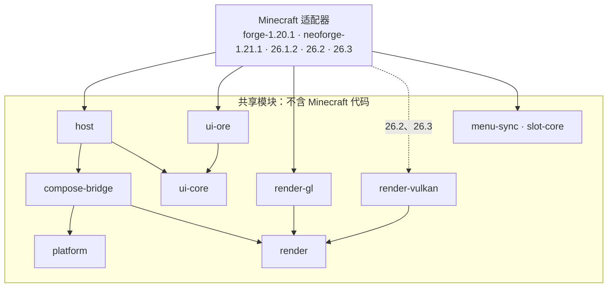
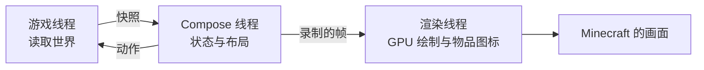

# 架构

[English](../en/architecture.md) · [全部指南](../README.md)

CompixelUI 是一个 Gradle 构建。共享模块包含所有与 Minecraft 无关的代码，每个 Minecraft 版本各有一个适配器把它们接入游戏。

## 模块

| 模块 | 职责 |
| --- | --- |
| `platform` | 与宿主游戏之间的视口、输入、剪贴板等约定 |
| `render` | 帧、GPU 资源与性能统计 |
| `compose-bridge` | 在独立线程运行 Compose，录制帧并绘制原生图像 |
| `host` | 界面会话、`UiBinding`、`ScreenTransition`，以及所有界面和 HUD 层共用的 Compose 层 `UiLayer` |
| `render-gl`、`render-vulkan` | OpenGL 与 Vulkan 渲染器 |
| `ui-core` | 设计系统的接入点：控件反馈、宿主内容外层的设计，以及每套设计系统各占一段的主题文件 |
| `ui-ore` | Ore UI 组件、主题与字体 |
| `menu-sync` | 菜单同步协议，以及客户端和服务端的会话 |
| `slot-core` | 槽位规则与 Shift 点击路线 |
| `minecraft/<加载器>-<版本>` | 某个 Minecraft 版本的界面、HUD 层、输入、物品、菜单与 GPU 接入 |
| `runtimes/*` | 打包 Compose、Skiko 与 Kotlin |
| `demo`、`desktop`、`testing` | 组件预览、它的桌面窗口以及共享测试代码 |
| `build-logic`、`gradle`、`tools` | 构建约定、版本元数据、检查与脚本 |

## 边界

- 共享模块从不导入 Minecraft 或加载器的类。只有 `render-gl` 和 `render-vulkan` 使用 LWJGL，运行时由游戏提供。
- `menu-sync` 和 `slot-core` 是没有任何依赖的 Java 17 模块，专用服务器加载它们时不会带入界面代码。
- 每个适配器自行管理构建设置、源码和测试；各版本之间不共享源文件。修复需要分别应用到每个受影响的版本。
- 原版容器是基准。虚拟资源、自定义事务等特殊行为属于需要它们的模组。

`verifyCoreBoundary` 是 `check` 的一部分，负责检查前两条规则。

## 线程与帧

游戏对象只留在游戏线程。Compose 看到的是不可变快照，并通过 `UiBinding` 把动作发回。界面和 HUD 层让绑定跟随 Compose 会话：会话打开时从第一份快照开始；输入事件发出的动作在事件返回前处理，其余动作在每刻处理，处理后再取下一份快照；会话关闭时绑定随之关闭。每一帧先由 Compose 录制，再由渲染线程在 Minecraft 自己的图形上下文中绘制：OpenGL 状态在绘制后恢复，Vulkan 使用游戏的设备和队列。

Compose 绘制的 GPU 图像（例如物品图标页）归渲染线程所有。Compose 录制的画面会保留对这些图像的引用，渲染器要等这些引用全部释放后才释放图像；在其他线程释放会丢失这块显存。

`compose-bridge` 中的 `NativeImageAtlas` 调度带宽高的图像请求：物品适配器选择图集网格，自定义原生绘制选择独立视口。Compose 邮箱和图像节点共用同一实现。`NativeImageOwner` 统一通过渲染器回收已发布图像，原生提示也复用这一所有权机制；提示的测量和加载器事件仍由各适配器负责。

## 打包

- 模组 JAR 包含所有 CompixelUI 模块，不含第三方代码。
- Compose、Skiko 和 Kotlin 打包为运行时包：`compixel-runtime-standard`、用于 26.2 和 26.3 的 `compixel-runtime-vulkan`，以及 `compixel-kotlin`。Skiko 包含 Windows、Linux 和 macOS 的 x64 与 arm64 原生库。
- 每个运行时包有自己的版本号，`bundle.lock` 记录该版本的确切内容。
- 玩家文件通过 Jar-in-Jar 内嵌运行时包；Maven 用户则把它们作为依赖获取。
- 启动时，Java 代码会在运行任何 Kotlin 代码之前检查所需的运行时和 Kotlin 库，并指出缺少的部分。

## 接入游戏的方式

优先使用加载器的公开 API。除此之外，每个适配器都声明了少量访问转换器：所有版本都有槽位坐标，1.20.1 还有槽位渲染钩子，26.x 还有容器尺寸、槽位高亮方法、原生预览工厂注册列表和 GPU 后端字段。26.x 适配器另有一个 Mixin，在截取原生绘制、物品图标和提示时把 `GuiRenderer` 的输出导向离屏目标。构建检查会拒绝任何未声明的修改。

## 添加 Minecraft 版本

1. 新建 `minecraft/<加载器>-<版本>`，写好它自己的 `build.gradle` 和 `gradle.properties`，并加入 `gradle/minecraft-targets.properties`。
2. 从最接近的版本移植游戏相关代码。原样复制客户端测试驱动，并为该版本编写 `SuitePlatform.kt`。
3. 构建，在每个图形后端上运行两套客户端测试，并用一个单独安装的模组测试 API。
4. 在文档的版本表格中加入该版本。
