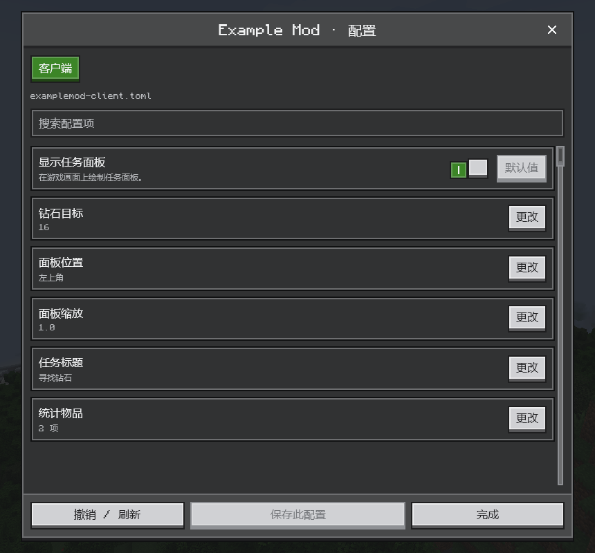

# 配置界面

[English](../en/configuration.md) · [全部指南](../README.md)

Compose MC 提供现成的模组配置编辑器。玩家可以按文件切换标签、搜索、检查取值、恢复默认、撤销和保存；你继续使用原有的配置规格即可。



## 注册

照常定义配置，然后在客户端模组构造函数中把 `ComposeConfigScreen` 注册为模组的配置界面：

```kotlin
object ExampleConfig {
    private val builder = ModConfigSpec.Builder()
    val showHud = builder.define("showHud", true)
    val goal = builder.defineInRange("goal", 16, 1, 64)
    val corner = builder.defineEnum("corner", Corner.TOP_LEFT)
    val scale = builder.defineInRange("scale", 1.0, 0.5, 2.0)
    val title = builder.define("title", "寻找钻石")
    val trackedItems = builder.defineList("trackedItems",
        listOf("minecraft:diamond", "minecraft:emerald"), { "minecraft:diamond" }) { it is String }
    val spec: ModConfigSpec = builder.build()

    fun register(container: ModContainer) {
        container.registerConfig(ModConfig.Type.CLIENT, spec)
        container.registerExtensionPoint(IConfigScreenFactory::class.java,
            IConfigScreenFactory { mod, parent -> ComposeConfigScreen(mod, parent) })
    }
}
```

之后在**模组**列表中点击配置，就会打开这个界面。Forge 1.20.1 请注册一个返回 `ComposeConfigScreen(modContainer, parent)` 的 `ConfigScreenHandler.ConfigScreenFactory`。

## 名称与说明

界面上的文字来自语言文件：

```json
{
  "examplemod.configuration.goal": "钻石目标",
  "examplemod.configuration.goal.tooltip": "完成任务所需的钻石数量。",
  "examplemod.configuration.option.top_left": "左上角"
}
```

| 文字 | 键 |
| --- | --- |
| 条目名称 | 配置规格中的翻译键，或 `<modid>.configuration.<路径>` |
| 说明 | `<条目键>.tooltip`，或配置规格中的注释 |
| 枚举选项 | `<条目键>.<常量>`，或 `<modid>.configuration.option.<常量>` |

常量名使用小写。没有翻译时，界面会把路径转换成易读的形式显示。

## 编辑与保存

- 支持的类型：布尔值、整数、长整数、有限的浮点数、字符串、枚举以及由它们组成的列表。其他类型只显示、不可编辑。
- 修改会一直处于待保存状态，直到玩家保存该文件。保存前会再次检查取值；文件在别处被修改时，会要求先刷新。
- 恢复默认和撤销只改动待保存的值，保存前不会写入文件。
- 有未保存的修改时关闭界面，会先询问玩家。
- 连接远程服务器时，以及世界对局域网开放期间，服务端配置为只读。

## 自定义配置页

`ConfigEditor` 是配置界面背后的模型。在游戏线程中使用它，可以搭建自己的配置页：

```java
ConfigEditor editor = new ConfigEditor("examplemod");
ConfigEditor.Result staged = editor.stage(fileId, "goal", ConfigEditor.Input.scalar("24"));
ConfigEditor.SaveResult saved = editor.save(fileId);
```

`snapshot()` 列出文件和条目及其 ID；`Input.list(values)` 用于列表；`reset`、`reload` 和 `discardAll` 用来撤销修改。
