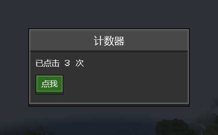

# 快速开始

[English](../en/getting-started.md) · [全部指南](../README.md)

本指南为一个 NeoForge 1.21.1 模组接入 Compose MC，并打开第一个界面。其他 Minecraft 版本的步骤相同，差异见[兼容性](compatibility.md)。

## 1. 添加依赖

在模组的 `build.gradle` 中：

```groovy
plugins {
    id 'org.jetbrains.kotlin.jvm' version '2.4.10'
    id 'org.jetbrains.kotlin.plugin.compose' version '2.4.10'
}

repositories {
    maven {
        url = 'https://maven.wintercogs.com/releases'
        content { includeGroup 'dev.composemc' }
    }
}

dependencies {
    compileOnly "dev.composemc:composemc-neoforge-1.21.1-with-kotlin:${composemc_version}"
    localRuntime "dev.composemc:composemc-neoforge-1.21.1-with-kotlin:${composemc_version}"
}

kotlin { jvmToolchain(21) }
```

在 `gradle.properties` 中：

```properties
composemc_version=0.1.1
kotlin.stdlib.default.dependency=false
```

`-with-kotlin` 坐标会一并带上 Kotlin 库。如果你的模组本来就依赖 Kotlin for Forge，两行都改用 `composemc-neoforge-1.21.1`，由 KFF 提供 Kotlin。

Compose MC 作为独立模组安装，不要用 Jar-in-Jar 打进你的 JAR。

## 2. 声明依赖

在 `src/main/resources/META-INF/neoforge.mods.toml` 中，换成你的模组 ID：

```toml
[[dependencies.examplemod]]
modId = "composemc"
type = "required"
versionRange = "[0.1.1]"
ordering = "AFTER"
side = "CLIENT"
```

如果用到[菜单同步](menu-sync.md)，它也在服务端运行，请改为 `side = "BOTH"`。

## 3. 打开界面

```kotlin
import androidx.compose.runtime.*
import androidx.compose.ui.unit.dp
import dev.composemc.forge.ComposeScreen
import dev.composemc.ui.ore.button.OreButton
import dev.composemc.ui.ore.display.OreText
import dev.composemc.ui.ore.layout.OreScreen
import net.minecraft.client.Minecraft
import net.minecraft.network.chat.Component

fun openCounterScreen() {
    Minecraft.getInstance().setScreen(ComposeScreen(Component.literal("计数器")) {
        var count by remember { mutableStateOf(0) }
        OreScreen("计数器", maxWidth = 160.dp, maxHeight = 78.dp) {
            OreText("已点击 $count 次")
            OreButton("点我", onClick = { count++ })
        }
    })
}
```



在客户端代码中调用 `openCounterScreen()`，例如按键绑定的处理函数。`ComposeScreen` 就是普通的 Minecraft 界面，`OreScreen` 负责绘制面板和标题。界面代码放在仅客户端加载的类里，专用服务器就不会加载它。

## 4. 显示游戏数据

Compose 运行在自己的线程上。请在游戏线程读取游戏数据，再通过 `dev.composemc.host` 中的 `UiBinding` 把不可变快照交给 Compose；按钮也通过它把动作发回来：

```kotlin
data class HeldItem(val name: String, val count: Int)

fun openHandScreen() {
    val minecraft = Minecraft.getInstance()
    val held = UiBinding<HeldItem, Unit>(HeldItem("", 0))
    minecraft.setScreen(object : ComposeScreen(Component.literal("手持物品"), content = {
        val item = held.value
        OreScreen("手持物品", maxWidth = 180.dp, maxHeight = 84.dp) {
            OreText("${item.name} × ${item.count}")
            OreButton("丢出一个", onClick = { held.send(Unit) })
        }
    }) {
        override fun tick() {
            super.tick()
            val player = minecraft.player ?: return
            held.drainActions { player.drop(false) }
            val stack = player.mainHandItem
            held.update(HeldItem(stack.hoverName.string, stack.count))
        }

        override fun removed() {
            super.removed()
            held.close()
        }
    })
}
```

| `UiBinding` 调用 | 在哪里调用 |
| --- | --- |
| 构造、`update`、`drainActions`、`close` | 游戏线程 |
| `value` | 可组合项内部 |
| `send` | UI 回调。绑定关闭或已有 64 个动作排队时返回 `false`。 |

不要在可组合项里访问玩家、物品堆等游戏对象，也不要让 Compose 等待游戏线程。

## 5. 发布

玩家把 Compose MC 和你的模组装在一起。每个 Minecraft 版本有两个文件，玩家选其一：

| 文件 | 适用于 |
| --- | --- |
| `composemc-neoforge-1.21.1-0.1.1-with-kotlin.jar` | 所有玩家，已包含 Kotlin |
| `composemc-neoforge-1.21.1-0.1.1.jar` | 已安装 Kotlin for Forge 的玩家 |

两个文件都可以在 [Releases](https://github.com/Frostbite-time/compose-mc/releases) 页面下载。

## 下一步

- [Ore UI](ore-ui.md)：所有控件及示例
- [物品与提示](items.md)：在界面中显示真实物品
- [容器界面](inventory.md)：带槽位的菜单
- [HUD 层](hud.md)：游戏画面上的 Compose 内容
- [菜单同步](menu-sync.md)与[配置界面](configuration.md)
