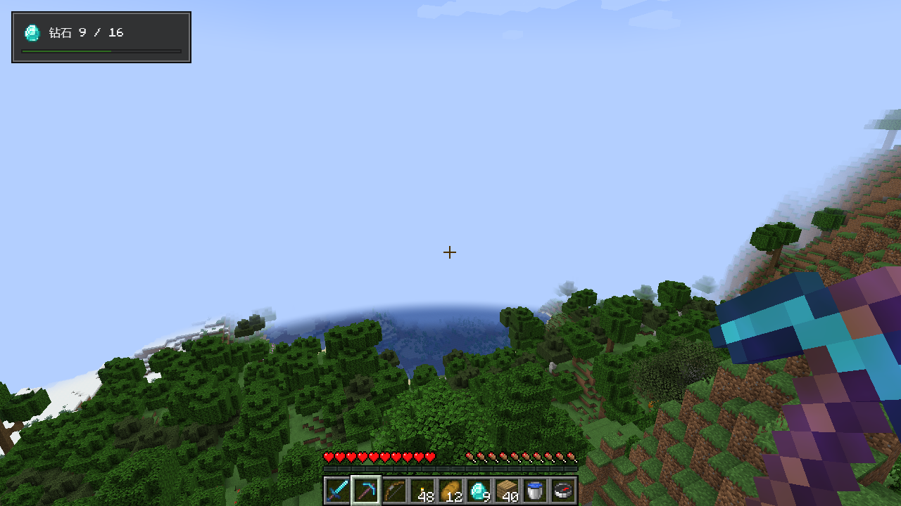

# HUD 层

[English](../en/hud.md) · [全部指南](../README.md)

`ComposeHudLayer` 在游戏画面上绘制 Compose 内容。它就是普通的 HUD 层：通过加载器注册，与原版 HUD 叠放在一起。



## 注册 HUD 层

这个 HUD 层统计玩家物品栏中的钻石。`ComposeHudLayer` 在 `snapshot` 中读取游戏，在 `Content` 中绘制最新的值：

```kotlin
class QuestHud(private val diamond: ItemIcon) : ComposeHudLayer<Int>() {
    override fun snapshot() = Minecraft.getInstance().player?.inventory?.countItem(Items.DIAMOND) ?: 0

    @Composable
    override fun Content(state: Int) = QuestPanel(diamond, state)
}

fun registerQuestHud(modBus: IEventBus) {
    modBus.addListener { event: RegisterGuiLayersEvent ->
        event.registerAbove(
            VanillaGuiLayers.HOTBAR,
            ResourceLocation.fromNamespaceAndPath("examplemod", "quest"),
            QuestHud(ItemIcon.snapshot(ItemStack(Items.DIAMOND))),
        )
    }
}

@Composable
fun QuestPanel(diamond: ItemIcon, found: Int) {
    OreSurface(Modifier.padding(8.dp).width(128.dp)) {
        Column(Modifier.padding(6.dp), verticalArrangement = Arrangement.spacedBy(4.dp)) {
            Row(verticalAlignment = Alignment.CenterVertically, horizontalArrangement = Arrangement.spacedBy(4.dp)) {
                MinecraftItemIcon(diamond)
                OreText("钻石 $found / 16")
            }
            OreProgressBar(found / 16f)
        }
    }
}
```

在客户端模组构造函数中调用 `registerQuestHud(modBus)`。没有游戏状态的 HUD 层继承 `ComposeHudLayer<Unit>`，写 `override fun snapshot() {}`。

## 表现

- HUD 层绘制在注册时指定的位置，位于所有打开的界面之下。
- 玩家按 F1 隐藏 HUD 时，它一起隐藏。
- 它不接收输入：点击、按键和文字都交给游戏，提示也不会弹出。需要交互的内容请放在界面里。
- 它在进入世界后的第一帧启动，离开世界时停止。调用 `close()` 可以提前停止；下次启动时 `remember` 的状态会重新开始。
- `snapshot` 在 HUD 层启动时于游戏线程调用一次，之后每个客户端刻调用一次，界面打开时也不例外。快照变化时内容才会重绘。

## 其他版本

| Minecraft | 注册事件 | 层类型 |
| --- | --- | --- |
| 1.20.1（Forge） | `RegisterGuiOverlaysEvent` | `IGuiOverlay`，使用字符串 ID 和 `VanillaGuiOverlay` 锚点 |
| 1.21.1 | `RegisterGuiLayersEvent` | `LayeredDraw.Layer`，使用 `ResourceLocation` |
| 26.x | `RegisterGuiLayersEvent` | `GuiLayer`，使用 `Identifier` |

各版本的 `ComposeHudLayer` 构造方式相同。

## 保持轻量

每个 HUD 层都有独立的 Compose 会话和窗口大小的绘制表面，HUD 可见时每帧都会合成。请把一个模组的所有 HUD 元素放进同一层，并避免永不停止的动画。
