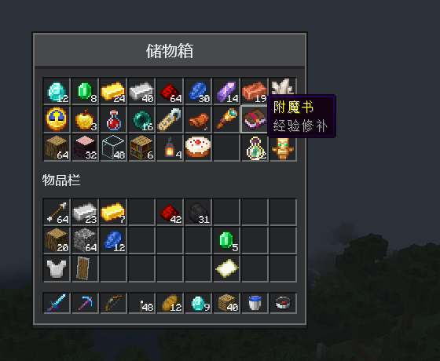

# 容器界面

[English](../en/inventory.md) · [全部指南](../README.md)

`ComposeInventoryScreen` 用 Compose 排布菜单的真实槽位，其余一切保持原版：点击、拖动、双击收集、Shift 点击、手持物品、槽位提示，以及配方查看器等模组依赖的钩子。



## 排布菜单

下面的界面对应一个"27 个储物槽 + 玩家物品栏"的菜单，和箱子一样：

```kotlin
class StorageScreen(menu: StorageMenu, inventory: Inventory, title: Component) :
    ComposeInventoryScreen<StorageMenu, Unit, Nothing>(menu, title) {
    private val caption = title.string

    override fun snapshot() {}

    override fun handle(action: Nothing) {}

    @Composable
    override fun Content(state: Unit, slots: ComposeMenuSlots<StorageMenu>) {
        OreScreen(caption, maxWidth = 176.dp, maxHeight = 190.dp, panelModifier = slots.areaModifier()) {
            SlotGrid(slots, 0 until 27)
            OreText("物品栏")
            SlotGrid(slots, 27 until 54)
            SlotGrid(slots, 54 until 63)
        }
    }
}

@Composable
fun SlotGrid(slots: ComposeMenuSlots<*>, ids: IntRange) {
    Column {
        for (row in ids.chunked(9)) Row { for (id in row) slots.Slot(id) }
    }
}
```

像注册其他菜单界面一样，在客户端模组构造函数中注册它：

```kotlin
modBus.addListener { event: RegisterMenuScreensEvent ->
    event.register(ModMenus.STORAGE.get(), ::StorageScreen)
}
```

- `slots.Slot(id)` 放置对应序号的菜单槽位。每个槽位只放一次，没放的槽位会被隐藏。
- `slots.areaModifier()` 标出其他模组眼中的容器区域，例如配方查看器据此把面板摆在旁边。
- 标题等游戏对象请在组合之前读取，就像这里的 `caption`。
- 槽位本身已经显示菜单里的物品，所以这个界面不需要自己的状态：和其他[没有游戏状态的界面](getting-started.md#4-显示游戏数据)一样，用 `Unit` 和 `Nothing` 表示。

Forge 1.20.1 请在 `FMLClientSetupEvent.enqueueWork` 中用 `MenuScreens.register` 注册。

大型容器的每个槽位都会显示图标，无需额外设置。`ComposeInventoryScreen` 在整个界面范围内最多缓存 256 个图标，包括玩家背包和合成区。调整缓存和每帧绘制上限见[大量物品](items.md#大量物品)。

## 显示菜单状态

界面除了槽位还要显示其他内容时，给它一个状态类型。下面这一版 `StorageScreen` 在 `snapshot` 中读取菜单，在 `Content` 中连同槽位绘制最新快照，并在 `handle` 中执行界面发来的动作：

```kotlin
data class StorageState(val used: Int, val locked: Boolean)

class StorageScreen(menu: StorageMenu, inventory: Inventory, title: Component) :
    ComposeInventoryScreen<StorageMenu, StorageState, Boolean>(menu, title) {
    private val caption = title.string

    override fun snapshot() = StorageState((0 until 27).count { container.getSlot(it).hasItem() }, container.locked())

    override fun handle(action: Boolean) {
        container.requestLocked(action)
    }

    @Composable
    override fun Content(state: StorageState, slots: ComposeMenuSlots<StorageMenu>) {
        OreScreen(
            caption,
            maxWidth = 176.dp,
            maxHeight = 210.dp,
            onClose = ::requestClose,
            panelModifier = slots.areaModifier(),
        ) {
            Row(verticalAlignment = Alignment.CenterVertically) {
                OreText("已用 ${state.used} / 27", Modifier.weight(1f))
                OreSwitch(state.locked, onCheckedChange = { send(it) })
            }
            SlotGrid(slots, 0 until 27)
            OreText("物品栏")
            SlotGrid(slots, 27 until 54)
            SlotGrid(slots, 54 until 63)
        }
    }
}
```

这里的 `locked` 和 `requestLocked` 代表你的菜单自己的状态，例如通过[菜单同步](menu-sync.md)保持一致。

- `snapshot` 在游戏线程调用：界面打开时、每刻，以及 `handle` 刚处理完某次输入事件发出的动作之后。
- `requestClose()` 从界面中关闭界面，就像这里面板的关闭按钮。
- 没有槽位的菜单用 `ComposeMenuScreen`，用法相同，只是 `Content(state)` 没有槽位参数。

## 选择界面类

| 类 | 适用于 |
| --- | --- |
| `ComposeScreen` | 没有菜单的界面 |
| `ComposeMenuScreen` | 没有槽位的服务端菜单 |
| `ComposeInventoryScreen` | 带槽位的菜单 |
| `SlotBehaviorScreen` | 原生绘制、但使用 CompixelUI 槽位规则的容器界面 |

## 修改点击行为

槽位规则是不可变的 `SlotBehavior`。下面的规则把右键改成你自己的动作，而不是拆分物品堆：

```java
SlotBehavior inspect = SlotBehavior.standard()
    .replaceClick(1, new SlotIntent.Local("example:inspect"));
```

在 `MenuSlotAdapter` 的 `behavior` 中返回它（或在 `SlotBehaviorScreen` 中重写 `slotBehavior`），再在 `localAction` 中处理这个动作。其他操作保持不变。本地动作本身不会向服务端发送任何内容。

`MenuSlotAdapter` 还决定每个槽位显示什么（`visual`）、拖动能经过哪些槽位（`canDragTo`）以及点击如何执行（`execute`）。默认的 `VanillaMenuSlotAdapter` 与 Minecraft 的行为一致。

### 自己绘制槽位

`slots.Slot(id)` 按 Ore 的外观绘制槽位。想让槽位使用自己的外观，就传入槽位尺寸，并自己绘制内容：

```kotlin
slots.Slot(id, Modifier.size(18.dp)) { slot ->
    Box(Modifier.matchParentSize().background(if (slot.hovered) Color(0xFFC6C6C6) else Color(0xFF8B8B8B)))
    slot.icon?.let { MinecraftItemIcon(it, Modifier.fillMaxSize().padding(1.dp)) }
    if (slot.amount.isNotEmpty()) BasicText(slot.amount, Modifier.align(Alignment.BottomEnd))
}
```

`slot` 包含槽位要显示的内容：图标 `icon`、数量文字 `amount` 和更短的 `compactAmount`、是否被标记 `marked`、拖动是否正把物品分散到它上面 `highlighted`，以及指针是否悬停在它上面 `hovered`。点击、拖动、Shift 点击和提示框都与 Ore 外观的槽位一样，图标和数量文字仍由 `MenuSlotAdapter` 的 `visual` 决定。

## Shift 点击路线

声明 Shift 点击时物品的去向，再让 `quickMoveStack` 使用这些路线：

```java
SlotTransferRoutes routes = SlotTransferRoutes.builder(63)
    .group("storage", 0, 27)
    .group("inventory", 27, 54)
    .group("hotbar", 54, 63, true)
    .route("storage", "hotbar", "inventory")
    .route("inventory", "storage")
    .route("hotbar", "storage")
    .build();

@Override
public ItemStack quickMoveStack(Player player, int slot) {
    return NativeSlotTransfers.quickMove(this, player, slot, routes);
}
```

范围不含结束值；`true` 表示从该组最后一个槽位开始填充。物品会先合并到相同的物品堆，再填入空槽，每个槽位的上限照常生效。合成输出等结果槽需要单独处理。

## 浮层与其他界面

- 对话框或窗口需要挡住槽位点击时，调用 `slots.Interaction(enabled = false)`。
- 配方查看器打开自己的界面时，菜单仍保持打开，你的界面也会保留它的内容：返回时，`remember` 的状态、滚动位置和输入的文字都保持原样，并读取新的快照。如果菜单在此期间关闭，或者配方查看器关闭后没有回到你的界面，你的界面也会随之关闭。参见[被覆盖的界面](transitions.md#被覆盖的界面)。
- 只需在界面最终关闭时做一次的工作（例如保存搜索文字），请重写 `menuClosed()`。配方查看器覆盖界面时不会调用它。
