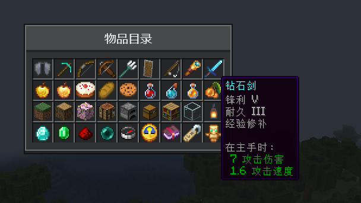

# 物品与提示

[English](../en/items.md) · [全部指南](../README.md)

CompixelUI 能在 Compose 中绘制真实的 Minecraft 物品：模型、动画和附魔光效与物品栏里完全一致，还能显示游戏原版的物品提示。



## 显示物品

在游戏线程用 `ItemIcon.snapshot` 为每个物品堆拍下快照，再把图标交给 Compose：

```kotlin
class ItemCatalogScreen(stacks: List<ItemStack>) : ComposeScreen<Unit, Nothing>(Component.literal("物品目录")) {
    private val icons = stacks.map { ItemIcon.snapshot(it) }

    override fun snapshot() {}

    override fun handle(action: Nothing) {}

    @Composable
    override fun Content(state: Unit) {
        OreScreen("物品目录", maxWidth = 176.dp, maxHeight = 110.dp) {
            LazyVerticalGrid(GridCells.FixedSize(18.dp)) {
                items(icons) { icon ->
                    MinecraftItemTooltip(icon) {
                        OreSlot { MinecraftItemIcon(icon, Modifier.fillMaxSize()) }
                    }
                }
            }
        }
    }
}
```

界面在游戏线程创建，所以可以在构造时拍下快照。会随游戏变化的图标则应放进界面状态，在 `snapshot()` 中拍下。

- `MinecraftItemIcon` 和其他可组合项一样，可以调整大小、裁剪、旋转或设置透明度。
- 指针停留 500 毫秒后，`MinecraftItemTooltip` 显示物品提示。提示由 Minecraft 自己绘制，其他模组添加的提示行也会出现。
- 图标持有物品堆的一份副本。物品不变时重复使用同一个图标，变化后再拍新的快照。

这些类型位于 `dev.compixel.forge.item`。

## 动画

图标会自动跟随游戏：附魔光效、动态纹理、指南针、时钟和冷却遮罩。需要不同行为时，给 `snapshot` 传入刷新策略：

| 策略 | 何时重绘 |
| --- | --- |
| `NativeRefresh.AUTO`（默认） | 物品有动画（如附魔光效、动态纹理）时每个游戏刻；否则在外观变化时 |
| `NativeRefresh.GAME_TICK` | 每个游戏刻 |
| `NativeRefresh.FRAME` | 每一帧 |
| `NativeRefresh.every(ms)` | 固定间隔，16 到 60,000 毫秒 |
| `NativeRefresh.STATIC` | 从不，保留第一帧画面 |

有动画的图标每个游戏刻重绘一次，与 Minecraft 播放纹理动画的频率相同。如果某个物品的自定义渲染器在模型不变的情况下播放动画，请使用 `GAME_TICK`；只有需要比这更快变化的绘制才使用 `FRAME`。

`NativeRefresh` 位于 `dev.compixel.forge.drawing`，供物品图标和矩形绘制共用。

## 自绘图标

`ItemIcon.drawn` 把 16×16 范围内的任意 `GuiGraphics` 绘制变成图标，适合流体、能量等不是物品的东西：

```kotlin
val water = ItemIcon.drawn("水", { graphics ->
    graphics.fill(0, 0, 16, 16, 0xFF3F76E4.toInt())
})
```

绘制在渲染线程执行，默认每个游戏刻重绘一次，也可以传入其他策略。自绘图标没有物品提示，可以改用 [OreTooltip](ore-ui.md#提示) 包裹。

## 矩形原生绘制

面板、预览或其他超过 16×16 图标范围的原生内容使用 `NativeDrawing`。在游戏线程创建句柄，再交给 Compose 重复使用：

```kotlin
import dev.compixel.forge.drawing.NativeDrawing
import dev.compixel.forge.drawing.NativeRefresh
import dev.compixel.forge.drawing.MinecraftNativeDrawing

val panel = NativeDrawing.create("原生面板", { context ->
    context.graphics.fill(0, 0, context.width, context.height, 0xFF203040.toInt())
    context.graphics.fill(4, 4, context.width - 4, 12, 0xFF80D4C0.toInt())
}, NativeRefresh.STATIC)

// 在 CompixelUI 界面或 HUD 中：
MinecraftNativeDrawing(panel, Modifier.size(180.dp, 48.dp))
```

回调在渲染线程执行。`context.graphics` 是对应版本的 `GuiGraphics`（1.20.1、1.21.1）或 `GuiGraphicsExtractor`（26.x），坐标从组件左上角开始；`width` 和 `height` 以 GUI 单位计，`pixelWidth` 和 `pixelHeight` 以像素计。

原生绘制没有自己的尺寸，需要给组件指定尺寸。裁剪、透明度和变换修饰符照常使用，回调画到图像边缘之外的内容会被裁掉。

回调可以读取游戏状态，但不能读取 Compose 状态。要绘制不同的数据，就创建新的句柄；同一尺寸重复使用同一句柄会共用图像。默认每个游戏刻刷新一次，且只在显示时刷新。

给界面或 HUD 层传入 `nativeDrawingOptions = NativeDrawingOptions(cacheCapacity, preparationsPerFrame)`，可以缓存隐藏的绘制（0–128，默认不缓存），或调整每帧最多运行的绘制数（1–64，默认 4）。

## 大量物品

图标绘制在图集页中，每页最多 64 个。一页只重绘到期的图标，所以一个有动画的物品不会连带重绘旁边的图标。

创建 `ComposeScreen`、`ComposeMenuScreen`、`ComposeInventoryScreen` 或 `ComposeHudLayer` 时，可以通过 `nativeItemOptions` 为该界面或 HUD 层单独调整：

```kotlin
class CatalogScreen(title: Component) :
    ComposeScreen<CatalogState, CatalogAction>(title, nativeItemOptions = NativeItemOptions(cacheCapacity = 512)) { … }

class StorageScreen(menu: StorageMenu, inventory: Inventory, title: Component) :
    ComposeInventoryScreen<StorageMenu, Unit, Nothing>(
        menu,
        title,
        nativeItemOptions = NativeItemOptions(cacheCapacity = 1024),
    ) { … }
```

`NativeItemOptions` 位于 `dev.compixel.forge.item`。

| 参数 | 默认值 | 范围 | 含义 |
| --- | --- | --- | --- |
| `cacheCapacity` | 128；容器界面为 256 | 1–1024 | 屏幕上的图标少于此数量时保留的图标数。滚出视野的图标在容量内继续缓存，滚回时无需重绘 |
| `preparationsPerFrame` | 64 | 1–1024 | 每帧最多绘制的图标数量。一个图集页最多容纳 64 个图标，更大的值会在一帧内绘制多页 |
| `imageSize` | 图标布局所占的像素 | 16–256 | 每个 16×16 图标绘制时使用的像素尺寸。默认按图标布局所占的像素绘制，因此任何尺寸都保持清晰，16 dp 时与原版物品一致。指定固定尺寸时，每个图标只绘制一次，并在屏幕上缩放 |

界面显示的图标多于 `preparationsPerFrame` 时，会在几帧内陆续显示完整。一页 64 个 16 dp 的图标在 GUI 缩放为 2 时约占 1 MB 显存，缩放为 4 时约 4 MB。

## 另见

- [容器界面](inventory.md)会自动为真实槽位显示物品、数量和提示。
- [HUD 层](hud.md)同样可以显示物品图标，但提示需要在界面中使用。
