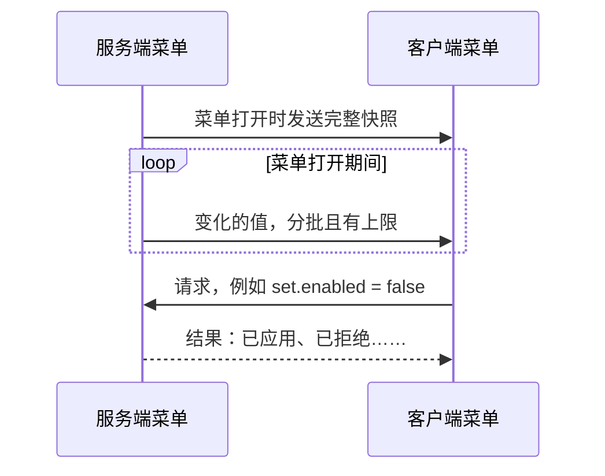

# 菜单同步

[English](../en/menu-sync.md) · [全部指南](../README.md)

菜单同步把服务端菜单的状态保持在客户端，并把客户端的类型化请求送回服务端。分批、分片和确认都由 Compose MC 处理；谁能修改什么，仍由你的菜单决定。



服务端和客户端都要安装 Compose MC，依赖声明使用 `side = "BOTH"`。菜单同步不含任何界面代码，可以在专用服务器上运行。

## 声明状态

让菜单实现 `SyncedMenu`，并用 `SyncSchema` 描述它的字段：

```java
abstract class PowerMenu extends AbstractContainerMenu implements SyncedMenu {
    private long energy;
    private boolean enabled;

    private static final SyncSchema<PowerMenu> SCHEMA =
        SyncSchema.<PowerMenu>builder("example:power", 1)
            .field("energy", SyncCodecs.LONG, m -> m.energy, (m, v) -> m.energy = v)
            .field("enabled", SyncCodecs.BOOLEAN, m -> m.enabled, (m, v) -> m.enabled = v)
            .build();

    private static final MenuAction<PowerMenu, Boolean> SET_ENABLED = MenuAction.of(
        "set.enabled", SyncCodecs.BOOLEAN,
        (menu, player, value) -> menu.mayConfigure(player) && menu.applyEnabled(value));

    private final MenuSync<PowerMenu> sync = MenuSync.bind(this, SCHEMA).action(SET_ENABLED);

    protected PowerMenu(MenuType<?> type, int id) { super(type, id); }
    @Override public MenuSync<?> menuSync() { return sync; }

    public void captureMachine(long energy, boolean enabled) {
        this.energy = energy;
        this.enabled = enabled;
    }
    public boolean requestEnabled(boolean value) { return sync.request(SET_ENABLED, value).queued(); }

    protected abstract boolean mayConfigure(ServerPlayer player);
    protected abstract boolean applyEnabled(boolean value);
}
```

- 服务端：机器状态变化时调用 `captureMachine`，新值会送达每个正在查看该菜单的客户端。
- 客户端：在游戏线程调用 `requestEnabled`，例如在处理 `UiBinding` 的动作时。返回 `true` 只表示请求已排队，不代表已经成功。
- 动作处理器在服务端运行。先在那里检查权限，再修改机器。

相关类型位于 `dev.composemc.sync.state`（结构与编解码器）、`dev.composemc.sync.action` 和 `dev.composemc.forge.sync`（菜单绑定）。

## 取值

getter 必须返回不可变且非空的值。要修改某个值，请替换它，不要原地修改。

| 编解码器 | 用途 |
| --- | --- |
| `SyncCodecs.INT`、`LONG`、`BOOLEAN`、`UUID` | 基本值 |
| `SyncCodecs.string(maxBytes)` | 限定 UTF-8 字节数的字符串 |
| `SyncCodecs.enumeration(MyEnum.class)` | 最多 256 个常量的枚举 |
| `SyncCodec.of(id, writer, reader)` | 自定义类型 |
| `MinecraftSyncCodecs.registry(id, maxBytes, streamCodec)` | `ItemStack` 等 Minecraft 值 |

```java
private static final SyncCodec<ItemStack> ITEM =
    MinecraftSyncCodecs.registry("example:item/1", 64 * 1024, ItemStack.OPTIONAL_STREAM_CODEC);
```

Forge 1.20.1 改用 `MinecraftSyncCodecs.buffer(id, maxBytes, codec)`，配合基于 `FriendlyByteBuf` 的编解码器。编码格式变化时，请修改编解码器 ID 或结构版本号。

## 集合

`keyedCollection` 同步条目带唯一键的列表。条目多、变化小的集合请用 `SyncMap` 配合 `keyedMap`，只发送变化的条目：

```java
final class CatalogState {
    record Entry(int id, String name) {}
    private SyncMap<Integer, Entry> entries = SyncMap.empty();

    private static final SyncCodec<String> NAME = SyncCodecs.string(256);
    private static final SyncCodec<Entry> ENTRY = SyncCodec.of("example:entry/1",
        (out, entry) -> { out.writeInt(entry.id()); NAME.write(out, entry.name()); },
        in -> new Entry(in.readInt(), NAME.read(in)));

    static final SyncSchema<CatalogState> SCHEMA = SyncSchema.<CatalogState>builder("example:catalog", 1)
        .keyedMap("entries", SyncCodecs.INT, ENTRY, Entry::id, m -> m.entries, (m, v) -> m.entries = v)
        .build();

    void upsert(int id, String name) { entries = entries.with(id, new Entry(id, name)); }
    void remove(int id) { entries = entries.without(id); }
}
```

映射没有顺序，请在显示时排序。`current.forEachChange(previous, handler)` 列出两个版本之间的变化。在客户端，完整的更新到达后会调用 `sync.onUpdate(menu -> …)`。

## 请求与结果

`request(action, value)` 返回 `ActionSubmission`。未能排队时，`failure()` 给出原因：

| 失败原因 | 含义 |
| --- | --- |
| `QUEUE_BYTES`、`PENDING_ACTIONS` | 等待中的内容太多，请稍后再试。 |
| `BODY_BYTES`、`CODEC` | 取值对这个动作来说太大或无效。 |
| `NOT_READY`、`CLOSED`、`TRANSPORT_UNAVAILABLE`、`UNKNOWN_ACTION` | 菜单或连接此时无法接收请求。 |

`actual()` 和 `limit()` 给出相关的大小。请求不会自动重试。

在菜单打开前注册 `onActionResult(listener)`，即可收到服务端的处理结果：`APPLIED`、`REJECTED`、`INVALID`、`THROTTLED` 或 `EXPIRED`。新状态本身仍通过正常同步到达。被拒绝的请求也会写入日志，每个菜单每 100 刻最多一次。

## 上限

所有上限都可以通过传给 `MenuSync.bind` 的 `MenuSyncOptions` 修改，两端必须使用相同的设置。默认值如下：

| 服务端 → 客户端 | 默认值 |
| --- | --- |
| 批大小 | 128 KiB |
| 传输速率 | 每刻 32 KiB，突发最多 4 MiB，每刻最多 256 KiB |
| 等待确认的批次 | 16 |
| 单个值上限 | 1 MiB |
| 快照或更新上限 | 32 MiB |
| 集合条目总数 | 100,000 |
| 无进展超时 | 200 刻 |

| 客户端 → 服务端 | 默认值 |
| --- | --- |
| 数据包大小 | 16 KiB |
| 传输速率 | 每刻 32 KiB，突发最多 4 MiB，每刻最多 256 KiB |
| 排队的请求数据 | 4 MiB |
| 等待结果的请求 | 32 |
| 每刻请求数 | 16 |
| 超时（排队、传输、回复） | 各 200 刻 |

单个动作默认最多 8 KiB，可以用 `MenuAction.of(id, codec, maxBytes, handler)` 声明更大的上限。较大的值会自动拆分成多个数据包。

```java
static final MenuSyncOptions OPTIONS = MenuSyncOptions.DEFAULT
    .withState(new SyncLimits(128 * 1024, new TransferBudget(64 * 1024, 8L * 1024 * 1024, 512 * 1024),
        16, 2 * 1024 * 1024, 64L * 1024 * 1024, 250_000, 400));

MenuSync.bind(this, SCHEMA, OPTIONS);
```

## 就绪状态

第一份完整状态到达后，`hasSnapshot()` 变为 `true`，后续更新传输期间也保持为 `true`。`status()` 和 `statistics()` 报告进度。更新总是整体应用，界面不会看到只更新了一半的状态。
