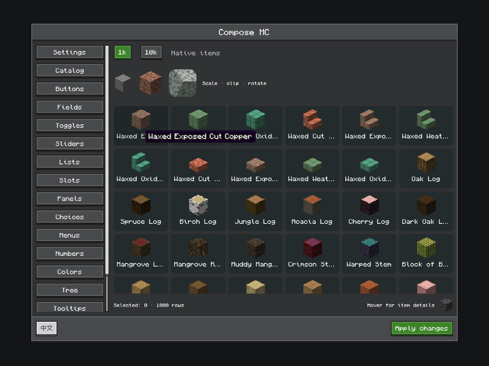

# 原生物品与提示

[English](../en/native-content.md) · [文档目录](../README.md)

所有支持的适配器都能在 Compose 中显示 Minecraft 物品图像和原生提示。本页示例使用 1.21.1 的 `dev.composemc.neoforge`；Forge 1.20.1 使用对应的 `dev.composemc.forge` API。



*使用打包后的 Minecraft 1.21.1 / NeoForge OpenGL 客户端重新获取的截图。物品图像和物品提示由 Minecraft 渲染，截图中的预览语言为英文。*

## 先捕获，再组合

在客户端渲染线程创建 `ItemIcon` 快照，再将句柄传给组合函数。不要从 Compose 读取实时 `ItemStack`。

```kotlin
import androidx.compose.foundation.layout.size
import androidx.compose.ui.Modifier
import androidx.compose.ui.unit.dp
import dev.composemc.neoforge.*
import dev.composemc.ui.ore.layout.OreScreen
import net.minecraft.client.Minecraft
import net.minecraft.network.chat.Component
import net.minecraft.world.item.ItemStack

fun openItemScreen(stack: ItemStack) {
    val minecraft = Minecraft.getInstance()
    val icon = ItemIcon.snapshot(stack)
    minecraft.setScreen(NeoForgeComposeScreen(
        Component.literal("物品详情"), parent = minecraft.screen,
    ) {
        OreScreen("物品详情") {
            MinecraftItemTooltip(icon) {
                MinecraftItemIcon(icon, Modifier.size(32.dp))
            }
        }
    })
}
```

快照持有物品堆的副本，内容或数量变化时应创建新快照。跨帧复用句柄，不要每 tick 无条件重建。同一个句柄可以在多个位置以不同变换和尺寸显示。

## 动画与图像准备

| 刷新策略 | 含义 |
| --- | --- |
| `IconRefresh.AUTO` | 物品默认策略，检测原生模型/纹理动画 |
| `IconRefresh.STATIC` | 在失效之前有意保持已准备的图像不变 |
| `IconRefresh.GAME_TICK` | 按游戏 tick 刷新 |
| `IconRefresh.FRAME` | 每帧刷新 |
| `IconRefresh.every(milliseconds)` | 指定 16–60,000 ms 间隔 |

`ItemIcon.drawn(description, drawing, refresh)` 允许在 16×16 GUI 区域内自定义原生绘制。回调在渲染线程执行，默认使用 `GAME_TICK`。应捕获绘制资源所需的数据，业务资源类型仍由消费者持有。自定义绘制图标不包含物品提示快照。

`NativeItemOptions` 默认采用 64 像素图像分辨率和 128 张缓存图像。每帧准备额度在 1.20.1/1.21.1 上默认为 8，在 26.x 上默认为 64。容器屏幕采用 256 张缓存；1.20.1/1.21.1 的容器屏幕还会把额度提高到每帧 16。容量应覆盖可见变体及惰性布局预取。活跃需求会固定缓存项；图像准备有额度限制，新网格可能分多帧填充。

原生渲染器在游戏线程准备图像，Compose 通过不可变句柄执行裁剪、变换和透明度处理。所有适配器都把原生图标绘制到槽位稳定的小型图集页中。每帧最多重绘一页、最多 `preparationsPerFrame` 个图标，并优先选择可见图标等待最久的一页；这套调度是共享代码，各适配器只负责绘制和复制图集页。OpenGL 和 Vulkan 在 GPU 上把图集页复制为 Skia 图像。原生提示框使用独立的离屏目标，也在 GPU 上复制。Minecraft 延迟提交 Vulkan GUI 绘制，因此 Vulkan 在下一帧发布完成的图标和提示框。使用诊断用 CPU 渲染器时，1.20.1/1.21.1 读回整页像素，26.x 仍按图标异步读回。适配器管理临时目标并释放替换的图像；资源重载会使已准备的图像失效，屏幕最终移除时释放自有资源。

## 原生提示行为

`MinecraftItemTooltip(icon, delayMillis = 500) { … }` 默认悬停延迟为 500 ms，`enabled=false` 可禁用。鼠标按下、滚动和按键会重新开始计时，失焦时隐藏。弹层会翻转并限制在视口内。富内容会通过换行或缩放适配空间；除失效外，可见内容最多每 100 ms 刷新一次。

包装器保留触发区域的组合、点击处理和记忆状态。所有适配器先测量收集到的提示组件与字体，再按内容尺寸分配离屏目标。Compose 在弹层中绘制生成的图像，因此层级、裁剪和位置由 Compose 管理。加载器的内容收集、字体和绘制前钩子仍会执行；1.20.1 与 1.21.1 使用颜色钩子，26.x 使用纹理钩子。绘制钩子的坐标相对于准备目标，原生屏幕位置覆盖不会决定弹层位置。

需要任意可交互嵌套内容时使用 [OreTooltip](ore-ui.md)。它立即显示并支持悬停锁定；原生物品提示属于渲染后的内容，不会将内部每个词条暴露为可交互组合函数。可以在 Ore 提示中放入物品图像，再用另一个 Ore 提示包裹它。

## 诊断与集成

在客户端线程读取 `nativeItemStatistics`、`nativeTooltipStatistics` 和 `rendererStatistics`。可复现截图与可选性能测量见[构建指南](build-and-test.md)。

真实菜单槽位应使用 [ComposeMenuSlots](inventory.md)，它已经提供物品外观、鼠标携带堆行为和原生槽位提示。对同一槽位再附加提示实现可能产生重复内容。图像 API 本身不执行物品栏操作。
