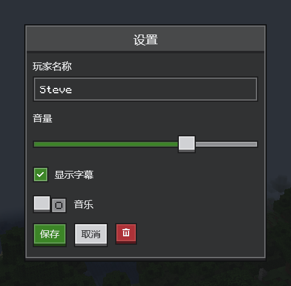
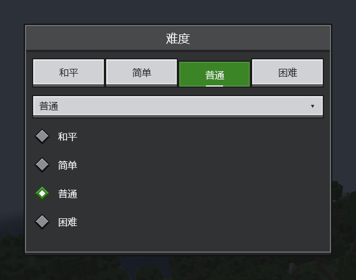
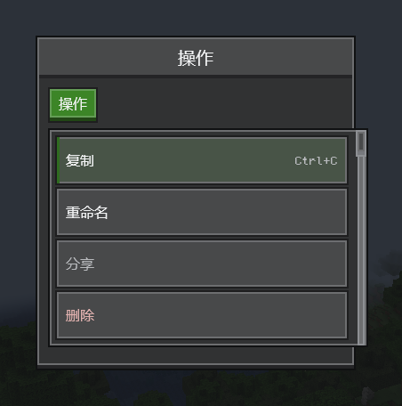
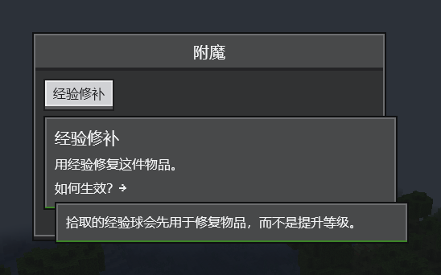
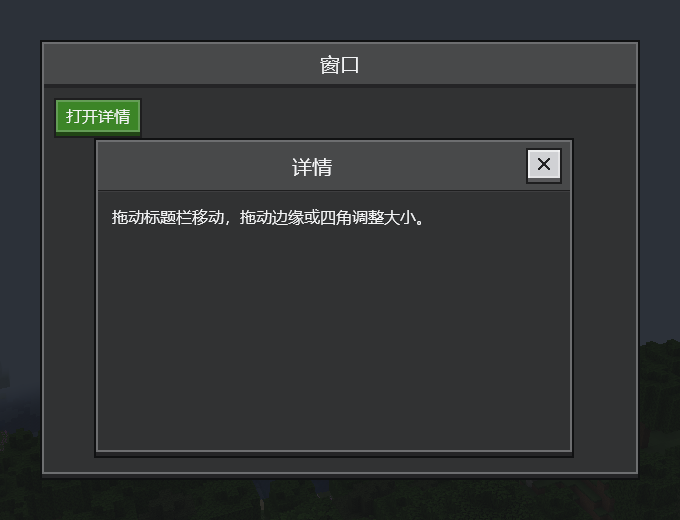
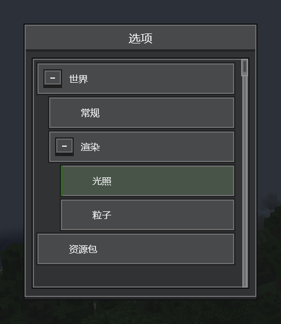
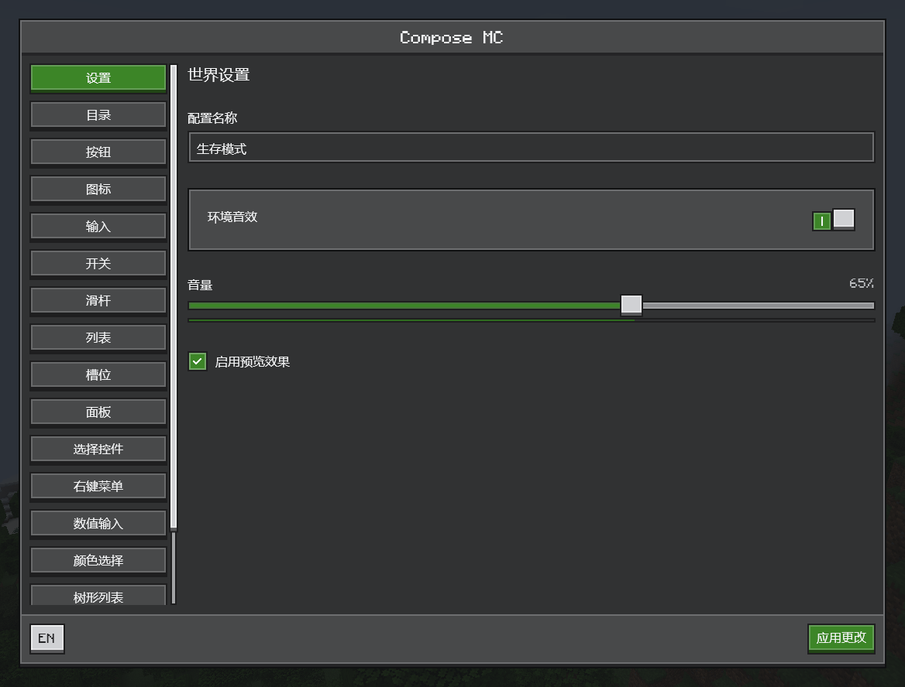

# Ore UI

[English](../en/ore-ui.md) · [全部指南](../README.md)

Ore UI 是 CompixelUI 的 Minecraft 风格组件集：像素字体、立体按钮、内嵌输入框和深色石质面板。CompixelUI 的界面会自动套用它的主题，标准的 Compose 布局、状态和修饰符照常使用。

和其他 Compose 组件一样，控件接收值和回调，状态由你的代码持有。

## 组件一览

下列包都位于 `dev.compixel.ui.ore` 之下。

| 包 | 组件 |
| --- | --- |
| `layout` | `OreScreen`、`OrePanel`、`OreSurface`、`OreDivider` |
| `display` | `OreText`、`OreIcon`、`OreGlyph`、`OreProgressBar` |
| `button` | `OreButton`、`OreIconButton` |
| `input` | `OreTextField`、`OreIntField`、`OreLongField`、`OreDoubleField`、`OreSlider`、`OreColorPicker` |
| `selection` | `OreCheckbox`、`OreSwitch`、`OreRadioButton`、`OreTabButton`、`OreSelect` |
| `navigation` | `OreTab`、`OreListItem`、`OreTreeView` |
| `scroll` | `OreScrollbar`、`OreScrollTrack` |
| `overlay` | `OreMenu`、`OreContextMenuArea`、`OreTextContextMenu`、`OreTooltip`、`OreDialog`、`OreWindow` |
| `inventory` | `OreSlot` |
| `theme` | `OreTheme`、`OreColors`、`OreTypography`、`OreDesign` |
| `editor` | `OreColorEditor` |

## 屏幕与标题栏

`OreScreen` 提供居中、尺寸限制和背景蒙层，内部用 `OrePanel` 绘制面板。两者都可以通过 `showTitleBar = false` 隐藏内置标题栏：

```kotlin
OreScreen(
    title = "仓储",
    showTitleBar = false,
    footer = { OreButton("关闭", onClick = onClose) },
) {
    // 自定义标题、工具栏或其他内容
    OreText("仓储内容")
}
```

隐藏标题栏后，标题、关闭按钮和分隔条腾出的空间都归内容使用；面板边框、内边距和 footer 保留。关闭按钮可以像上例一样放在 footer，或放进自己的工具栏。

## 按钮与输入



```kotlin
@Composable
fun ControlsExample() {
    var name by remember { mutableStateOf("Steve") }
    var volume by remember { mutableFloatStateOf(0.7f) }
    var subtitles by remember { mutableStateOf(true) }
    var music by remember { mutableStateOf(false) }
    Column(verticalArrangement = Arrangement.spacedBy(8.dp)) {
        OreTextField(name, { name = it }, label = "玩家名称")
        OreText("音量")
        OreSlider(volume, { volume = it })
        OreCheckbox(subtitles, { subtitles = it }, label = "显示字幕")
        Row(verticalAlignment = Alignment.CenterVertically, horizontalArrangement = Arrangement.spacedBy(6.dp)) {
            OreSwitch(music, { music = it })
            OreText("音乐")
        }
        Row(horizontalArrangement = Arrangement.spacedBy(6.dp)) {
            OreButton("保存", onClick = {})
            OreButton("取消", onClick = {}, style = OreButtonStyle.Secondary)
            OreIconButton(OreGlyph.Trash, "删除", onClick = {}, style = OreButtonStyle.Destructive)
        }
    }
}
```

- 按钮样式有 `Primary`、`Secondary`、`Destructive` 和 `Quiet`。
- `OreIntField`、`OreLongField` 和 `OreDoubleField` 把数值限制在范围内，可用方向键和鼠标滚轮步进，按住 Shift 或 Ctrl 步长更大。
- `OreColorPicker` 编辑 `Color`：拖动色板和滑条，或直接输入十六进制颜色。
- `OreGlyph` 提供常用图形：箭头、加号、叉号、对勾、放大镜、铅笔、垃圾桶、齿轮等。自定义图标可用 16 行 `#` 与 `.` 写成 `OrePixelArt`，再交给 `OreIcon` 绘制。

## 选择



```kotlin
@Composable
fun DifficultyOptions() {
    val options = listOf("和平", "简单", "普通", "困难")
    var selected by remember { mutableIntStateOf(2) }
    Column(verticalArrangement = Arrangement.spacedBy(6.dp)) {
        OreTabButton(options, selected, { selected = it })
        OreSelect(options, options[selected], { selected = options.indexOf(it) })
        options.forEachIndexed { index, label ->
            OreRadioButton(selected == index, { selected = index }, label = label)
        }
    }
}
```

`OreCheckbox` 也接受 `ToggleableState`，可以做出带"部分选中"状态的全选框。

## 菜单



```kotlin
@Composable
fun ActionMenu() {
    var expanded by remember { mutableStateOf(false) }
    Box {
        OreButton("操作", onClick = { expanded = true })
        OreMenu(expanded, { expanded = false }, listOf(
            OreMenuItem("copy", "复制", shortcut = "Ctrl+C") {},
            OreMenuItem("rename", "重命名") {},
            OreMenuItem("share", "分享", enabled = false) {},
            OreMenuItem("remove", "删除", destructive = true) {},
        ))
    }
}
```

菜单和触发它的按钮放在同一个 `Box` 里。`OreContextMenuArea(items) { … }` 用右键打开同样的菜单。两者都支持方向键、回车和 Esc。快捷键文字只是显示用，按键绑定需要自己注册。

菜单默认宽 136 dp，较长的文字会换行；选择框的下拉菜单与选择框同宽。

## 提示



```kotlin
@Composable
fun MendingHint() {
    OreTooltip(tooltip = {
        OreText("经验修补", style = OreTheme.typography.title)
        OreText("用经验修复这件物品。")
        OreTooltip(tooltip = {
            OreText("拾取的经验球会先用于修复物品，而不是提升等级。")
        }) {
            OreText("如何生效？→")
        }
    }) {
        OreButton("经验修补", onClick = {}, style = OreButtonStyle.Secondary)
    }
}
```

默认的 `OreTooltipMode.Delayed` 在指针移入时立即显示；保持不动，等绿色进度线走完（`lockDelayMillis`，默认 600 毫秒）提示就会锁定，之后可以移入提示中点击按钮或打开下一层。锁定后，`exitDelayMillis`（默认 350 毫秒）为跨越间隙提供保留时间。提示里可以放任何可组合项，包括物品图标。

只需跟随父组件显示的提示，使用 `OreTooltipMode.Immediate`：

```kotlin
OreTooltip("刷新列表", mode = OreTooltipMode.Immediate) {
    OreButton("刷新", onClick = { refresh() })
}
```

立即模式的提示在指针移入时显示，指针一离开触发控件就关闭，不会锁定。`OreIconButton` 的操作说明就用这种提示。

## 窗口与对话框



```kotlin
@Composable
fun WindowExample() {
    var open by remember { mutableStateOf(true) }
    Box(Modifier.fillMaxSize()) {
        OreButton("打开详情", onClick = { open = true })
        if (open) OreWindow("详情", onClose = { open = false }) {
            OreText("拖动标题栏移动，拖动边缘或四角调整大小。")
        }
    }
}
```

窗口停留在所在的 `Box` 内，周围的页面仍可操作。需要玩家先作答才能继续时，改用 `OreDialog`。

## 树形与列表



```kotlin
@Composable
fun SettingsTree() {
    val nodes = listOf(
        OreTreeNode("world", "世界", listOf(
            OreTreeNode("general", "常规"),
            OreTreeNode("render", "渲染", listOf(
                OreTreeNode("lighting", "光照"),
                OreTreeNode("particles", "粒子"),
            )),
        )),
        OreTreeNode("packs", "资源包"),
    )
    var selected by remember { mutableStateOf<String?>("lighting") }
    var expanded by remember { mutableStateOf(setOf("world", "render")) }
    OreTreeView(nodes, selected, { selected = it }, expanded,
        { id, open -> expanded = if (open) expanded + id else expanded - id })
}
```

树的行按需创建，上万个条目也能流畅滚动。普通列表可以把 `OreListItem` 放进 `LazyColumn`，再配一个 `OreScrollbar`。

## 配色与文字

- `OreTheme` 提供 Ore 的颜色和 `OreTypography`，控件用 `OreTheme.colors[OreColors.panel]` 这样的写法读取颜色。颜色来自玩家选择的配色，玩家可以在颜色编辑器里修改，资源包也可以修改；给界面传入 `design = OreDesign("yourmod")`，它就有自己的一份配色列表。详见[配色](themes.md)。`OreTheme(OreColors.scheme("light"))` 则直接使用固定颜色。
- 文字使用内置的 Compixel 字体：Monocraft 已有的字符用 Monocraft，Minecraft 各语言的其余字符（例如中文、日文和韩文）用 Minecraft 同样采用的 GNU Unifont，因此在每台电脑上显示一致。字号为 9 sp 时，Monocraft 的一个像素正好对应一个界面像素，Unifont 的一个像素对应半个，与 Minecraft 自己的文字相同。emoji、天城文、泰米尔文、卡纳达文、生僻汉字，以及 Minecraft 没有对应语言的文字，由系统字体显示：emoji 是彩色的，这些文字也能正确排版。
- `OreSlot` 是 18 dp 的槽位框，内容区 16 dp；[容器界面](inventory.md)用它显示真实的菜单槽位。

## 在游戏中试用全部组件

把开发产物加入运行配置，启动游戏后按 **F8**：

```groovy
localRuntime "dev.compixel:compixel-neoforge-1.21.1:${compixel_version}:development"
```


