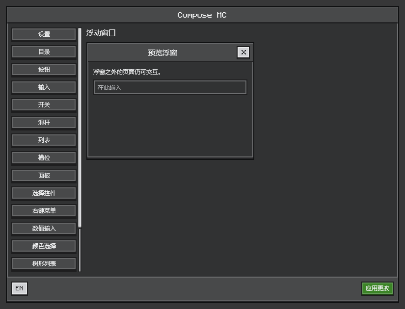

# Ore UI

[English](../en/ore-ui.md) · [文档目录](../README.md)

面向 Minecraft 的控件位于 `dev.composemc.ui.ore` 的各个子包。该模块基于 Compose Foundation，不依赖 Minecraft。屏幕适配器会提供 `OreTheme`；独立组合需要自行包裹主题。标准 Compose 布局、状态和 Modifier 均可继续使用。


*共享预览的离屏渲染：组合标签按钮、下拉选择、单选框和混合选择状态。*

## 选择组件

以下包名统一以 `dev.composemc.ui.ore.` 为前缀。

| 子包 | 职责 | 组件及配套类型 |
| --- | --- | --- |
| `theme` | 主题配置与交互反馈 | `OreTheme`、`OreColors`、`OreTypography`、`OreFeedback` |
| `display` | 只读内容展示 | `OreText`、`OreIcon`、`OreGlyph`、`OreProgressBar` |
| `layout` | 表面与页面结构 | `OreSurface`、`OreSurfaceStyle`、`OrePanel`、`OreScreen`、`OreDivider` |
| `button` | 操作触发 | `OreButton`、`OreButtonStyle`、`OreIconButton` |
| `input` | 文本、数值及颜色编辑 | `OreTextField`、`OreIntField`、`OreLongField`、`OreDoubleField`、`OreSlider`、`OreColorPicker` |
| `selection` | 离散值选择 | `OreSelect`、`OreRadioButton`、`OreTabButton`、`OreCheckbox`、`OreSwitch` |
| `navigation` | 页签、列表行及树形导航 | `OreTab`、`OreListItem`、`OreTreeView`、`OreTreeNode` |
| `scroll` | 滚动控件 | `OreScrollbar`、`OreScrollTrack` |
| `overlay` | 菜单、提示、对话框及浮窗 | `OreMenu`、`OreMenuItem`、`OreContextMenuArea`、`OreTooltip`、`OreDialog`、`OreWindow`、`OreWindowState`、`rememberOreWindowState` |
| `inventory` | 槽位外观 | `OreSlot`；真实容器交互使用[容器宿主](inventory.md) |

`OreTabButton` 用于组合单选，因此归入 `selection`；`OreTab` 表示页面导航。`OreSlider` 用于修改值，`OreProgressBar` 仅展示值。

## 导入与源码组织

从组件所属子包导入。Kotlin 通配导入不会包含子包，因此需要替换旧的 `dev.composemc.ui.ore.*`。例如，文本组件现在是 `dev.composemc.ui.ore.display.OreText`，四种文本及数字输入框均位于 `dev.composemc.ui.ore.input`。消费者必须针对重新构建的库重新编译，旧 JVM 包名不保留兼容别名。

每个独立公共组件使用同名文件。重载和组件专属类型放在一起：`OreButtonStyle` 随 `OreButton`，`OreMenuItem` 随 `OreMenu`，窗口状态随 `OreWindow`。主题颜色、排版和交互反馈各有独立文件。数字编辑、弹出位置等辅助实现放在使用它们的组件旁边；跨组件使用的边框绘制位于 `internal`。这些辅助实现仍为 Kotlin `internal`，不属于消费者 API。新增组件应进入对应职责包，避免继续堆进通用的 `Controls` 文件。

## 自定义图标按钮

`OreGlyph` 是内置图标目录。`OreIconButton` 同时提供 `icon: @Composable (Color) -> Unit` 内容槽，消费者可以传入 painter、矢量图、Canvas 或已准备好的原生图像，无需扩展枚举。按钮统一处理样式、鼠标/键盘点击、反馈、禁用状态和 tooltip。内容槽会收到当前前景色，包括次要按钮的对比色及禁用色，可用于单色图标着色；全彩图像可以不使用该着色。

```kotlin
import androidx.compose.foundation.Image
import androidx.compose.foundation.layout.size
import androidx.compose.runtime.Composable
import androidx.compose.ui.Modifier
import androidx.compose.ui.graphics.ColorFilter
import androidx.compose.ui.graphics.painter.Painter
import androidx.compose.ui.unit.dp
import dev.composemc.ui.ore.button.OreIconButton

@Composable
fun RefreshButton(painter: Painter, onRefresh: () -> Unit, enabled: Boolean = true) {
    OreIconButton(contentDescription = "刷新", onClick = onRefresh, enabled = enabled) { contentColor ->
        Image(painter, contentDescription = null, modifier = Modifier.size(8.dp),
            colorFilter = ColorFilter.tint(contentColor))
    }
}
```

按钮的 `contentDescription` 同时用于 tooltip，内部图像应作为装饰（`contentDescription = null`），内容槽内避免再嵌套可点击控件。图标尺寸在内容槽内设置，按钮外部尺寸通过其 `modifier` 设置。`OreIconButton(OreGlyph.Edit, description, onClick)` 重载仍然保留，复用同一套实现。F8 的按钮页展示了自定义 Canvas 图标及其启用、禁用样式。

## 状态与选择

控件接收值和回调，由你的组合持有状态。下方示例均包含所需导入。

```kotlin
import androidx.compose.foundation.layout.Column
import androidx.compose.runtime.*
import dev.composemc.ui.ore.selection.OreRadioButton
import dev.composemc.ui.ore.selection.OreSelect
import dev.composemc.ui.ore.selection.OreTabButton

@Composable
fun DifficultyOptions() {
    val options = listOf("和平", "简单", "一般", "困难")
    var selected by remember { mutableStateOf(2) }
    Column {
        OreTabButton(options, selected, { selected = it })
        OreSelect(options, options[selected], { selected = options.indexOf(it) })
        options.forEachIndexed { index, label ->
            OreRadioButton(selected == index, { selected = index }, label = label)
        }
    }
}
```

`OreTabButton` 将多个按钮连接为一个单选组，选项必须非空，选中索引必须有效。`OreRadioButton` 表示单个选项，通过共享选中值实现组内互斥。`OreSelect` 还支持 `optionLabel`、`optionEnabled`，以及无选中值时的占位文字。

`OreCheckbox` 提供 Boolean 和 `ToggleableState` 两种重载。后者显示 `Off`、`On` 或 `Indeterminate`，由调用者决定点击后的状态，例如将混合分组选为全选。`ToggleableState` 位于 `androidx.compose.ui.state`。

## 编辑与结构化数据

- 数值控件要求当前值位于声明范围内。`OreLongField` 保留完整有符号 64 位精度，不经过浮点转换。`OreDoubleField` 接受有限值与有限正步长，采用十进制步进。数值编辑器支持按钮、方向键、滚轮及 Shift/Ctrl 步长。不完整输入保留在编辑器内部，无效值不会发布为业务值。
- `OreColorPicker` 接收 Compose `Color`，提供 HSV 控制与十六进制输入；可通过 `showAlpha=false` 隐藏透明度控件。
- `OreTreeView` 接收不可变 `OreTreeNode`、选中 ID 和展开 ID 集合，节点 ID 必须唯一。回调报告选择和展开变化，由你的状态决定是否接受。可见行采用惰性布局，支持键盘导航。
- 请为标签、选项、占位文字及无障碍描述提供本地化内容。内置英文默认值仅用于便利调用，不会自动翻译消费者内容。

## 菜单与右键菜单

按钮锚定菜单应将 `OreMenu` 和触发按钮放进同一个 `Box`，由调用者管理 `expanded`。每个 `OreMenuItem` 需要唯一 ID 和回调，可选的勾选、禁用、危险操作及快捷键文字决定其外观。快捷键文字不会自动注册按键。

```kotlin
import androidx.compose.foundation.layout.Box
import androidx.compose.runtime.*
import dev.composemc.ui.ore.button.OreButton
import dev.composemc.ui.ore.overlay.OreMenu
import dev.composemc.ui.ore.overlay.OreMenuItem

@Composable
fun ActionMenu(onInspect: () -> Unit) {
    var expanded by remember { mutableStateOf(false) }
    Box {
        OreButton("操作", { expanded = true })
        OreMenu(expanded, { expanded = false }, listOf(
            OreMenuItem("inspect", "查看", onClick = onInspect),
        ))
    }
}
```

`OreContextMenuArea(items) { content() }` 提供在鼠标位置展开的右键菜单。菜单支持方向键、Home/End 和确认键，Escape/Tab 可关闭。原生容器的右键仍由[槽位策略](inventory.md)处理，单独包裹 Compose 右键区域不会替代容器输入钩子。

## 可交互的多层提示

鼠标进入触发区域时，`OreTooltip` 立刻出现；锁定前移出会立刻关闭。默认持续悬停 600 ms 时进度线填满并锁定，随后提供 350 ms 移出宽限，允许鼠标跨入提示内部。悬停提示内部或任意子级时，祖先提示保持显示。窗口失焦、禁用或移除触发区域会关闭提示。

```kotlin
import androidx.compose.runtime.*
import dev.composemc.ui.ore.display.OreText
import dev.composemc.ui.ore.overlay.OreTooltip

@Composable
fun EquipmentHint() {
    OreTooltip(tooltip = {
        OreText("装备详情")
        OreTooltip(tooltip = { OreText("提高移动速度。") }) {
            OreText("速度效果")
        }
    }) {
        OreText("悬停查看详情")
    }
}
```

通过 `lockDelayMillis` 和 `exitDelayMillis` 调整时长。富内容区域可以包含任意组合函数，包括已准备的物品图像和另一个 `OreTooltip`。`MinecraftItemTooltip` 属于独立的原生内容 API，时序和渲染方式不同，见[原生内容](native-content.md)。


## 浮窗与对话框

在有明确边界的 `Box` 内，将浮窗放在页面内容之后，并持有其状态和可见性：

```kotlin
import androidx.compose.foundation.layout.Box
import androidx.compose.foundation.layout.fillMaxSize
import androidx.compose.runtime.*
import androidx.compose.ui.Modifier
import dev.composemc.ui.ore.button.OreButton
import dev.composemc.ui.ore.display.OreText
import dev.composemc.ui.ore.overlay.OreWindow
import dev.composemc.ui.ore.overlay.rememberOreWindowState

@Composable
fun WindowExample() {
    var open by remember { mutableStateOf(false) }
    val window = rememberOreWindowState()
    Box(Modifier.fillMaxSize()) {
        OreButton("打开详情", { open = true })
        if (open) OreWindow("详情", { open = false }, window) {
            OreText("拖动标题移动，拖动边缘或角落缩放。")
        }
    }
}
```

`OreWindow` 位于当前场景内，支持标题拖动和八个方向的缩放，限制在父区域内，默认最小尺寸为 120×80 dp。被覆盖的 Compose 控件不会收到同一次点击，周围页面仍可交互。多个窗口的堆叠顺序由调用者决定。需要模态交互时使用 `OreDialog`。如果弹层需要阻止原生槽位操作，容器屏幕还须单独关闭该输入。



## 外观与字体

通过 `OreTheme` 的 `OreColors` 和 `OreTypography` 自定义外观。平面、内凹和凸起表面共享像素对齐边框。按钮提供主要、次要、危险和安静样式，焦点、悬停、按下及禁用状态具有独立外观。

`OreSlot` 默认为 18 dp 外框和 16 dp 内容区域。外框尺寸与 `contentModifier` 相互独立，仅放大外框不会自动放大内容。

内置 Monocraft 字体采用 [SIL Open Font License](../../ui-ore/src/main/resources/dev/composemc/ui/ore/Monocraft-LICENSE.txt)。未覆盖的字符使用 Compose/Skia 平台字体回退，CJK 外观取决于系统字体。如果需要跨平台一致的字符覆盖，请提供自己的字体族。`ui-ore` 不打包 Minecraft 字体或纹理文件。

[F8 与桌面预览](build-and-test.md)使用同一组组件。源码和完整参数列表位于 [ui-ore](../../ui-ore/src/main/kotlin/dev/composemc/ui/ore)。
